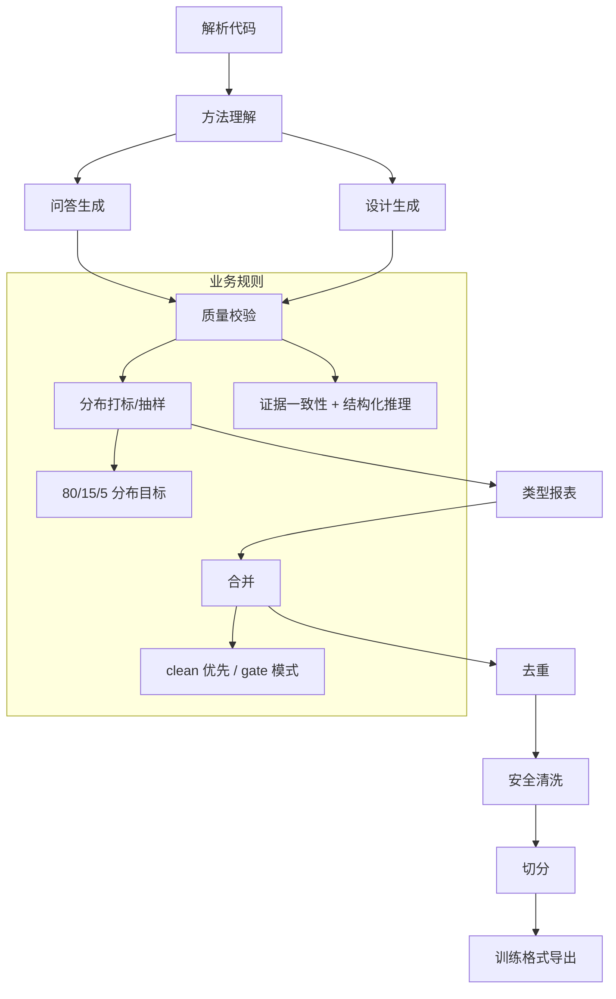

# Intelligent Training Data Generation System

面向业务与工程团队的离线训练集生成流水线，强调“证据可追溯、质量可控、分布可解释”。

## 🌟 核心概念：像“有质检的内容工厂”一样
> 就像生产线先有质检再出货，系统先抽取代码证据，再生成样本，并用质量与分布规则把关。

## 📋 运作基石（必要元数据）

- **涉及领地 (Code Context)**：
  - Pipeline 编排：`src/pipeline/orchestrator.py`, `src/pipeline/base_step.py`
  - 解析与证据：`src/pipeline/steps/parse.py`, `src/parser/*`
  - 方法理解：`src/pipeline/steps/method_understanding.py`, `src/engine/auto_method_understander.py`
  - 问答生成：`src/pipeline/steps/question_answer.py`, `src/engine/auto_question_generator.py`, `src/engine/answer_generator.py`
  - 设计生成：`src/pipeline/steps/design_generation.py`, `src/engine/auto_design_question_generator.py`, `src/engine/design_generator.py`
  - 质量与分布：`src/pipeline/steps/validation.py`, `coverage_tagger.py`, `coverage_sampler.py`, `question_type_report.py`
  - 后处理与导出：`merge.py`, `deduplication.py`, `secrets_scan.py`, `split.py`, `export.py`

- **执行准则 (Business Rules)**：
  - 每条样本必须带证据引用 `evidence_refs`，并与代码符号一致。
  - 质量校验会产出 clean 分支，合并时优先使用 clean。
  - 分布控制按 80/15/5 目标抽样，并输出分布报表与回归告警。
  - 推理记录结构化输出（observations/inferences/assumptions），用于质量审计。

- **参考证据**：
  - `data/raw/extracted/symbols.jsonl` 与 `repo_commit` 用于一致性校验。

## ⚙️ 仪表盘：我该如何控制它？

| 配置参数 | 业务名称 | 调节它的效果 | 专家建议 |
| :--- | :--- | :--- | :--- |
| `repo.path` | 代码仓路径 | 指定解析对象 | 指向目标仓库 |
| `language.name` | 语言类型 | 选择解析器 | java / python |
| `llm.model` | 生成模型 | 控制生成质量与成本 | `qwen2.5:7b` |
| `method_understanding.enabled` | 方法理解开关 | 是否产出方法画像 | demo 开启 |
| `question_answer.max_questions` | QA 问题上限 | 控制问答规模 | 25 |
| `design_questions.max_questions` | 设计问题上限 | 控制设计样本规模 | 30 |
| `quality.gate_mode` | 质量门禁 | gate / report | demo 可 report |
| `question_answer.coverage.targets` | QA 难度分布 | 高/中/难比例 | 0.8/0.15/0.05 |
| `safety.mode` | 敏感信息处理 | drop / sanitize / keep | demo 可 keep |
| `dedup.semantic.enabled` | 语义去重开关 | 是否开启语义去重 | demo 可关闭 |

## 🛠️ 它是如何工作的（逻辑流向）



### 核心工作流：高质量问答对生成

本系统通过一个精密的、分阶段的流程来生成高质量且可追溯的问答（QA）训练样本。其核心思想是“先理解、再提问、最后基于证据回答”。

1.  **静态解析，建立索引 (`CodeSymbol`)**
    *   **过程**：首先，系统通过静态分析（非 LLM）扫描整个代码库，将每个类、方法等解析成一个结构化的 `CodeSymbol` 对象，并建立索引。
    *   **证据**：此过程由 `src/parser/` 中的解析器完成，其数据结构在 `src/utils/schemas.py` 中定义，并被 `docs/SCHEMAS.md` 详细记录。

2.  **LLM 生成方法摘要 (`MethodProfile`)**
    *   **过程**：对于解析出的关键方法，系统调用一个 LLM，让其扮演“代码分析专家”，为方法生成一份结构化的“摘要”（`MethodProfile`），其中包含业务规则、依赖关系等深度语义。
    *   **证据**：`src/engine/auto_method_understander.py` 使用 `auto_method_understanding.txt` 这个 Prompt 来完成此任务。

3.  **基于摘要生成问题 (`Question-First`)**
    *   **过程**：系统利用上一步生成的 `MethodProfile`（摘要），再次调用 LLM，让其扮演“技术培训专家”，围绕摘要中的要点生成多样化、有深度且分布可控的问题。
    *   **证据**：`src/engine/auto_question_generator.py` 使用 `auto_question_generation.txt` Prompt，其中 `MethodProfile` 是关键输入。

4.  **RAG 检索上下文 (`Context`)**
    *   **过程**：在回答问题时，系统**不会**使用之前的摘要。相反，它会启动一个 RAG（检索增强生成）流程，根据问题，通过直接证据、向量搜索和调用链分析等方式，从代码库中重新检索最相关的**源码原文**，拼接成上下文。
    *   **证据**：`src/engine/answer_generator.py` 中复杂的检索逻辑，它为“开卷考试”准备了最精确的“开卷材料”。

5.  **基于证据生成答案 (`Evidence-Based Answers`)**
    *   **过程**：最后，系统将问题和检索到的源码上下文一起交给 LLM，并用一份极其严格的 Prompt “合同”来强迫它必须基于源码回答，且在结构化的 `thought`（思考过程）中引用具体的代码证据（`evidence_refs`）。
    *   **证据**：`auto_answer_generation.txt` Prompt 强制要求答案必须引用证据。同时，`answer_generator.py` 的代码会对 LLM 的输出进行严格校验，不合规的回答会被直接丢弃。

6.  **自动化质量门禁 (`Quality Gates`)**
    *   **过程**：在流程的每一步，系统都会进行自动化校验。例如，答案是否引用了有效的证据、JSON 格式是否正确等。不符合质量要求的样本会被拒绝，并记录在案。
    *   **证据**：`docs/pipeline/05-validation-step.md` 中描述了独立的验证步骤，同时在各个 `generator` 中也包含了大量的错误处理和校验逻辑。

### 核心工作流：体系化设计方案生成

与QA对焦于“是什么”和“为什么”不同，Design方案旨在回答“如何做”。它模拟一个架构师接到需求后，被要求基于现有代码库进行改造或新增功能的设计过程。

1.  **混合式问题来源 (Top-Down & Bottom-Up)**
    *   **过程**: 设计问题的来源是多样的。一方面，可以由用户在 `configs/user_inputs/design_questions.yaml` 中定义明确的、自上而下的设计任务（Top-Down）。另一方面，系统也能基于对现有代码的分析，自动生成与当前架构相关的设计问题（Bottom-Up）。
    *   **证据**: `src/engine/auto_design_question_generator.py` 负责从代码符号（`CodeSymbol`）和可选的方法摘要（`MethodProfile`）中获取灵感，自动生成问题。这确保了问题既有用户的主动输入，也有对现有代码的覆盖。

2.  **广域RAG，检索架构上下文**
    *   **过程**: 收到一个设计问题后，系统不会只看一个文件或一个方法。相反，`design_generator` 会进行一个广域的RAG检索。它通过关键字匹配和架构分层规则（如Controller、Service），从整个代码库中筛选出一组最相关的代码片段，共同组成回答该设计问题所需的“架构上下文”。
    *   **证据**: `src/engine/design_generator.py` 的 `_retrieve_context` 方法通过打分机制筛选出多个相关符号，并通过调用链分析（`expand_call_chain`）扩大证据范围。

3.  **基于约束与证据生成方案**
    *   **过程**: LLM会获取到设计问题、以及上一步检索到的架构上下文。它被要求扮演一个“架构师”，在遵循 `configs/user_inputs/architecture_constraints.yaml` 中定义的架构约束的前提下，给出一份包含“现状分析”、“方案概述”、“风险权衡”等多个部分的结构化设计文档。
    *   **证据**: `configs/prompts/design/design_user_prompt.txt` 指导LLM不仅要输出方案，还要在 `thought` 结构中明确引用作为决策依据的`evidence_refs`。

4.  **严格的方案合理性校验**
    *   **过程**: 系统会对LLM输出的方案进行严格的自动化校验。这不仅包括检查 `evidence_refs` 是否真实有效，还会检查方案 `answer` 的文本中是否包含了所有被要求的设计章节。
    *   **证据**: `src/engine/design_generator.py` 中的 `_validate_sample` 方法负责执行这些检查，确保输出的不是空洞的文字，而是有结构、有证据支撑的有效设计。

## 📐 样本数量计算逻辑

### QA 样本数量决定链

```
1. MethodUnderstanding
   ├── 输入: symbols.jsonl 中的所有方法符号
   └── 输出: method_profiles.jsonl
       └── 数量限制: max_methods (默认 25)

2. AutoQuestionGenerator
   ├── 输入: method_profiles (最多 25 个)
   ├── 每个 profile 生成问题数: questions_per_method (默认 3)
   ├── 潜在问题数 = 25 × 3 = 75 个
   └── 输出限制: max_questions (默认 15)
       └── 实际输出: min(75, 15) = 15 个问题

3. AnswerGenerator
   ├── 输入: 15 个问题
   └── 输出: 每个问题生成 1 个答案 → 15 个 QA 样本
       └── 质量门禁后: 15 - rejected = 最终 QA 数
```

| 配置项 | 路径 | 默认值 | 作用 |
|--------|------|--------|------|
| `max_methods` | `method_understanding.max_methods` | 25 | 限制处理的方法数 |
| `questions_per_method` | `question_answer.questions_per_method` | 3 | 每个方法生成多少问题 |
| `max_questions` | `question_answer.max_questions` | 15 | QA 问题总数上限 |

**公式**:
```
最终 QA 数 = min(max_methods × questions_per_method, max_questions) - rejected
           = min(25 × 3, 15) - rejected
           = 15 - rejected
```

### Design 样本数量决定链

```
1. DesignQuestionGenerator
   ├── 输入: symbols.jsonl + method_profiles.jsonl (可选)
   ├── 输出: design_questions_auto.jsonl
   └── 数量限制: max_questions (默认 10)

2. DesignGenerator
   ├── 输入: 10 个设计问题
   ├── 每个问题生成 1 个设计样本
   └── 内部上限: max_samples (默认 50)
       └── 实际受限于设计问题数，通常是 10

3. 输出: 10 个 Design 样本
   └── 质量门禁后: 10 - rejected = 最终 Design 数
```

| 配置项 | 路径 | 默认值 | 作用 |
|--------|------|--------|------|
| `max_questions` | `design_questions.max_questions` | 10 | 设计问题总数上限 |
| `max_samples` | `core.max_items` | 50 | Design 样本内部上限 |
| `use_method_profiles` | `design_questions.use_method_profiles` | true | 是否用 profiles 增强 |

**公式**:
```
最终 Design 数 = min(design_questions_count, max_samples) - rejected
              = min(10, 50) - rejected
              = 10 - rejected
```

### 关键结论

1. **QA 瓶颈在 `max_questions`** — 即使 `max_methods × questions_per_method` 很大，最终也只输出 `max_questions` 个问题
2. **Design 瓶颈在 `design_questions.max_questions`** — `max_samples` 是内部保护，实际被设计问题数量限制
3. **如果要增加输出数量**：
   - QA: 提高 `question_answer.max_questions`
   - Design: 提高 `design_questions.max_questions`
4. **Rejected 样本不影响生成数量计算** — 它们是在生成后被质量门禁过滤的，而非预先减少生成目标

## 🧩 解决的痛点与带来的改变

- **以前的乱象**：样本随机生成、证据不可追溯、质量难以说明。
- **现在的秩序**：证据有锚定、质量有门禁、分布有报表与回归提示。

## 💡 开发者笔记

- Pipeline 默认串行执行，单步失败不会阻断后续步骤（便于 demo 跑通）。
- 关键输出：`data/reports/*`（质量与分布报表）、`data/final/*`（训练数据）。
- 详细功能说明请见：
  - `docs/features/README.md`
  - `docs/pipeline/README.md`

## 快速开始（保留项）

### 配置目标解析仓库

在 `configs/launch.yaml` 中设置目标仓库路径与可选 commit：

```yaml
repo:
  path: "./repos/java/spring-ai"
  commit: ""
```

测试仓库（示例）：

- https://github.com/spring-projects/spring-ai
- https://github.com/FlutteryEmbers/online_shopping_be
- https://github.com/dieudonneAwa/mini-chatGPT

### Prerequisites

- Python 3.10+
- 本地 Ollama（用于 LLM 与 embedding）

```bash
ollama serve
ollama pull qwen2.5:7b
ollama pull nomic-embed-text
```

### Install

```bash
python3 -m venv venv
source venv/bin/activate  # Linux/Mac
# venv\Scripts\activate   # Windows
pip install -r requirements.txt
```

### 环境变量（可选）

```bash
# Windows
set REPO_PATH=D:\path\to\repo
set OLLAMA_BASE_URL=http://localhost:11434
set OLLAMA_MODEL=qwen2.5:7b

# Linux/Mac
export REPO_PATH=/path/to/repo
export OLLAMA_BASE_URL=http://localhost:11434
export OLLAMA_MODEL=qwen2.5:7b
```

### Run

```bash
python3 main.py
```

常用参数（CLI）：

- `--config`：指定配置文件（默认 `configs/launch.yaml`）
- `--skip-parse`：跳过解析
- `--skip-question-answer`：关闭 Auto QA（使用用户问题）
- `--skip-auto`：`--skip-question-answer` 的旧别名
- `--skip-auto-design-questions`：跳过自动设计问题生成
- `--skip-llm`：跳过所有 LLM 生成
- `--skip-qa`：跳过 QA 生成
- `--skip-design`：跳过设计生成
- `--skip-dedup`：跳过去重
- `--skip-safety`：跳过安全扫描
- `--skip-export`：跳过导出

示例：

```bash
# 指定配置文件
python3 main.py --config configs/launch.yaml

# 使用用户问题（关闭 Auto QA）
python3 main.py --skip-question-answer

# 快速跳过耗时步骤
python3 main.py --skip-parse --skip-llm --skip-export
```

### Outputs（你应该看到）

- Parse：`data/raw/extracted/symbols.jsonl`、`data/raw/repo_meta/repo_meta.json`
- Intermediate：`data/intermediate/*.jsonl`
- Final：`data/final/{train,val,test}_sft.jsonl`（以及 `data/final/qa/*`、`data/final/design/*`）
- Reports：`data/reports/pipeline_summary.json`、`data/reports/dataset_stats.json`、`data/reports/coverage_report.json`、`data/reports/question_type_report.json`
