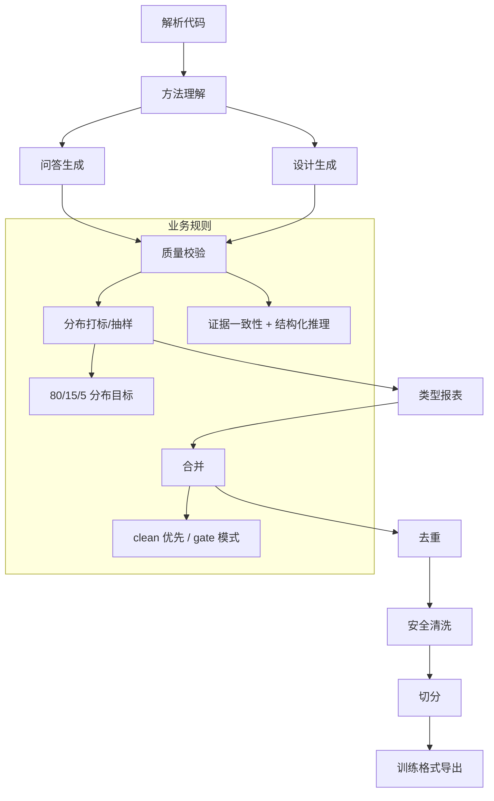

# Intelligent Training Data Generation System

面向业务与工程团队的离线训练集生成流水线，强调“证据可追溯、质量可控、分布可解释”。

## 🌟 核心概念：像“有质检的内容工厂”一样
> 就像生产线先有质检再出货，系统先抽取代码证据，再生成样本，并用质量与分布规则把关。

## 📋 运作基石（必要元数据）

- **涉及领地 (Code Context)**：
  - Pipeline 编排：`src/pipeline/orchestrator.py`, `src/pipeline/base_step.py`
  - 解析与证据：`src/pipeline/steps/parse.py`, `src/parser/*`
  - 方法理解：`src/pipeline/steps/method_understanding.py`, `src/engine/auto_method_understander.py`
  - 问答生成：`src/pipeline/steps/question_answer.py`, `src/engine/auto_question_generator.py`, `src/engine/answer_generator.py`
  - 设计生成：`src/pipeline/steps/design_generation.py`, `src/engine/auto_design_question_generator.py`, `src/engine/design_generator.py`
  - 质量与分布：`src/pipeline/steps/validation.py`, `coverage_tagger.py`, `coverage_sampler.py`, `question_type_report.py`
  - 后处理与导出：`merge.py`, `deduplication.py`, `secrets_scan.py`, `split.py`, `export.py`

- **执行准则 (Business Rules)**：
  - 每条样本必须带证据引用 `evidence_refs`，并与代码符号一致。
  - 质量校验会产出 clean 分支，合并时优先使用 clean。
  - 分布控制按 80/15/5 目标抽样，并输出分布报表与回归告警。
  - 推理记录结构化输出（observations/inferences/assumptions），用于质量审计。

- **参考证据**：
  - `data/raw/extracted/symbols.jsonl` 与 `repo_commit` 用于一致性校验。

## ⚙️ 仪表盘：我该如何控制它？

| 配置参数 | 业务名称 | 调节它的效果 | 专家建议 |
| :--- | :--- | :--- | :--- |
| `repo.path` | 代码仓路径 | 指定解析对象 | 指向目标仓库 |
| `language.name` | 语言类型 | 选择解析器 | java / python |
| `llm.model` | 生成模型 | 控制生成质量与成本 | `qwen2.5:7b` |
| `method_understanding.enabled` | 方法理解开关 | 是否产出方法画像 | demo 开启 |
| `question_answer.max_questions` | QA 问题上限 | 控制问答规模 | 25 |
| `design_questions.max_questions` | 设计问题上限 | 控制设计样本规模 | 30 |
| `quality.gate_mode` | 质量门禁 | gate / report | demo 可 report |
| `question_answer.coverage.targets` | QA 难度分布 | 高/中/难比例 | 0.8/0.15/0.05 |
| `safety.mode` | 敏感信息处理 | drop / sanitize / keep | demo 可 keep |
| `dedup.semantic.enabled` | 语义去重开关 | 是否开启语义去重 | demo 可关闭 |

## 🛠️ 它是如何工作的（逻辑流向）



## 🧩 解决的痛点与带来的改变

- **以前的乱象**：样本随机生成、证据不可追溯、质量难以说明。
- **现在的秩序**：证据有锚定、质量有门禁、分布有报表与回归提示。

## 💡 开发者笔记

- Pipeline 默认串行执行，单步失败不会阻断后续步骤（便于 demo 跑通）。
- 关键输出：`data/reports/*`（质量与分布报表）、`data/final/*`（训练数据）。
- 详细功能说明请见：
  - `docs/features/README.md`
  - `docs/pipeline/README.md`

## 快速开始（保留项）

### Prerequisites

- Python 3.10+
- 本地 Ollama（用于 LLM 与 embedding）

```bash
ollama serve
ollama pull qwen2.5:7b
ollama pull nomic-embed-text
```

### Install

```bash
python3 -m venv venv
source venv/bin/activate  # Linux/Mac
# venv\Scripts\activate   # Windows
pip install -r requirements.txt
```

### 环境变量（可选）

```bash
# Windows
set REPO_PATH=D:\path\to\repo
set OLLAMA_BASE_URL=http://localhost:11434
set OLLAMA_MODEL=qwen2.5:7b

# Linux/Mac
export REPO_PATH=/path/to/repo
export OLLAMA_BASE_URL=http://localhost:11434
export OLLAMA_MODEL=qwen2.5:7b
```

### Run

```bash
python3 main.py
```

常用跳过项：

```bash
python3 main.py --skip-parse --skip-llm --skip-export
```

Auto QA 开关：

```bash
# 默认开启 Auto QA
python3 main.py

# 使用用户问题（关闭 Auto QA）
python3 main.py --skip-question-answer
```

### Outputs（你应该看到）

- Parse：`data/raw/extracted/symbols.jsonl`、`data/raw/repo_meta/repo_meta.json`
- Intermediate：`data/intermediate/*.jsonl`
- Final：`data/final/{train,val,test}_sft.jsonl`（以及 `data/final/qa/*`、`data/final/design/*`）
- Reports：`data/reports/pipeline_summary.json`、`data/reports/dataset_stats.json`、`data/reports/coverage_report.json`、`data/reports/question_type_report.json`
