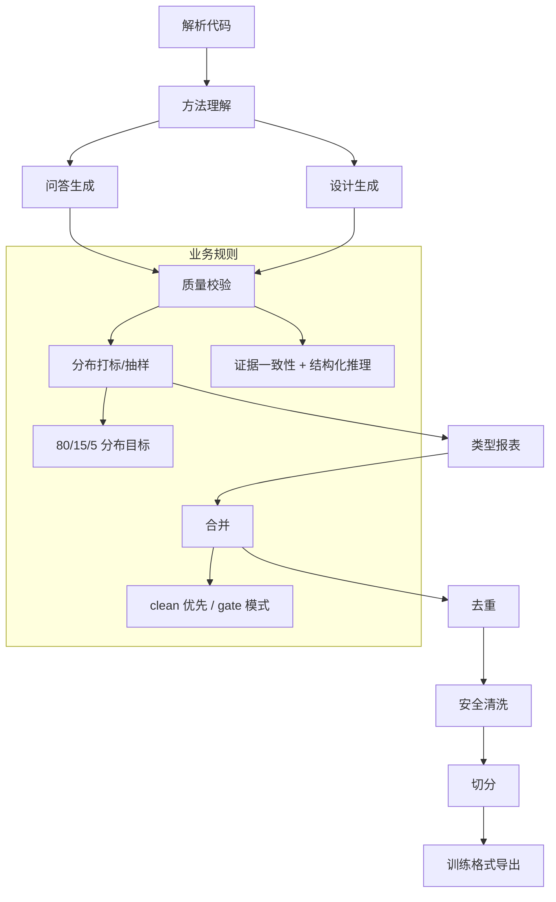

# 系统架构与原理

## 🌟 核心概念
>
> 就像生产线先有质检再出货，系统先抽取代码证据，再生成样本，并用质量与分布规则把关。

核心理念：**“证据可追溯、质量可控、分布可解释”**。

## 📋 运作基石（必要元数据）

- **涉及领地 (Code Context)**：
  - Pipeline 编排：`src/pipeline/orchestrator.py`, `src/pipeline/base_step.py`
  - 解析与证据：`src/pipeline/steps/parse.py`, `src/parser/*`
  - 方法理解：`src/pipeline/steps/method_understanding.py`, `src/engine/generators/method_profile/understander.py`
  - 问答生成：`src/pipeline/steps/question_answer.py`, `src/engine/generators/qa_rule/`
  - 设计生成：`src/pipeline/steps/design_generation.py`, `src/engine/generators/arch_design/`
  - 核心引擎：`src/engine/core/` (`BaseGenerator`, `LLMClient`), `src/engine/rag/` (`Retriever`)
  - 质量与分布：`src/pipeline/steps/validation.py`, `src/utils/data/sampling.py`
  - 后处理与导出：`merge.py`, `deduplication.py`, `secrets_scan.py`, `split.py`, `export.py`

- **执行准则 (Business Rules)**：
  - 每条样本必须带证据引用 `evidence_refs`，并与代码符号一致。
  - 质量校验会产出 clean 分支，合并时优先使用 clean。
  - 分布控制按多样性配置目标抽样，并输出分布报表与回归告警。
  - 推理记录结构化输出（observations/inferences/assumptions），用于质量审计。
  - **Prompt 合约**：通过 `BaseGenerator` 统一编排“角色定义 + 通用规则 + 场景模板”。

- **参考证据**：
  - `data/raw/extracted/symbols.jsonl` 与 `repo_commit` 用于一致性校验。

## 🛠️ 逻辑流向

### 1. 核心工作流：高质量问答对生成

本系统通过一个精密的、分阶段的流程来生成高质量且可追溯的问答（QA）训练样本。其核心思想是“先理解、再提问、最后基于证据回答”。

1. **静态解析，建立索引 (`CodeSymbol`)**
    - **过程**：首先，系统通过静态分析（非 LLM）扫描整个代码库，将每个类、方法等解析成一个结构化的 `CodeSymbol` 对象，并建立索引。
    - **证据**：此过程由 `src/parser/` 中的解析器完成，其数据结构在 `src/schemas/` 中定义，并被 `docs/DATA_MODEL.md` 详细记录。

2. **LLM 生成方法摘要 (`MethodProfile`)**
    - **过程**：对于解析出的关键方法，系统调用一个 LLM，让其扮演“代码分析专家”，为方法生成一份结构化的“摘要”（`MethodProfile`），其中包含业务规则、依赖关系等深度语义。
    - **证据**：`src/engine/generators/method_profile/understander.py` 配合 `configs/prompts/method_profile/system.txt` 与 `user.txt` 完成此任务。

3. **基于摘要生成问题 (`Question-First`)**
    - **过程**：系统利用上一步生成的 `MethodProfile`（摘要），再次调用 LLM，让其扮演“技术培训专家”，围绕摘要中的要点生成多样化、有深度且分布可控的问题。
    - **证据**：`src/engine/generators/qa_rule/question_generator.py` 使用 `configs/prompts/qa_rule/gen_q_user.txt` 模板，并从 `configs/language/` 获取语言相关的约束规则。

4. **RAG 检索上下文 (`Context`)**
    - **过程**：在回答问题时，系统**不会**使用之前的摘要。相反，它会启动一个 RAG（检索增强生成）流程，根据问题，通过直接证据、向量搜索和调用链分析等方式，从代码库中重新检索最相关的**源码原文**，拼接成上下文。
    - **证据**：`src/engine/rag/retriever.py` 提供了统一的检索逻辑，包括基于 Tree-sitter 的调用链扩展（`expand_call_chain`）和跨层级平衡。

5. **基于证据生成答案 (`Evidence-Based Answers`)**
    - **过程**：最后，系统将问题和检索到的源码上下文一起交给 LLM，并用一份极其严格的 Prompt “合同”来强迫它必须基于源码回答，且在结构化的 `thought`（思考过程）中引用具体的代码证据（`evidence_refs`）。
    - **证据**：`configs/prompts/qa_rule/gen_a_user.txt` 配合 `configs/prompts/common/json_rules.txt` 强制要求输出格式。`answer_generator.py` 会对结果进行解析与二次校验。

6. **自动化质量门禁 (`Quality Gates`)**
    - **过程**：在流程的每一步，系统都会进行自动化校验。例如，答案是否引用了有效的证据、JSON 格式是否正确等。不符合质量要求的样本会被拒绝，并记录在案。
    - **证据**：`docs/pipeline/05-validation-step.md` 中描述了独立的验证步骤，同时在各个 `generator` 中也包含了大量的错误处理和校验逻辑。

### 2. 核心工作流：体系化设计方案生成

Design方案模拟一个架构师接到需求后，被要求基于现有代码库进行改造或新增功能的设计过程。

1. **混合式问题来源 (Top-Down & Bottom-Up)**
    - **过程**: 设计问题的来源是多样的。一方面，可以由用户在 `configs/user_inputs/design_questions.yaml` 中定义明确的、自上而下的设计任务（Top-Down）。另一方面，系统也能基于对现有代码的分析，自动生成与当前架构相关的设计问题（Bottom-Up）。
    - **证据**: `src/engine/generators/arch_design/question_generator.py` 负责从代码符号（`CodeSymbol`）和可选的方法摘要（`MethodProfile`）中获取灵感。

2. **广域RAG，检索架构上下文**
    - **过程**: 收到一个设计问题后，`design_generator` 会进行一个广域的RAG检索。它通过关键字匹配和架构分层规则（如Controller、Service），从整个代码库中筛选出一组最相关的代码片段，共同组成回答该设计问题所需的“架构上下文”。
    - **证据**: `src/engine/generators/arch_design/design_generator.py` 集成了 `Retriever`，通过对各分层组件的评分与调用链分析来确定证据集合。

3. **基于约束与证据生成方案**
    - **过程**: LLM会获取到设计问题、以及上一步检索到的架构上下文。它被要求扮演一个“架构师”，在遵循 `configs/user_inputs/architecture_constraints.yaml` 中定义的架构约束的前提下，给出一份包含“现状分析”、“方案概述”、“风险权衡”等多个部分的结构化设计文档。
    - **证据**: `configs/prompts/arch_design/gen_s_user.txt` 结合语言 Profile 中的 `arch_design_role` 指导 LLM 输出。

4. **严格的方案合理性校验**
    - **过程**: 系统会对LLM输出的方案进行严格的自动化校验。这不仅包括检查 `evidence_refs` 是否真实有效，还会检查方案 `answer` 的文本中是否包含了所有被要求的设计章节。
    - **证据**: `src/engine/design_generator.py` 中的 `_validate_sample` 方法负责执行这些检查。

## 详细实现文档

- 详细的步骤API: `docs/pipeline/00-orchestrator-and-step-api.md`
- 各阶段具体实现: 请查阅 `docs/pipeline/` 目录下的其他分步文档。
