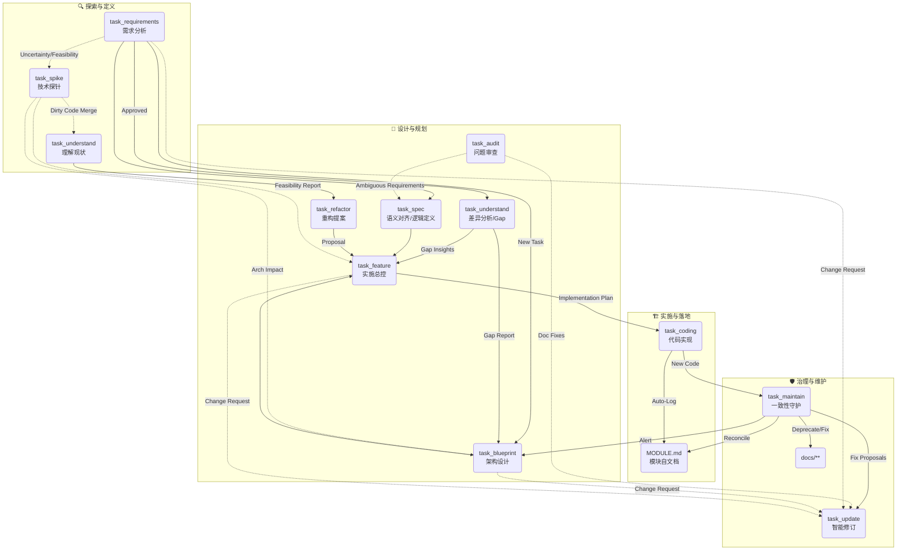

# AI 辅助开发工作流 (AI-Assisted Development Workflow)

> **Philosophy**: **Doc as Code**.
> 文档是代码的快照与契约。我们通过一系列标准化的任务，确保文档与代码的**双向一致性**，并利用 Agent 实现模块的**自描述**与**自维护**。

## 🌐 上下文流转图 (Context Flow)

这是一个基于“领域驱动”和“代码为王”的闭环系统。

## 📂 任务清单 (Task Catalog)

任务定义位于 `workflow_core/tasks/`。所有文档均采用 **Domain-Centric** Naming Law (`docs/{Features}/{Domain}/{Intent}.md`)。

### 核心生产流 (Production)

| 任务文件                                                             | 角色 (Role) | 目标 (Goal)                                                     |
| :------------------------------------------------------------------- | :---------- | :-------------------------------------------------------------- |
| **[task_understand](workflow_core/tasks/task_understand.md)**     | 探险家      | **[双模式]** 生成地图 (Map Mode) 或 差异分析 (Gap Mode)。 |
| **[task_requirements](workflow_core/tasks/task_requirements.md)** | 分析师      | 产出结构化 PRD。                                                |
| **[task_spike](workflow_core/tasks/task_spike.md)**               | 起草人      | 技术可行性验证 (Doc + Sandbox Code)。                           |
| **[task_blueprint](workflow_core/tasks/task_blueprint.md)**       | 架构师      | 基于 Gap Analysis 设计架构方案。                                |
| **[task_feature](workflow_core/tasks/task_feature.md)**           | TDD 专家    | **[总控]** 实施计划 (含熔断检查与模式选择)。              |
| **[task_spec](workflow_core/tasks/task_spec.md)**                 | 精算师      | **[立法]** 业务逻辑去模糊化与公式定义。                   |
| **[task_coding](workflow_core/tasks/task_coding.md)**             | 工程师      | **[执行]** 编码 + **自动维护 MODULE.md**。          |

### 治理与维护流 (Governance)

| 任务文件                                                     | 负责角色 | 描述                                                 |
| :----------------------------------------------------------- | :------- | :--------------------------------------------------- |
| **[task_refactor](workflow_core/tasks/task_refactor.md)** | 精修师   | 产出重构提案。                                       |
| **[task_audit](workflow_core/tasks/task_audit.md)**       | 找茬员   | 深度审计与 Arch Rule 检查。                          |
| **[task_update](workflow_core/tasks/task_update.md)**     | 编辑     | **[智能]** 带影响分析与回滚机制的文档修订。    |
| **[task_maintain](workflow_core/tasks/task_maintain.md)** | 守护者   | **[校准]** Code-First 双向一致性修复与初始化。 |

## �🚀 关键机制 (Key Mechanisms)

### 1. 模块自文档化 (Module Self-Documentation)

- **MODULE.md**: 每个业务模块根目录下的“简历”。
- **Auto-Update**: `Coding Task` 结束时，Agent 会自动：
  - 更新 Public API 签名。
  - 追加 **Distributed Changelog**（标注跨模块的 Trigger 关系）。

### 2. 一致性校准 (Code-First Reconciliation)

- **Maintain Task** 拥有最高裁决权：**代码是唯一的真理来源**。
- **Jurisdiction**: 仅维护存续性文档 (Living Docs)。Feature/Blueprint 等事务性文档 (Transactional Docs) 视为历史档案，只读不改。
- **Living Docs 定义**: 以代码为准、可被持续校准的“运行时知识文档”
- **Living Docs 具体内容**:
  - **模块契约**（`src/**/MODULE.md`）：模块职责、Public Interface 列表、依赖边界、变更日志。
  - **系统地图**（`docs/system_maps/**`）：核心业务流程图、数据流/控制流、关键调用链路、模块依赖关系。
  - **API 索引**（`docs/system_maps/api_catalog.md`）：服务/模块 API 清单、用途说明、所属模块、调用方。
  - **数据模型**（`docs/system_maps/data_model.mermaid`）：核心实体、字段关系、约束/关联。
  - **架构红线**（`ARCH_RULES.md`）：分层规则、依赖约束、禁止调用清单。
  - **审计与漂移报告**（`docs/audits/**`）：与代码不一致的点、风险项、修正建议。

### 3. 模式化执行 (Mode-Based Execution)

Coding Task 根据风险等级强制分为三种模式，通过 Prompt 约束 Agent 行为：

- **Safety Mode (默认)**: 严禁修改配置和接口，仅允许写业务逻辑。
- **Pragmatic Mode**: 允许受控的配置变更（需注释）。
- **Refactor Mode**: 仅允许代码清理和重构，严禁变更业务逻辑。

### 4. 人类审批门禁 (Human-in-the-Loop)

任何外部动作执行、以及代码合并都必须经过审阅者确认。

Copyright (c) 2026 Shili Wu
