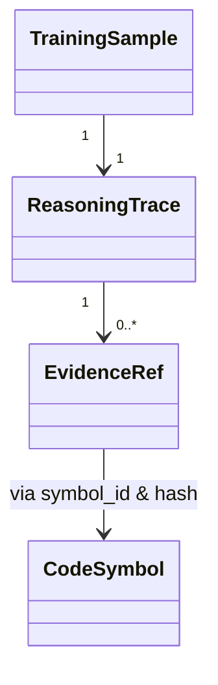

# Schema Design

本文档解释本项目核心数据结构（`src/utils/schemas.py`）的设计目标与跨模块契约。

## 🔹 核心理念
1.  **Evidence-first (证据优先)**: 所有 Reasoning 必须锚定到具体的 `source_hash`，确保数据可追溯、可验证。
2.  **Structured Trace (结构化推理)**: 区分 Observation, Inference, Assumption，避免不可控的 CoT。
3.  **Stability (稳定性)**: 使用 Content-based Hashing 作为 Sample ID，确保多次运行的 ID 稳定性。

## 📂 模块导航

详细的字段定义早已拆分为独立文档，请按需查看：

*   [**Core Models**](schemas/core_models.md): `CodeSymbol`, `EvidenceRef`, `TrainingSample` 等流转全链路的核心对象。
*   [**Generation Models**](schemas/generation_models.md): `MethodProfile`, `QuestionSample`, `DesignQuestion` 等生成过程中的中间对象。
*   [**Reports**](schemas/reports.md): `CoverageReport`, `ParsingReport` 等统计报表结构。

## 📊 数据流与工件映射

### 核心关系图

### 文件映射表
| 文件路径 | 对应 Schema | 说明 |
|---|---|---|
| `extracted/symbols.jsonl` | `CodeSymbol` | 代码静态分析产物 |
| `intermediate/*_raw.jsonl` | `TrainingSample` | 原始生成样本 |
| `final/*_sft.jsonl` | `messages` dict | 最终训练格式 (SFT) |
| `intermediate/method_profiles.jsonl` | `MethodProfile` | 方法语义理解 |
