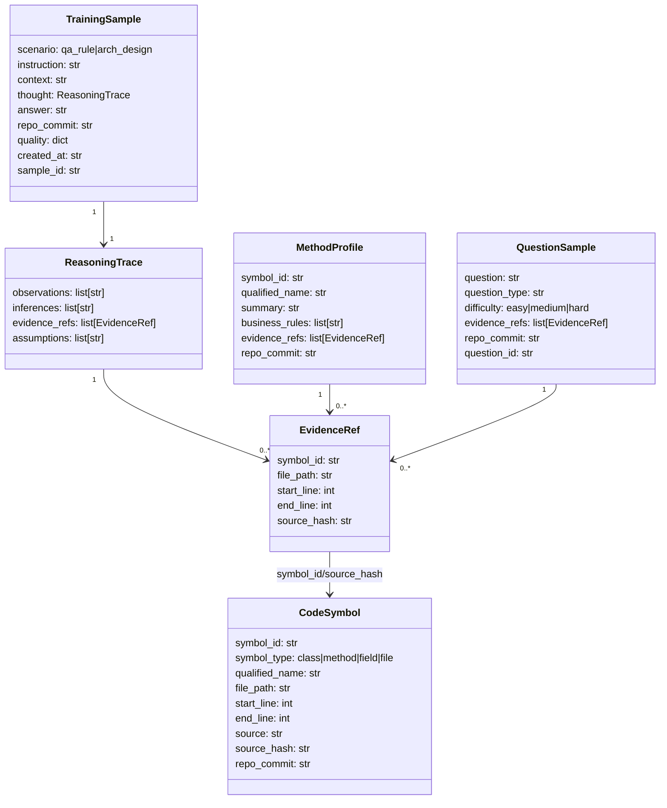

# Schema Design Doc (Pydantic Models)

本文档解释本项目核心数据结构（`src/utils/schemas.py`）的设计目标、字段语义、生成/消费位置与跨模块契约。其用途是帮助理解训练数据如何被**解析、生成、校验、切分、导出**，并作为后续设计演进（质量 gate、契约统一）的基准。

---

## 章节与重点内容

- Architecture Overview：Schema 在 pipeline 中的位置、与文件工件（artifacts）的映射
- Design Patterns：Evidence-first、结构化推理（非自由文本 CoT）、稳定主键与可验证性
- Data Flow：从 Repo → `CodeSymbol` → `TrainingSample` → SFT 导出
- Modular Detail：逐项 schema 注解（字段含义、约束、生产者/消费者、常见坑）
- Trade-offs：可验证性 vs 成本、trace 字段的训练安全、稳定性与扩展性

---

## Architecture Overview

### Schema 与工件（Artifacts）映射

| Artifact 文件 | 每行/每条对象类型 | 主要生产者 | 主要消费者 |
|---|---|---|---|
| `data/raw/extracted/symbols.jsonl` | `CodeSymbol` | `ParseStep` → parser | QA/Design/Auto 引擎、Validation、Split |
| `data/intermediate/*_raw.jsonl` | `TrainingSample`（dict 形态） | `DesignGenerator` / `AnswerGenerator` | Validation、Merge、Dedup、Safety、Split、Export |
| `data/intermediate/method_profiles.jsonl` | `MethodProfile` | `AutoMethodUnderstander` | Auto QA（问/答）、Auto Design Questions（可选） |
| `data/intermediate/questions.jsonl` | `QuestionSample` | `AutoQuestionGenerator` | `AnswerGenerator` |
| `data/final/*_sft.jsonl` | SFT messages（dict） | `ExportStep` | 训练框架/微调脚本 |

### 核心关系图

---

## Design Patterns

### 1) Evidence-first（证据优先）

样本中的 `thought.evidence_refs` 不是“可选装饰”，而是数据质量与可验证性的核心契约：

- Validation 会用 `symbols.jsonl` 校验 `symbol_id/source_hash/file_path/line` 一致性
- Split 会用 evidence 指向的代码位置做分组，降低 train/val/test 泄漏风险
- Export 会把 evidence_refs 放入 metadata，便于审计/评测

### 2) 结构化推理（非自由文本 CoT）

`ReasoningTrace` 把推理拆成 observations/inferences/assumptions，并强制 evidence_refs 单独存储，避免把“隐式推理”训练成模型输出。

### 3) 稳定主键与哈希校验

- `CodeSymbol.symbol_id`：稳定引用键
- `CodeSymbol.source_hash` / `EvidenceRef.source_hash`：用来检验“引用的证据是否与符号一致”
- `TrainingSample.sample_id`：基于内容生成的轻量稳定 ID（用于去重/索引/统计）

---

## Data Flow（从 Request 到 Storage/DB）

> 本项目是离线 pipeline，因此 “DB” 等价于文件系统上的 JSON/JSONL 工件。

1. Parse：Repo → `CodeSymbol` → `symbols.jsonl`
2. Generate：`symbols.jsonl` → `TrainingSample` → `*_raw.jsonl`
3. Validate：`symbols.jsonl` + `*_raw.jsonl` → quality reports + rejected
4. Post-process：Merge/Dedup/Safety → `all_dedup.jsonl`
5. Split：`all_dedup.jsonl` + `symbols.jsonl` → train/val/test
6. Export：split → `*_sft.jsonl`（messages + metadata）

---

## Modular Detail（逐项 Schema 注解）

以下说明以 `src/utils/schemas.py` 为准。

### Helper: `sha256_text(text: str) -> str`

- 作用：计算 SHA256（hex）用于 `source_hash` 与各类 *id 的派生。
- 约束：输入是**实际落盘/校验使用的文本**（例如 `CodeSymbol.source` 若被截断，则 hash 对应截断后的内容）。
- 影响面：Evidence 校验、样本/问题 ID 生成、数据一致性审计。

### Helper: `now_iso() -> str`

- 作用：生成 UTC ISO 时间戳，用于 `created_at`。
- 约束：仅用于元数据，不参与数据一致性校验。

---

### Schema: `Annotation`

用途：抽象“语言层面的标记”，当前主要服务于 Java（注解），并被候选选择/评分逻辑使用。

字段注解：

- `name`：注解名（例如 `Transactional`）。建议存储**去掉 @ 的规范名**（当前实现即如此）。
- `arguments`：注解参数（结构化字典，可为空）。
- `raw_text`：注解原文（便于 debug/审计）。

生产者/消费者：

- 生产者：parser（Java/Python）在构造 `CodeSymbol.annotations` 时填充
- 消费者：QA/Auto 候选评分、语言 profile markers 匹配

---

### Schema: `CodeSymbol`

用途：代码证据的标准化单位（类/方法/字段/文件）。训练数据中所有证据引用最终都应指向某个 `CodeSymbol`。

字段注解：

- `symbol_id`：稳定主键，格式约定为 `{file_path}:{qualified_name}:{start_line}`（`make_symbol_id()`）。
  - 契约：后续 `EvidenceRef.symbol_id` 必须可在 symbols_map 中命中。
- `symbol_type`：`class|method|field|file`。
  - 契约：Question/Answer 模块候选通常只选 `method`；Design 可能使用 class/method/file 组合拼上下文。
- `name` / `qualified_name`：用于检索、分层识别、分组切分。
  - Split 的 `group_by=package` 从 `qualified_name` 提取包前缀。
- `file_path`：相对路径；用于证据定位与 split 的 `group_by=path`。
- `start_line` / `end_line`：1-based 行号区间；用于证据定位与“可疑大范围”警告。
- `source`：源码片段（允许截断）；用于 prompt context 与证据审计。
- `doc`：注释/JavaDoc（可为空）；用于候选评分与更好问题生成。
- `annotations`：标记列表；用于候选评分/规则匹配。
- `metadata`：扩展字段容器；用于语言特定信息或 parser 附加信息（例如类层级、装饰器等）。
- `repo_commit`：符号所属仓库版本。
  - 契约：`TrainingSample.repo_commit` 应与其证据符号一致（UNKNOWN 情况除外）。
- `source_hash`：`sha256(source)`。
  - 契约：`EvidenceRef.source_hash` 必须与此匹配，用于防止“证据漂移/错指”。

派生字段：

- `line_count`：`end_line - start_line + 1`（computed_field）。

生产者/消费者：

- 生产者：`ParseStep`（经 JavaParser/PythonParser）
- 消费者：所有生成引擎、Validation、Split（分组 key）、Export（间接通过 evidence_refs）

---

### Schema: `EvidenceRef`

用途：用最小字段指向“可验证的代码证据片段”。它是 TrainingSample/MethodProfile/QuestionSample 的共同依赖。

字段注解：

- `symbol_id`：引用目标 `CodeSymbol.symbol_id`。
- `file_path`：冗余字段（与 symbol 对齐），用于直接显示与校验。
- `start_line` / `end_line`：引用范围（通常可与 symbol 的范围一致或是子集）。
- `source_hash`：必须匹配 `CodeSymbol.source_hash`，作为一致性校验关键。

生产者/消费者：

- 生产者：QA/Design/Auto 引擎在生成样本时填充；MethodProfile/QuestionSample 也可填充
- 消费者：Validation（强校验）、Split（分组锚点）、Export（metadata 审计）

---

### Schema: `ReasoningTrace`

用途：结构化表达“推理痕迹”，并显式绑定证据引用；避免自由文本 CoT 直接进入训练输出。

字段注解：

- `observations`：从代码上下文观察到的事实（应可被 evidence_refs 支撑）。
- `inferences`：由 observations 推导出的结论/解释。
- `evidence_refs`：证据引用列表（建议至少 1 条；Design 通常 >=2）。
- `assumptions`：无法从代码直接验证的假设（对可移植性/风险说明有价值）。

方法：

- `is_empty()`：用于快速判定是否缺失推理痕迹（质量 gate 常用）。

生产者/消费者：

- 生产者：QA/Design/Auto 引擎输出
- 消费者：Validation（证据校验）、Export（metadata）、Split（分组）

---

### Schema: `TrainingSample`

用途：统一表达两类训练样本（QA 与架构设计），是 pipeline 的“核心业务对象”。

字段注解：

- `scenario`：枚举 `qa_rule | arch_design`。
  - 契约：Split 使用该字段分流 QA/Design 子集。
- `instruction`：问题/指令（用户侧输入）。
- `context`：代码上下文（通常包含若干 `CodeSymbol.source` 拼接）。
- `thought`：`ReasoningTrace`（结构化推理 + 证据）。
- `answer`：最终答案/方案输出。
- `repo_commit`：样本所属仓库版本（应与 evidence 指向符号版本一致）。
- `quality`：质量评估与 gate 结果容器（Validation 的输出不会回填到 raw，目前为后续演进预留）。
- `created_at`：生成时间戳。
- `sample_id`：若为空则自动生成：`sha256(f"{scenario}:{instruction}:{context[:100]}")[:16]`。
  - 设计意图：轻量稳定索引，便于去重/统计/排查。
  - 注意：不是强唯一（截断 context），但在训练数据规模下通常足够。

生产者/消费者：

- 生产者：`DesignGenerator` / `AnswerGenerator`
- 消费者：Validation、Dedup（基于 instruction+answer）、Safety（扫描 context+answer）、Split、Export

---

### Schema: `ParsingReport`

用途：记录解析过程统计与错误信息；便于诊断 parser 覆盖率与失败原因。

字段注解（摘录）：

- `repo_path` / `repo_commit`：解析对象定位。
- `total_files/parsed_files/failed_files`：解析覆盖率。
- `total_symbols/symbols_by_type`：符号产出分布。
- `errors`：失败文件与错误详情。
- `parsing_time_seconds`：性能指标。
- `created_at`：生成时间。

生产者/消费者：

- 生产者：parser/base（或未来 ParseStep 扩展）
- 消费者：报告输出、调试与性能分析

---

### Schema: `MethodProfile`（Question/Answer 模块）

用途：方法级理解的中间表示（可视为“可检索的语义文档”），支撑 Auto QA 与自动设计问题增强。

字段注解（核心）：

- `symbol_id/file_path/qualified_name`：与 CodeSymbol 对齐，作为索引主键与审计定位。
- `summary`：方法摘要（用于 embedding 与 prompt）。
- `business_rules`：抽取出的业务规则（用于问题生成与答案对齐）。
- `inputs/outputs/side_effects/error_handling/consistency/dependencies`：结构化语义特征，帮助生成更具体的问题与设计建议。
- `evidence_refs`：证据引用（可选，但建议至少包含方法自身）。
- `repo_commit/tags/created_at`：元数据。

生产者/消费者：

- 生产者：`AutoMethodUnderstander`
- 消费者：`vector_index.build_embeddings`、`AutoQuestionGenerator`、Auto Design Questions（可选）

---

### Schema: `QuestionSample`（Question/Answer 模块）

用途：在“问题生成”与“答案生成”之间的桥接对象，承载问题类型与难度等标签。

字段注解：

- `question`：问题文本。
- `question_type`：分类标签（用于多样性控制与分析）。
- `difficulty`：`easy|medium|hard`（用于分层评估/采样）。
- `evidence_refs`：与问题直接相关的证据（可选，但建议包含方法本体）。
- `repo_commit/created_at`：元数据。
- `question_id`：若为空则自动生成：`sha256(f"{question}:{question_type}")[:16]`。

生产者/消费者：

- 生产者：`AutoQuestionGenerator`
- 消费者：`AnswerGenerator`

---

## Trade-offs

### 1) 可验证性 vs 生成成本

强制 evidence_refs + source_hash 校验显著提升可审计性，但也要求生成引擎更严格地挑选/携带证据（prompt 设计与输出解析更复杂）。

### 2) 结构化推理 vs 训练安全

`ReasoningTrace` 的存在主要用于：

- 数据集质量评估（证据链是否完整）
- Debug 与离线分析

而默认导出时不把 thought 写入 assistant content，避免“训练模型输出推理过程”的风险（见 `src/utils/exporter.py` 的导出策略）。

### 3) 可扩展性

`metadata` / `quality` 等 dict 容器为演进预留空间，但也会带来“字段不受控”的风险；建议对关键扩展字段逐步 schema 化，或在质量 gate 中加入严格校验。

