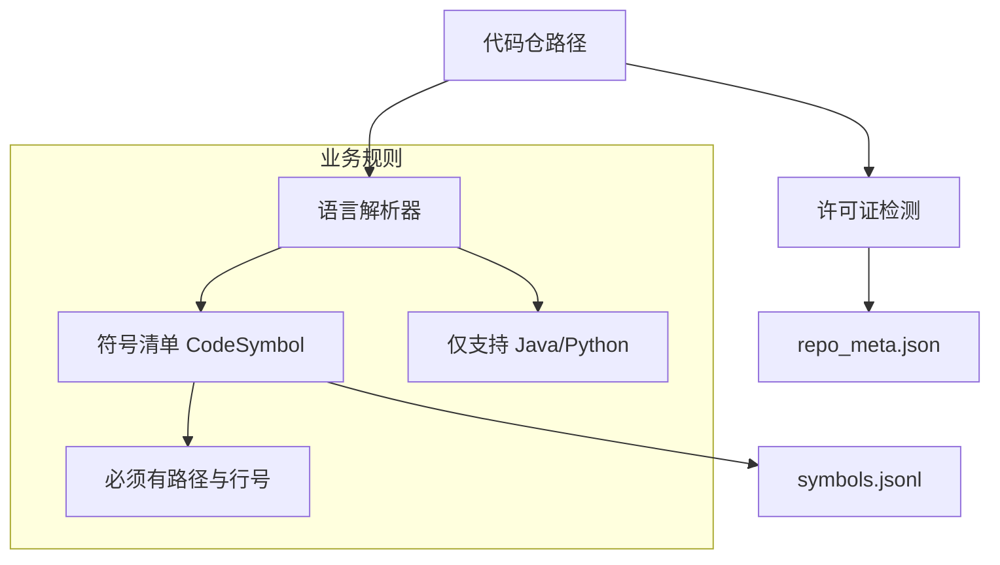

# 代码解析与符号提取

## 🌟 核心概念：像“整理货架”一样
> 就像把仓库的货按类别摆好，系统先把代码切成一件件“可识别的零件”，为后续生成提供标准素材。

## 📋 运作基石（必要元数据）

- **涉及领地 (Code Context)**：
  - `src/pipeline/steps/parse.py`
  - `src/parser/java_parser.py`
  - `src/parser/python_parser.py`
  - `src/utils/schemas.py`（CodeSymbol）
  - `src/utils/safety.py`（license 检测）
  - `configs/launch.yaml`

- **执行准则 (Business Rules)**：
  - 只解析已支持语言（当前为 Java / Python）。
  - 每个符号都要有 `symbol_id / file_path / line_range / source_hash`。
  - 解析结果必须与 `repo_commit` 对齐，便于后续证据追溯。
  - 输出包含许可证信息，便于合规审计。

- **参考证据**：
  - 解析产物写入 `data/raw/extracted/symbols.jsonl` 与 `data/raw/repo_meta/repo_meta.json`。

## ⚙️ 仪表盘：我该如何控制它？

| 配置参数 | 业务名称 | 调节它的效果 | 专家建议 |
| :--- | :--- | :--- | :--- |
| `repo.path` | 代码仓路径 | 指定要解析的仓库 | 指向目标仓库 |
| `repo.commit` | 版本定位 | 固定解析版本 | 为空则自动获取 |
| `language.name` | 语言选择 | 选择 Java / Python | 与代码一致 |
| `language.profile_dir` | 语言规则目录 | 解析规则与标记来源 | 保持默认 |
| `output.raw_dir` | 符号输出目录 | symbols.jsonl 输出路径 | data/raw/extracted |
| `output.repo_meta_dir` | 仓库信息目录 | repo_meta.json 输出路径 | data/raw/repo_meta |

## 🛠️ 它是如何工作的（逻辑流向）

## 🧩 解决的痛点与带来的改变

- **以前的乱象**：后续生成缺少统一证据来源，难以追溯。
- **现在的秩序**：所有问题与回答都引用同一份“符号清单”。

## 💡 开发者笔记

- 解析结果会随 repo_commit 变化；缓存命中时可跳过解析。
- 解析质量直接影响后续证据一致性。
