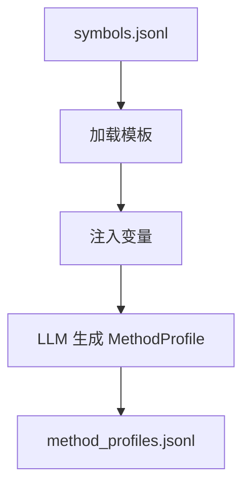
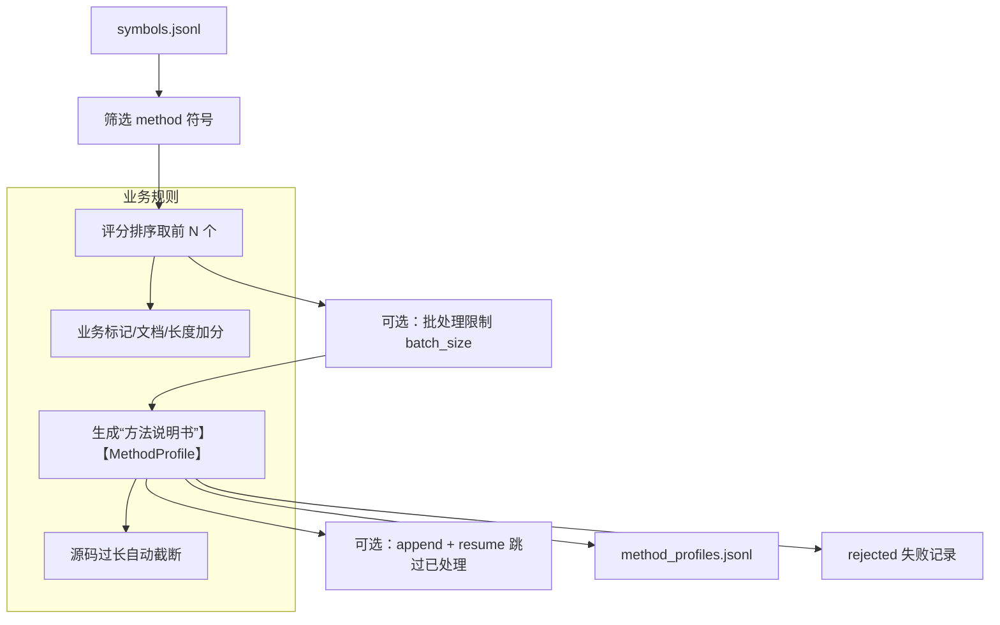

# 方法理解（Method Understanding）

## 🌟 核心概念：像“给每个方法做说明书”一样
> 就像产品要先写说明书，系统会先为关键方法生成“可读摘要”，后续问答与设计都能直接用。

## 📋 运作基石（必要元数据）

- **涉及领地 (Code Context)**：
  - `src/pipeline/steps/method_understanding.py`
  - `src/engine/auto_method_understander.py`
  - `configs/launch.yaml`
  - `configs/prompts/method_understanding/auto_method_understanding.txt`
  - `configs/language/*`（业务标记规则）

- **执行准则 (Business Rules)**：
  - 只选择 `method` 类型符号。
  - 候选方法按“业务标记、文档、合适长度”加权评分，取前 N 个。
  - 源码过长会截断，保证上下文长度可控。
  - 输出包含 `evidence_refs`，后续回答可直接引用。
  - 启用批处理时仅处理 `batch_size` 上限；可选追加写入与跳过已处理方法。

- **参考证据**：
  - 方法来源于 `symbols.jsonl`，并附带 `repo_commit`、文件路径与行号信息。

## ⚙️ 仪表盘：我该如何控制它？

| 配置参数 | 业务名称 | 调节它的效果 | 专家建议 |
| :--- | :--- | :--- | :--- |
| `method_understanding.enabled` | 方法理解开关 | 是否执行该步骤 | demo 开启 |
| `method_understanding.max_methods` | 方法候选上限 | 控制抽取多少个方法 | 小仓库 10~30 |
| `method_understanding.prompts.generation` | 生成模板 | 控制“说明书”的结构 | 保持默认 |
| `core.max_context_chars` | 源码上限 | 截断过长方法 | 16000 |
| `method_understanding.batching.enabled` | 批处理开关 | 单次运行只处理一小批 | demo 视机器开启 |
| `method_understanding.batching.batch_size` | 单次处理上限 | 缩短每次运行时间 | 50 |
| `method_understanding.batching.output_mode` | 输出模式 | overwrite 或 append | overwrite |
| `method_understanding.batching.resume` | 追加跳过 | append 时跳过已处理 | false |
| `artifacts.method_profiles_jsonl` | 方法说明书输出 | 结构化摘要输出路径 | 默认即可 |
| `artifacts.auto_method_understanding_rejected_jsonl` | 失败记录 | 失败原因审计 | 默认即可 |

## Prompt 说明（模板角色）

### 模板：`configs/prompts/method_understanding/auto_method_understanding.txt`

#### 🌟 核心概念
> 就像给每个方法写“工作简历”一样，让后续问答与设计有统一的事实底稿。

#### 📋 运作基石（元数据与规则）
- **存放位置 (Loading Point)**：`configs/prompts/method_understanding/auto_method_understanding.txt`
- **工序位置 (Step)**：MethodUnderstandingStep（方法理解阶段）
- **变量注入**：`symbol_id`、`file_path`、`qualified_name`、`annotations`、`javadoc`、`source_code`、`start_line`、`end_line`、`source_hash`、`repo_commit`
- **核心准则**：
  - 必须输出严格 JSON（禁止 Markdown 与额外说明）
  - `evidence_refs` 必须逐字复制输入值
  - 摘要与规则条目要求简洁、可落地
  - 输出字段固定，避免缺项
- **推理模式**：结构化信息抽取（按字段填充，避免自由发挥）

#### ⚙️ 仪表盘：我该如何控制它？

| 配置参数 | 业务直观名称 | 调节它的效果 | 专家建议 |
| :--- | :--- | :--- | :--- |
| `method_understanding.prompts.generation` | 方法理解模板 | 决定“简历”结构与字段 | 保持默认 |
| `core.max_context_chars` | 源码截断上限 | 过长源码会被截断 | 16000 |

#### 🛠️ 逻辑流向图 (Mermaid)

#### 🧩 解决的痛点
- **以前的乱象**：方法语义靠人工理解，信息不稳定。
- **现在的秩序**：每个方法都有结构化“简历”，可直接复用。

## 🛠️ 它是如何工作的（逻辑流向）

## 🧩 解决的痛点与带来的改变

- **以前的乱象**：问答与设计缺少“稳定摘要”，上下文难统一。
- **现在的秩序**：有一份统一的“方法说明书”，后续生成更稳定。

## 💡 开发者笔记

- 若 `method_profiles.jsonl` 缺失，Auto QA 会直接失败。
- 该步骤本身不写训练样本，只提供后续生成的“原材料”。
