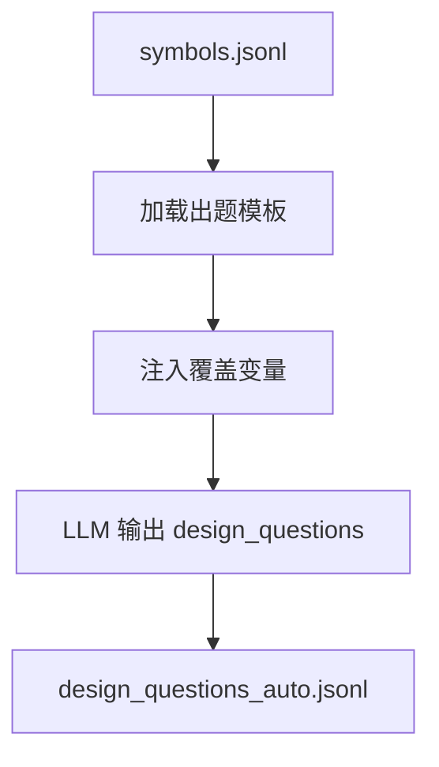
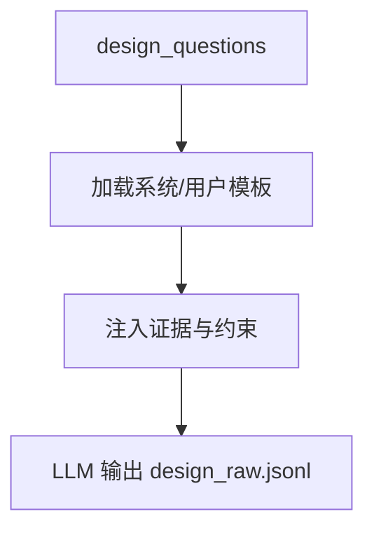
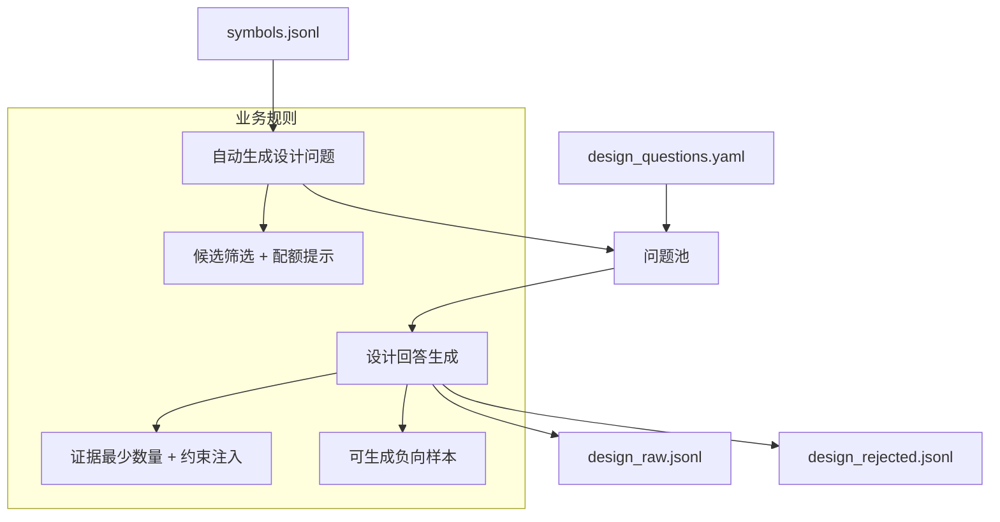

# 架构设计生成（Architecture Design Generation）

## 🌟 核心概念：像“设计评审题库”一样
> 就像设计评审会准备一组关键问题，系统会先生成设计问题，再输出可追溯的设计方案。

## 📋 运作基石（必要元数据）

- **涉及领地 (Code Context)**：
  - `src/pipeline/steps/design_generation.py`
  - `src/engine/auto_design_question_generator.py`
  - `src/engine/design_generator.py`
  - `configs/launch.yaml`
  - `configs/user_inputs/design_questions.yaml`
  - `configs/prompts/design/*`
  - `configs/user_inputs/design_scenario_templates.yaml`

- **执行准则 (Business Rules)**：
  - Auto 模式会从代码符号中筛选候选，生成设计问题；失败时回退到用户问题。
  - 设计回答必须包含证据引用并满足最少证据数要求。
  - 可启用“调用链扩展”召回相关方法（弱规则）。
  - 可注入架构约束与反例对比提示。
  - 支持负向样本（冲突说明/问题模糊等）。

- **参考证据**：
  - `symbols.jsonl` 与 `method_profiles.jsonl`（可选增强）。

## ⚙️ 仪表盘：我该如何控制它？

| 配置参数 | 业务名称 | 调节它的效果 | 专家建议 |
| :--- | :--- | :--- | :--- |
| `design_questions.max_questions` | 设计问题上限 | 控制总体规模 | 30 |
| `design_questions.user_questions_path` | 用户设计问题入口 | 回退时使用 | 默认即可 |
| `design_questions.use_method_profiles` | 方案增强 | 是否使用方法说明书 | true |
| `design_questions.profiles_top_k` | 方案增强数量 | 引用多少条方法摘要 | 20 |
| `design_questions.min_evidence_refs` | 最少证据数 | 设计样本证据下限 | 2 |
| `design_questions.batch_size` | 批量生成 | 生成问题的批次 | 5 |
| `design_questions.prompts.question_generation` | 设计出题模板 | 控制问题风格 | 默认即可 |
| `design_questions.prompts.user_prompt` | 设计回答模板 | 控制回答结构 | 默认即可 |
| `design_questions.retrieval.mode` | 检索模式 | hybrid / symbol_only | hybrid |
| `design_questions.retrieval.call_chain.enabled` | 调用链扩展 | 召回关联方法 | true |
| `design_questions.coverage.negative_ratio` | 负样本比例 | 反向场景占比 | 0.05 |
| `design_questions.coverage.negative_types` | 负样本类型 | 冲突/模糊问题 | 按需选 |
| `design_questions.coverage.diversity.question_type_targets` | 设计问题类型配额 | architecture/performance 等 | 保持默认 |
| `design_questions.coverage.scenario_injection.fuzzy_ratio` | 模糊设计问题比例 | 注入“模糊场景” | 0.15 |
| `design_questions.constraints.enable_counterexample` | 反例对比 | 要求“为何不选其他方案” | true |
| `design_questions.constraints.enable_arch_constraints` | 架构约束 | 引用约束清单 | true |
| `artifacts.design_questions_jsonl` | 设计问题输出 | auto 设计问题文件 | 默认即可 |
| `artifacts.design_rejected_jsonl` | 设计拒绝记录 | 失败样本日志 | 默认即可 |

## Prompt 说明（模板角色）

### 模板：`configs/prompts/design/auto_design_question_generation.txt` / `coverage_design_question_generation.txt`

#### 🌟 核心概念
> 就像“设计题库模板”一样，保证问题结构清晰、覆盖目标明确。

#### 📋 运作基石（元数据与规则）
- **存放位置**：`configs/prompts/design/auto_design_question_generation.txt`（基础）/ `coverage_design_question_generation.txt`（带覆盖约束）
- **工序位置**：DesignGenerationStep → DesignQuestionGenerator（Step 3a）
- **变量注入**：`language`、`coverage_bucket/intent/question_type`、`constraint_strength/constraint_rules`、`scenario_constraints`、`context`、`evidence_pool`、`max_design_questions`、`min_evidence_refs`
- **推理模式**：覆盖约束驱动的结构化出题
- **核心准则**：
  - 仅输出 JSON，必须包含 `design_questions` 列表
  - 证据必须来自 `evidence_pool`
  - 问题必须符合 bucket/intent/类型要求

#### ⚙️ 仪表盘：我该如何控制它？

| 配置参数 | 业务直观名称 | 调节它的效果 |
| :--- | :--- | :--- |
| `design_questions.prompts.question_generation` | 设计出题模板 | 控制问题结构 |
| `design_questions.prompts.coverage_generation` | 覆盖出题模板 | 启用覆盖约束 |
| `design_questions.coverage.*` | 覆盖与场景规则 | 控制 bucket/intent/场景注入 |

#### 🛠️ 逻辑流向图 (Mermaid)

#### 🧩 解决的痛点
- **以前的乱象**：设计问题来源单一、分布不可控。
- **现在的秩序**：设计问题有模板、有证据池、有覆盖目标。

---

### 模板：`configs/prompts/design/design_system_prompt.txt` + `design_user_prompt.txt`

#### 🌟 核心概念
> 就像“设计方案写作规范”一样，保证输出结构统一、证据可审计。

#### 📋 运作基石（元数据与规则）
- **存放位置**：`configs/prompts/design/design_system_prompt.txt`、`configs/prompts/design/design_user_prompt.txt`
- **工序位置**：DesignGenerationStep → DesignGenerator（Step 3b）
- **变量注入**：`design_question_id/goal/constraints/acceptance_criteria/non_goals`、`context`、`architecture_constraints`、`counterexample_guidance`、`controller_symbol_id`、`service_evidence`、`repo_commit`
- **推理模式**：证据锚定的结构化设计方案
- **核心准则**：
  - 仅输出 JSON（answer + thought）
  - answer 必须包含 6 个章节
  - evidence_refs 必须逐字复制提供的值

#### ⚙️ 仪表盘：我该如何控制它？

| 配置参数 | 业务直观名称 | 调节它的效果 |
| :--- | :--- | :--- |
| `design_questions.prompts.system_prompt` | 系统提示模板 | 固定答案结构 |
| `design_questions.prompts.user_prompt` | 用户提示模板 | 注入问题与证据 |
| `design_questions.constraints.*` | 反例/架构约束 | 强化审计性 |

#### 🛠️ 逻辑流向图 (Mermaid)

#### 🧩 解决的痛点
- **以前的乱象**：设计方案结构不一致、证据难追溯。
- **现在的秩序**：结构统一、证据明确、可审计。

## 🛠️ 它是如何工作的（逻辑流向）

## 🧩 解决的痛点与带来的改变

- **以前的乱象**：设计问题来源单一，缺少自动化覆盖。
- **现在的秩序**：自动问题 + 用户回退，既能扩展覆盖又能保持可控。

## 💡 开发者笔记

- Auto 设计问题生成失败会自动回退到用户问题，不会阻断流程。
- 调用链扩展为弱规则，适合 demo，不会强行改变证据结构。
