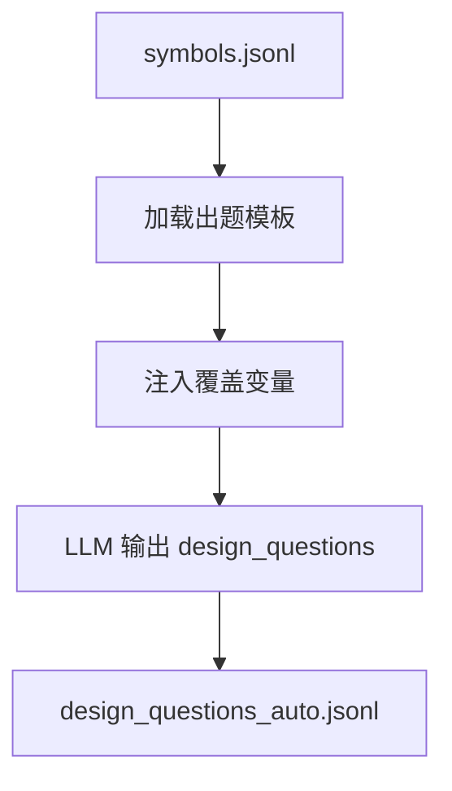
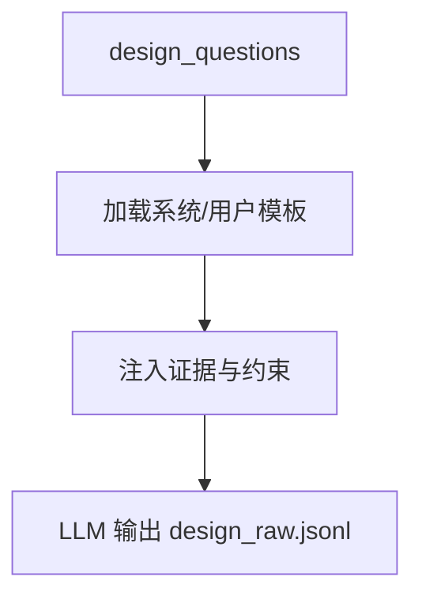

# 架构设计生成（Architecture Design Generation）

## 🌟 核心概念：像“设计评审题库”一样
> 就像设计评审会准备一组关键问题，系统会先生成设计问题，再输出可追溯的设计方案。

## 📋 运作基石（必要元数据）

- **涉及领地 (Code Context)**：
  - `src/pipeline/steps/design_generation.py`
  - `src/engine/auto_design_question_generator.py`
  - `src/engine/design_generator.py`
  - `configs/launch.yaml`
  - `configs/user_inputs/design_questions.yaml`
  - `configs/prompts/design/*`
  - `configs/user_inputs/design_scenario_templates.yaml`

- **执行准则 (Business Rules)**：
  - Auto 模式会从代码符号中筛选候选，生成设计问题；失败时回退到用户问题。
  - 设计回答必须包含证据引用并满足最少证据数要求。
  - 可启用“调用链扩展”召回相关方法（弱规则）。
  - 可注入架构约束与反例对比提示。
  - 支持负向样本（冲突说明/问题模糊等）。

- **参考证据**：
  - `symbols.jsonl`: 静态解析出的代码符号，是证据的最小单元。
  - `method_profiles.jsonl`: 由LLM生成的方法摘要，是 **RAG检索阶段的核心**，用于将高阶设计问题映射到具体的代码符号。

## ⚙️ 仪表盘：我该如何控制它？

| 配置参数 | 业务名称 | 调节它的效果 | 专家建议 |
| :--- | :--- | :--- | :--- |
| `design_questions.max_questions` | 设计问题上限 | 控制总体规模 | 30 |
| `design_questions.user_questions_path` | 用户设计问题入口 | 回退时使用 | 默认即可 |
| `design_questions.use_method_profiles` | 方案增强 | 是否使用方法说明书 | true |
| `design_questions.profiles_top_k` | 方案增强数量 | 引用多少条方法摘要 | 20 |
| `design_questions.min_evidence_refs` | 最少证据数 | 设计样本证据下限 | 2 |
| `design_questions.batching.batch_size` | 批量生成 | 单个 batch 的目标生成数 | 5 |
| `design_questions.batching.num_batches` | 批次数上限 | 最多发起多少个 batch | 50 |
| `design_questions.prompts.question_generation` | 设计出题模板 | 控制问题风格 | 默认即可 |
| `design_questions.prompts.user_prompt` | 设计回答模板 | 控制回答结构 | 默认即可 |
| `design_questions.retrieval.mode` | 检索模式 | hybrid / symbol_only | hybrid |
| `design_questions.retrieval.call_chain.enabled` | 调用链扩展 | 召回关联方法 | true |
| `design_questions.coverage.negative_ratio` | 负样本比例 | 反向场景占比 | 0.05 |
| `design_questions.coverage.negative_types` | 负样本类型 | 冲突/模糊问题 | 按需选 |
| `design_questions.coverage.diversity.question_type_targets` | 设计问题类型配额 | architecture/performance 等 | 保持默认 |
| `design_questions.coverage.scenario_injection.fuzzy_ratio` | 模糊设计问题比例 | 注入“模糊场景” | 0.15 |
| `design_questions.constraints.enable_counterexample` | 反例对比 | 要求“为何不选其他方案” | true |
| `design_questions.constraints.enable_arch_constraints` | 架构约束 | 引用约束清单 | true |
| `artifacts.design_questions_jsonl` | 设计问题输出 | auto 设计问题文件 | 默认即可 |
| `artifacts.design_rejected_jsonl` | 设计拒绝记录 | 失败样本日志 | 默认即可 |

**设计问题数量控制逻辑**：
- `design_questions.max_questions` 是总体上限。
- 当 `design_questions.batching.enabled = false`：单次调用按 `max_questions` 请求生成。
- 当 `design_questions.batching.enabled = true`：最多循环 `num_batches` 次，每批请求 `min(batch_size, remaining)`，总数上限仍是 `max_questions`；实际产出可能因解析失败或 goal 去重而小于目标值。

## Prompt 说明（模板角色）

### 模板：`configs/prompts/design/auto_design_question_generation.txt` / `coverage_design_question_generation.txt`

#### 🌟 核心概念
> 就像“设计题库模板”一样，保证问题结构清晰、覆盖目标明确。

#### 📋 运作基石（元数据与规则）
- **存放位置**：`configs/prompts/design/auto_design_question_generation.txt`（基础）/ `coverage_design_question_generation.txt`（带覆盖约束）
- **工序位置**：DesignGenerationStep → DesignQuestionGenerator（Step 3a）
- **变量注入**：`language`、`coverage_bucket/intent/question_type`、`constraint_strength/constraint_rules`、`scenario_constraints`、`context`、`evidence_pool`、`max_design_questions`、`min_evidence_refs`
- **推理模式**：覆盖约束驱动的结构化出题
- **核心准则**：
  - 仅输出 JSON，必须包含 `design_questions` 列表
  - 证据必须来自 `evidence_pool`
  - 问题必须符合 bucket/intent/类型要求

#### ⚙️ 仪表盘：我该如何控制它？

| 配置参数 | 业务直观名称 | 调节它的效果 |
| :--- | :--- | :--- |
| `design_questions.prompts.question_generation` | 设计出题模板 | 控制问题结构 |
| `design_questions.prompts.coverage_generation` | 覆盖出题模板 | 启用覆盖约束 |
| `design_questions.coverage.*` | 覆盖与场景规则 | 控制 bucket/intent/场景注入 |

#### 🛠️ 逻辑流向图 (Mermaid)

#### 🧩 解决的痛点
- **以前的乱象**：设计问题来源单一、分布不可控。
- **现在的秩序**：设计问题有模板、有证据池、有覆盖目标。

---

### 模板：`configs/prompts/design/design_system_prompt.txt` + `design_user_prompt.txt`

#### 🌟 核心概念
> 就像“设计方案写作规范”一样，保证输出结构统一、证据可审计。

#### 📋 运作基石（元数据与规则）
- **存放位置**：`configs/prompts/design/design_system_prompt.txt`、`configs/prompts/design/design_user_prompt.txt`
- **工序位置**：DesignGenerationStep → DesignGenerator（Step 3b）
- **变量注入**：`design_question_id/goal/constraints/acceptance_criteria/non_goals`、`context`、`architecture_constraints`、`counterexample_guidance`、`controller_symbol_id`、`service_evidence`、`repo_commit`
- **推理模式**：证据锚定的结构化设计方案
- **核心准则**：
  - 仅输出 JSON（answer + thought）
  - answer 必须包含 6 个章节
  - evidence_refs 必须逐字复制提供的值

#### ⚙️ 仪表盘：我该如何控制它？

| 配置参数 | 业务直观名称 | 调节它的效果 |
| :--- | :--- | :--- |
| `design_questions.prompts.system_prompt` | 系统提示模板 | 固定答案结构 |
| `design_questions.prompts.user_prompt` | 用户提示模板 | 注入问题与证据 |
| `design_questions.constraints.*` | 反例/架构约束 | 强化审计性 |

#### 🛠️ 逻辑流向图 (Mermaid)

#### 🧩 解决的痛点
- **以前的乱象**：设计方案结构不一致、证据难追溯。
- **现在的秩序**：结构统一、证据明确、可审计。

## 🛠️ 它是如何工作的（逻辑流向）

与QA对焦于“是什么”和“为什么”不同，Design方案旨在回答“如何做”。它模拟一个架构师接到需求后，被要求基于现有代码库进行改造或新增功能的设计过程。

### 深度解析：设计工作流中的 RAG (Retrieval-Augmented Generation)

`DesignGenerator` 的核心同样是 RAG 流程，但其侧重点与 QA 有所不同。它旨在将一个高阶、抽象的**设计目标**（如“实现幂等性”）转化为一份可执行、可追溯的**架构方案**。`MethodProfile` 在这个过程中扮演了提供深层语义信息的关键角色。

#### 阶段一：检索 (Retrieval) - “从设计目标到代码证据”

与 QA 流程类似，设计方案的生成也始于一个严格的“寻找证据”阶段。系统需要为抽象的设计问题，找到最相关的代码作为“开卷材料”。

1.  **精确制导 (Direct Hit)**：设计问题（`DesignQuestion`）通常不直接携带 `evidence_refs`。但如果存在，系统会优先加载这些代码。
2.  **语义搜索 (Vector Search)**：这是最核心的步骤。
    *   **查询**: 系统将设计问题的 `goal`（目标描述）作为查询向量。
    *   **索引**: 与 QA 流程**共享同一个“方法语义索引”** (`method_embeddings.jsonl`)。这个索引的向量正是由 `MethodProfile` 的内容（业务摘要、逻辑规则）和方法签名等信息生成的，因此它蕴含了代码的“业务语义”。
    *   **召回**: 通过在索引中搜索，系统能够找出那些在**业务功能**上与设计目标最相关的方法。例如，一个关于“实现用户认证”的设计问题，会高分匹配到那些在 `MethodProfile` 中描述了“登录逻辑”、“权限校验”或“Token 生成”的方法。
3.  **关联扩展 (Graph Expansion)**：找到核心相关方法后，`DesignGenerator` 同样会通过 `expand_call_chain` 分析其调用关系，将被调用或调用它的其他方法也纳入上下文，形成更完整的代码视图。

这个阶段的产物是一个 `context` 变量，其中包含了所有检索到的**真实源码片段**，它们是设计方案的基石。`MethodProfile` 的价值在此阶段体现为：它在构建索引时提供了丰富的业务语义，使得向量搜索能够超越关键词匹配，实现真正的“意图理解”。

#### 阶段二：生成 (Generation) - “基于证据与约束的架构设计”

获得全面的上下文证据后，系统进入“架构师”角色，开始撰写设计方案。这个过程同样受到“Prompt 合同”和“代码校验”的双重保障。

1.  **事前约束 (Prompt 合同)**：
    *   **角色扮演**: `configs/prompts/design/design_system_prompt.txt` 首先会赋予 LLM 一个“资深软件架构师”的角色，并设定好输出的结构化格式（例如，必须包含“方案概述”、“风险分析”等六大章节）。
    *   **证据注入**: `configs/prompts/design/design_user_prompt.txt` 则会将具体的设计问题 `{design_question}`、检索到的上下文 `{context}`、架构约束 `{architecture_constraints}` 等一并提供给 LLM。
    *   **强制引用**: Prompt 明确要求，在 `thought`（思考过程）中，必须引用在 `{context}` 中出现的 `evidence_refs`，确保所有设计决策都有据可依。

2.  **事后验证 (代码校验)**：
    *   **结构监察**: `DesignGenerator` 在收到 LLM 的回复后，会立刻用 `_validate_sample` 方法进行检查。
    *   **证据有效性**: 校验 `thought.evidence_refs` 中的引用是否真实存在于原始的证据池中。
    *   **内容完整性**: 检查 `answer` 文本中是否包含了所有被要求的章节标题。
    *   **失败品回收**: 任何无法通过校验的设计方案都会被视为不合格，记录到 `design_rejected.jsonl` 文件中，并被**彻底丢弃**。

通过这个 RAG 闭环，系统不仅生成了一份设计文档，更确保了这份文档是**基于现有代码、遵循架构约束、且思考过程透明可追溯的**高质量产出。`MethodProfile` 在此流程中起到了至关重要的作用，它既是 RAG 检索阶段的核心“导航仪”，也为 LLM 在生成阶段提供了超越原始代码的“语义洞察力”。

## 🧩 解决的痛点与带来的改变

- **以前的乱象**：设计问题来源单一，缺少自动化覆盖。
- **现在的秩序**：自动问题 + 用户回退，既能扩展覆盖又能保持可控。

## 💡 开发者笔记

- Auto 设计问题生成失败会自动回退到用户问题，不会阻断流程。
- 调用链扩展为弱规则，适合 demo，不会强行改变证据结构。
