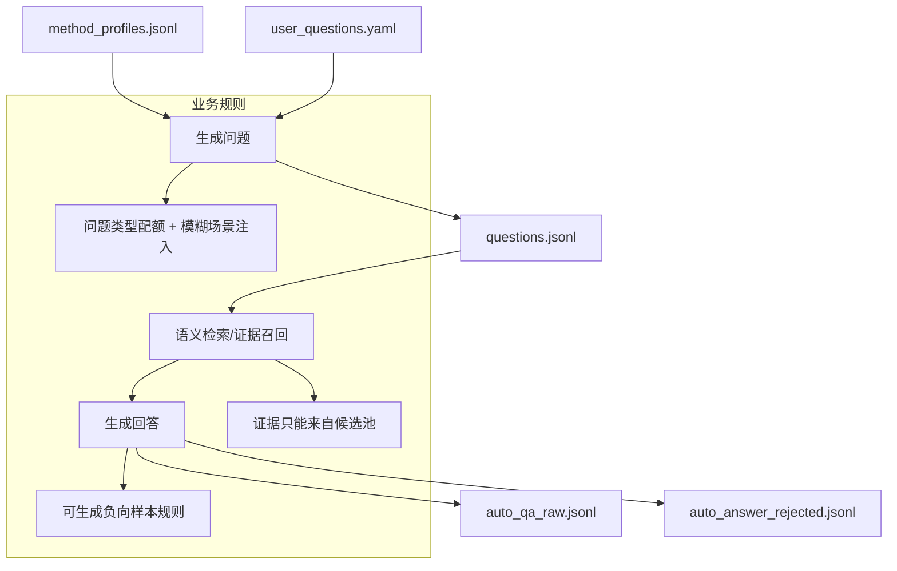

# QA 问答生成（QA Generation）

## 🌟 核心概念：像“出题 + 标准答案流水线”一样
> 就像考试先出题再写答案，系统先生成问题，再基于代码证据生成可追溯的标准回答。

## 📋 运作基石（必要元数据）

- **涉及领地 (Code Context)**：
  - `src/pipeline/steps/question_answer.py`
  - `src/engine/auto_question_generator.py`
  - `src/engine/answer_generator.py`
  - `src/utils/vector_index.py`
  - `configs/launch.yaml`
  - `configs/user_inputs/user_questions.yaml`
  - `configs/prompts/question_answer/*`
  - `configs/user_inputs/qa_scenario_templates.yaml`

- **执行准则 (Business Rules)**：
  - Auto 模式：先产出问题，再检索证据生成回答。
  - User 模式：读取用户问题，必要时仍可构建“语义索引”以辅助检索。
  - 问题与回答必须携带 `evidence_refs`，用于后续质量校验。
  - 可按“问题类型配额”生成，并按比例注入“模糊/指代型”场景。
  - 可生成负向样本（证据不足/错误前提/冲突说明）。

- **参考证据**：
  - `method_profiles.jsonl` 作为出题原材料，`method_embeddings.jsonl` 作为语义检索索引。

## ⚙️ 仪表盘：我该如何控制它？

| 配置参数 | 业务名称 | 调节它的效果 | 专家建议 |
| :--- | :--- | :--- | :--- |
| `question_answer.questions_per_method` | 每个方法出题数 | 生成问题数量 | 3 |
| `question_answer.max_questions` | 总问题上限 | 控制整体规模 | 25 |
| `question_answer.batch_size` | 批量出题 | 控制并行批次 | 5 |
| `question_answer.user_questions_path` | 用户问题入口 | 读取人工输入问题 | 保持默认 |
| `question_answer.build_embeddings_in_user_mode` | 用户模式索引 | 无证据时也能检索 | demo 可开启 |
| `question_answer.embedding_model` | 语义索引模型 | 生成检索向量 | `nomic-embed-text` |
| `question_answer.retrieval.mode` | 检索模式 | hybrid / symbol_only | demo 用 symbol_only |
| `question_answer.retrieval.call_chain.enabled` | 调用链扩展 | 召回关联方法 | true |
| `question_answer.coverage.diversity.question_type_targets` | 问题类型配额 | 控制问题风格 | 保持默认 |
| `question_answer.coverage.scenario_injection.fuzzy_ratio` | 模糊问题比例 | 注入“这段代码”类问题 | 0.2 |
| `question_answer.coverage.negative_ratio` | 负样本比例 | 反向场景占比 | 0.1 |
| `question_answer.coverage.negative_types` | 负样本类型 | 证据不足/错误前提/冲突 | 按需选 |
| `question_answer.constraints.enable_counterexample` | 反例对比 | 要求“为何不选其他方案” | true |
| `question_answer.constraints.enable_arch_constraints` | 架构约束 | 引用约束清单 | true |
| `artifacts.auto_qa_raw_jsonl` | QA 输出 | 生成的问答样本 | 默认即可 |
| `artifacts.method_embeddings_jsonl` | 语义索引输出 | 检索索引文件 | 默认即可 |
| `artifacts.auto_answer_rejected_jsonl` | QA 拒绝记录 | 输出失败样本 | 默认即可 |

## 🛠️ 它是如何工作的（逻辑流向）

## 🧩 解决的痛点与带来的改变

- **以前的乱象**：问题来源不稳定，回答缺乏证据。
- **现在的秩序**：问题有配额、回答有证据、负样本可控。

## 💡 开发者笔记

- Auto 模式若缺少 `method_profiles.jsonl` 会失败。
- 语义索引不存在时会自动降级为“只用证据引用”。
- 回答必须带 `evidence_refs`，否则会被质量校验拦截。
