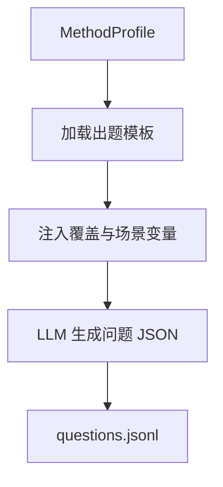
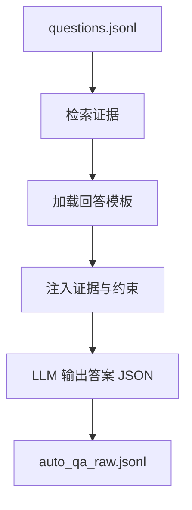
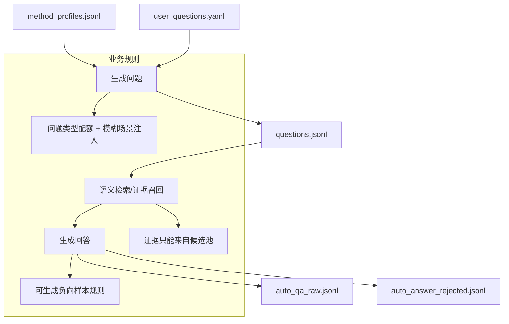

# QA 问答生成（QA Generation）

## 🌟 核心概念：像“出题 + 标准答案流水线”一样
>
> 就像考试先出题再写答案，系统先生成问题，再基于代码证据生成可追溯的标准回答。

## 📋 运作基石（必要元数据）

- **涉及领地 (Code Context)**：
  - `src/pipeline/steps/question_answer.py`
  - `src/engine/auto_question_generator.py`
  - `src/engine/answer_generator.py`
  - `src/utils/vector_index.py`
  - `configs/launch.yaml`
  - `configs/user_inputs/user_questions.yaml`
  - `configs/prompts/question_answer/*`
  - `configs/user_inputs/qa_scenario_templates.yaml`

- **执行准则 (Business Rules)**：
  - Auto 模式：先产出问题，再检索证据生成回答。
  - User 模式：读取用户问题，必要时仍可构建“语义索引”以辅助检索。
  - 问题与回答必须携带 `evidence_refs`，用于后续质量校验。
  - 可按“问题类型配额”生成，并按比例注入“模糊/指代型”场景。
  - 可生成负向样本（证据不足/错误前提/冲突说明）。

- **参考证据**：
  - `method_profiles.jsonl` 作为出题原材料，`method_embeddings.jsonl` 作为语义检索索引。

## ⚙️ 仪表盘：我该如何控制它？

| 配置参数 | 业务名称 | 调节它的效果 | 专家建议 |
| :--- | :--- | :--- | :--- |
| `question_answer.questions_per_method` | 每个方法出题数 | 生成问题数量 | 3 |
| `question_answer.max_questions` | 总问题上限 | 控制整体规模 | 25 |
| `question_answer.batch_size` | 批量出题 | 控制并行批次 | 5 |
| `question_answer.user_questions_path` | 用户问题入口 | 读取人工输入问题 | 保持默认 |
| `question_answer.build_embeddings_in_user_mode` | 用户模式索引 | 无证据时也能检索 | demo 可开启 |
| `question_answer.embedding_model` | 语义索引模型 | 生成检索向量 | `nomic-embed-text` |
| `question_answer.retrieval.mode` | 检索模式 | hybrid / symbol_only | demo 用 symbol_only |
| `question_answer.retrieval.call_chain.enabled` | 调用链扩展 | 召回关联方法 | true |
| `question_answer.coverage.diversity.question_type_targets` | 问题类型配额 | 控制问题风格 | 保持默认 |
| `question_answer.coverage.scenario_injection.fuzzy_ratio` | 模糊问题比例 | 注入“这段代码”类问题 | 0.2 |
| `question_answer.coverage.negative_ratio` | 负样本比例 | 反向场景占比 | 0.1 |
| `question_answer.coverage.negative_types` | 负样本类型 | 证据不足/错误前提/冲突 | 按需选 |
| `question_answer.constraints.enable_counterexample` | 反例对比 | 要求“为何不选其他方案” | true |
| `question_answer.constraints.enable_arch_constraints` | 架构约束 | 引用约束清单 | true |
| `artifacts.auto_qa_raw_jsonl` | QA 输出 | 生成的问答样本 | 默认即可 |
| `artifacts.method_embeddings_jsonl` | 语义索引输出 | 检索索引文件 | 默认即可 |
| `artifacts.auto_answer_rejected_jsonl` | QA 拒绝记录 | 输出失败样本 | 默认即可 |

## Prompt 说明（模板角色）

### 模板：`configs/prompts/question_answer/auto_question_generation.txt` / `coverage_question_generation.txt`

#### 🌟 核心概念 (出题)
>
> 就像标准化“出题模板”一样，确保每一批问题都符合配额与业务语义。

#### 📋 运作基石 (出题规则)

- **存放位置**：`configs/prompts/question_answer/auto_question_generation.txt`（基础）/ `coverage_question_generation.txt`（带覆盖约束）
- **工序位置**：QuestionAnswerStep → AutoQuestionGenerator（问题生成）
- **变量注入**：`method_profile`、`source_code`、`questions_per_method`、`coverage_bucket`、`coverage_intent`、`question_type`、`scenario_constraints`、`constraint_strength`、`constraint_rules`、`symbol_id/file_path/start_line/end_line/source_hash`、`repo_commit`
- **推理模式**：约束驱动的结构化出题（配额 + 证据对齐）
- **核心准则**：
  - 必须输出严格 JSON 且数量固定
  - `evidence_refs` 必须逐字复制输入
  - 问题必须与 bucket/intent/question_type 对齐
  - 禁止 Markdown/附加说明

#### ⚙️ 仪表盘 (出题控制)

| 配置参数 | 业务直观名称 | 调节它的效果 |
| :--- | :--- | :--- |
| `question_answer.prompts.question_generation` | 基础出题模板 | 控制问题结构 |
| `question_answer.prompts.coverage_generation` | 覆盖出题模板 | 启用覆盖约束 |
| `question_answer.coverage.*` | 覆盖与场景规则 | 决定 bucket/intent/场景注入 |

#### 🛠️ 逻辑流向图 (出题流程)

#### 🧩 解决的痛点 (出题)

- **以前的乱象**：问题风格不一致、分布不可控。
- **现在的秩序**：出题有模板、有配额、有证据约束。

---

### 模板：`configs/prompts/question_answer/auto_answer_generation.txt`

#### 🌟 核心概念 (回答)
>
> 就像“标准答案模板”一样，回答必须带证据、结构一致、可审计。

#### 📋 运作基石 (回答规则)

- **存放位置**：`configs/prompts/question_answer/auto_answer_generation.txt`
- **工序位置**：QuestionAnswerStep → AnswerGenerator（回答生成）
- **变量注入**：`question`、`context`、`available_evidence_refs`、`format_constraints`、`common_mistakes_examples`、`architecture_constraints`、`counterexample_guidance`
- **推理模式**：证据锚定的结构化回答（observations/inferences/assumptions）
- **核心准则**：
  - 仅输出 JSON，禁止 Markdown
  - `answer` 必须是字符串且包含 Rejected Alternatives
  - `thought.evidence_refs` 必须来自可用证据池
  - 结构化推理（observations/inferences/assumptions）

#### ⚙️ 仪表盘 (回答控制)

| 配置参数 | 业务直观名称 | 调节它的效果 |
| :--- | :--- | :--- |
| `question_answer.prompts.answer_generation` | 回答模板 | 决定答案结构 |
| `question_answer.constraints.*` | 反例/架构约束 | 强化回答可审计性 |
| `question_answer.retrieval.*` | 证据召回 | 控制可用证据池 |

#### 🛠️ 逻辑流向图 (回答流程)

### 核心工作流：高质量问答对生成

本系统通过一个精密的、分阶段的流程来生成高质量且可追溯的问答（QA）训练样本。其核心思想是“先理解、再提问、最后基于证据回答”。

1. **静态解析，建立索引 (`CodeSymbol`)**
    - **过程**：首先，系统通过静态分析（非 LLM）扫描整个代码库，将每个类、方法等解析成一个结构化的 `CodeSymbol` 对象，并建立索引。
    - **证据**：此过程由 `src/parser/` 中的解析器完成，其数据结构在 `src/utils/schemas.py` 中定义，并被 `docs/SCHEMAS.md` 详细记录。

2. **LLM 生成方法摘要 (`MethodProfile`)**
    - **过程**：对于解析出的关键方法，系统调用一个 LLM，让其扮演“代码分析专家”，为方法生成一份结构化的“摘要”（`MethodProfile`），其中包含业务规则、依赖关系等深度语义。
    - **证据**：`src/engine/auto_method_understander.py` 使用 `auto_method_understanding.txt` 这个 Prompt 来完成此任务。

3. **基于摘要生成问题 (`Question-First`)**
    - **过程**：系统利用上一步生成的 `MethodProfile`（摘要），再次调用 LLM，让其扮演“技术培训专家”，围绕摘要中的要点生成多样化、有深度且分布可控的问题。
    - **证据**：`src/engine/auto_question_generator.py` 使用 `auto_question_generation.txt` Prompt，其中 `MethodProfile` 是关键输入。

4. **RAG 检索上下文 (`Context`)**
    - **过程**：在回答问题时，系统**不会**使用之前的摘要。相反，它会启动一个 RAG（检索增强生成）流程，根据问题，通过直接证据、向量搜索和调用链分析等方式，从代码库中重新检索最相关的**源码原文**，拼接成上下文。
    - **证据**：`src/engine/answer_generator.py` 中复杂的检索逻辑，它为“开卷考试”准备了最精确的“开卷材料”。

5. **基于证据生成答案 (`Evidence-Based Answers`)**
    - **过程**：最后，系统将问题和检索到的源码上下文一起交给 LLM，并用一份极其严格的 Prompt “合同”来强迫它必须基于源码回答，且在结构化的 `thought`（思考过程）中引用具体的代码证据（`evidence_refs`）。
    - **证据**：`auto_answer_generation.txt` Prompt 强制要求答案必须引用证据。同时，`answer_generator.py` 的代码会对 LLM 的输出进行严格校验，不合规的回答会被直接丢弃。

6. **自动化质量门禁 (`Quality Gates`)**
    - **过程**：在流程的每一步，系统都会进行自动化校验。例如，答案是否引用了有效的证据、JSON 格式是否正确等。不符合质量要求的样本会被拒绝，并记录在案。
    - **证据**：`docs/pipeline/05-validation-step.md` 中描述了独立的验证步骤，同时在各个 `generator` 中也包含了大量的错误处理和校验逻辑。

#### 深度解析：RAG (检索增强生成) 流程

`AnswerGenerator` 的核心是实现了 RAG (Retrieval-Augmented Generation) 流程，可以将其理解为一个“开卷考试”的过程，以确保所有回答都基于真实的代码证据，而非 LLM 的“凭空记忆”。

##### 阶段一：检索 (Retrieval) - “寻找相关证据”

在回答任何问题之前，系统会像一个严谨的考生一样，先去代码库这个“图书馆”里寻找所有相关的“资料”。这个过程是混合策略的：

1. **精确制导 (Direct Hit)**：如果问题本身（来自上一步）已经携带了 `evidence_refs`，系统会优先加载这些引用的代码。这就像老师直接划定了考试范围，效率最高。
2. **语义搜索 (Vector Search)**：如果问题没有明确的证据指向（例如，用户手写的问题），系统会启动向量搜索。它将问题的文本与预先建立的“方法语义索引”（`method_embeddings.jsonl`）进行比对，找出内容上最相似的方法作为证据。这就像通过关键词索引来定位书中最相关的章节。
3. **关联扩展 (Graph Expansion)**：找到核心证据后，系统还会通过 `expand_call_chain` 进一步分析代码的调用关系，将与核心代码有调用关系的其他方法也一并纳入上下文。这就像阅读书中的一页时，也会把该页交叉引用的其他页面一并参考。

这个阶段的最终产物是一个名为 `context` 的变量，其中包含了所有检索到的**真实源码片段**。这就是提供给 LLM 的“开卷材料”。

##### 阶段二：生成 (Generation) - “基于证据回答并被严格约束”

这是整个流程的精髓，系统通过“Prompt 合同”和“代码校验”双重保险，强迫 LLM 必须忠于证据。

1. **事前约束 (Prompt 合同)**：
    - **严格的输入**：`configs/prompts/question_answer/auto_answer_generation.txt` 这个 Prompt 会清晰地将问题 `{question}`、检索到的源码 `{context}`、以及一个**明确的可用证据清单** `{available_evidence_refs}` 提供给 LLM。
    - **明确的命令**：Prompt 中用加粗等方式反复强调，`thought.evidence_refs` **必须**从 `{available_evidence_refs}` 列表中选择，并且如果证据不足，**必须**在回答中明说，禁止捏造。
    - **结构化思考**：Prompt 强制 LLM 输出 `thought` 对象，包含 `observations` (观察)、`inferences` (推断)等，迫使其先进行基于证据的分析，再得出结论。

2. **事后验证 (代码校验)**：
    - **监考老师**：`AnswerGenerator` 的代码在收到 LLM 的回复后，会立刻进行校验。
    - **格式与内容检查**：代码会尝试用 Pydantic 模型解析返回的 JSON。如果 LLM 没有遵守 Prompt 的规定，例如 `evidence_refs` 缺失、格式错误、或引用了“可用证据清单”之外的证据，解析过程就会失败并抛出异常。
    - **失败品回收**：任何无法通过校验的生成结果都会被捕获，记录到 `rejected_jsonl` 文件中，并被**彻底丢弃**，绝不会进入最终的训练数据集。

通过这个“**事前引导 + 事后验证**”的 RAG 闭环，系统确保了每一个问答样本的答案都真实、可追溯，并牢牢地“锚定”在代码证据之上。

##### ⚠️ 特殊场景与挑战：模糊问题 (Fuzzy Questions)

在实际运行中，系统可能会遇到一类“模糊”或“宏观”的问题（例如：“系统如何处理部分故障？”），这类问题的处理通过 RAG 会面临特有的挑战：

1. **处理流程**：
    - **检索 (Retriever)**：检索器依旧会尽职地基于语义搜索（Vector Search）寻找最相关的 Top-K 代码片段。对于宏观问题，它通常会找到某些具体实现了该逻辑的微观代码片段（例如某一个 `LoginView` 的异常处理逻辑）。
    - **生成 (Generator)**：LLM 接收到这些微观片段作为上下文。

2. **潜在风险 (Risks)**：
    - **微观证据不足以支撑宏观结论**：LLM 虽然能从微观代码中推断出系统的某种行为模式，但受限于 Prompt 中“严禁捏造”、“必须引用准确证据”的强约束，它往往会**拒绝**在 `evidence_refs` 中引用这些由于“粒度太细”而显得不那么有力的证据。
    - **结果**：这会导致 LLM 虽然生成了内容正确的回答，但 `evidence_refs` 字段为空，从而触发 `EVIDENCE_MISSING` 校验错误，导致样本被丢弃。这是 RAG 系统在处理架构级问题时的固有局限，需要通过未来的分层检索或查询扩展来解决。

#### 🧩 解决的痛点 (回答)

- **以前的乱象**：回答缺证据、结构随意。
- **现在的秩序**：回答结构统一、证据可追溯。

备注：

- `qa_system_prompt.txt` / `qa_user_prompt.txt` 当前未在代码中加载，属于历史模板。

## 🛠️ 它是如何工作的（逻辑流向）

## 🧩 解决的痛点与带来的改变

- **以前的乱象**：问题来源不稳定，回答缺乏证据。
- **现在的秩序**：问题有配额、回答有证据、负样本可控。

## 💡 开发者笔记

- Auto 模式若缺少 `method_profiles.jsonl` 会失败。
- **智能检索兜底**：当语义索引 (`method_embeddings.jsonl`) 不存在时，系统会自动启用 **Keyword Search (BM25)** 机制，基于关键词权重在代码库中搜索相关证据，而不仅仅是简单的“只用引用”或随机返回。
- 回答必须带 `evidence_refs`，否则会被质量校验拦截。
