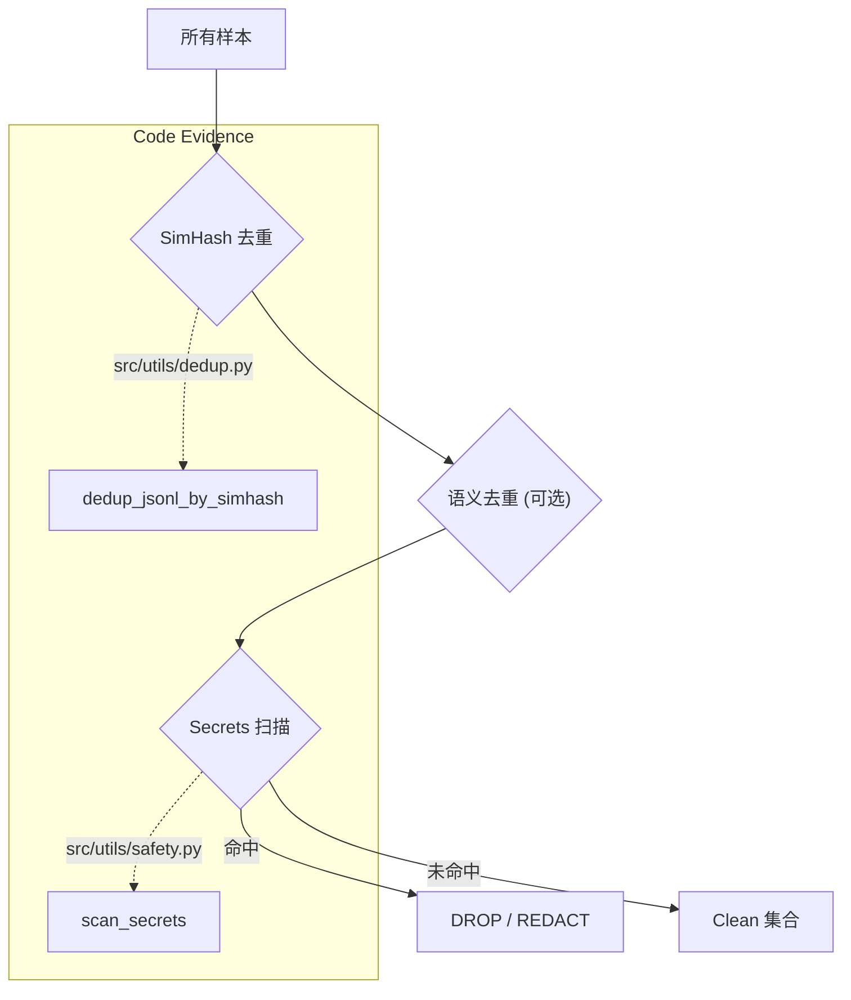

# 工程质量与清洗（Data Engineering & Cleaning）

## 🌟 核心概念：像“质检+清洁产线”一样
>
> 就像工厂会先质检、再清洁、再封装，系统会在训练数据进入最终集前做长度校验、去重与安全清洗。

## 📋 运作基石（必要元数据）

- **涉及领地 (Code Context)**：
  - `src/utils/data/validator.py`
  - `src/pipeline/steps/deduplication.py`
  - `src/utils/dedup.py`
  - `src/pipeline/steps/secrets_scan.py`
  - `src/utils/safety.py`
  - `configs/launch.yaml`

- **执行准则 (Business Rules)**：
  - 过短/过长回答会触发质量告警（可配置为拒绝）。
  - 先做 SimHash 去重，必要时再做语义去重。
  - 命中黑名单或敏感信息时，根据 `safety.mode` 进行丢弃/脱敏/保留。

- **参考证据**：
  - `dedup_mapping.json`、`secrets_dropped.jsonl` 会记录处理结果，方便审计。

## ⚙️ 仪表盘：我该如何控制它？

| 配置参数 | 业务名称 | 调节它的效果 | 专家建议 |
| :--- | :--- | :--- | :--- |
| `quality.min_instruction_length` | 最小问题长度 | 过短问题触发告警 | 10 |
| `quality.min_answer_length` | 最小回答长度 | 过短回答触发告警 | 20 |
| `quality.max_answer_length` | 最大回答长度 | 过长回答触发告警 | 6000 |
| `quality.fail_on_warnings` | 告警即拒绝 | 将告警升级为拒绝 | demo 关闭 |
| `dedup.simhash_bits` | 去重粒度 | 越大越严格 | 64 |
| `dedup.max_hamming` | 去重阈值 | 越小越严格 | 3 |
| `dedup.semantic.enabled` | 语义去重开关 | 启用相似语义去重 | demo 可关闭 |
| `dedup.semantic.threshold` | 语义相似阈值 | 越高越严格 | 0.92 |
| `safety.mode` | 安全处理方式 | drop / sanitize / keep | demo 可 keep |
| `safety.blacklist_keywords` | 黑名单关键词 | 命中后处理 | 根据项目定制 |

## 🛠️ 它是如何工作的（逻辑流向）

### 1. 去重流水线 (Deduplication)

数据去重旨在过滤重复的训练样本，保证数据的多样性。该步骤由 `src/pipeline/steps/deduplication.py` 编排。

- **SimHash 指纹去重**:
  - 系统使用 `src/utils/dedup.py` 中的 `dedup_jsonl_by_simhash` 函数。
  - 它计算每个样本 instruction + input 的 SimHash 指纹（64位），并比较海明距离（Hamming Distance）。
  - 默认 `max_hamming=3`，意味着如果两个样本的指纹只有 3 位不同，它们被视为重复，仅保留一个。

- **语义去重 (Semantic Deduplication)**:
  - 若配置开启，系统会调用 `dedup_jsonl_by_semantic`。
  - 它使用 embedding 模型将样本向量化，计算余弦相似度。
  - 相似度高于 `threshold` (如 0.92) 的样本被视为语义重复。

### 2. 安全清洗 (Safety Cleaning)

在去重之后，数据进入安全清洗环节，由 `src/pipeline/steps/secrets_scan.py` 执行。

- **敏感信息扫描**:
  - 系统内置了一套正则表达式库，扫描代码中的 API Key、Token、Password 等模式。
  - 扫描逻辑位于 `src/utils/safety.py`。
  
- **黑名单关键词**:
  - 检查 `instruction` 或 `answer` 是否包含 `safety.blacklist_keywords` 中定义的词汇。

- **处理策略**:
  - 根据 `safety.mode`:
    - `drop`: 直接丢弃整条样本（默认）。
    - `sanitize`: 将敏感串替换为 `REDACTED`。
    - `keep`: 仅记录日志，保留样本（测试用）。

## 🧩 解决的痛点与带来的改变

- **以前的乱象**：重复样本多、回答质量参差、敏感内容难过滤。
- **现在的秩序**：数据更干净、重复更少、敏感信息可控。

## 💡 开发者笔记

- 长度规则默认是“告警”，不会阻断；如需更严格可开 `fail_on_warnings`。
- 语义去重依赖语义向量，适合离线批量，不建议在 demo 环境强开。
