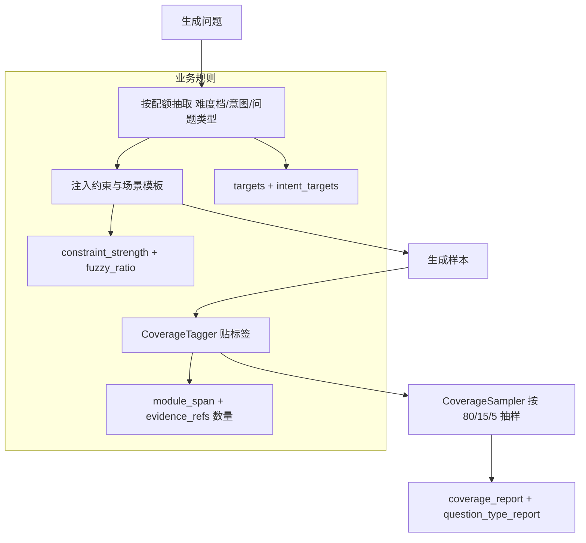

# 宏观分布控制（Distribution Control）

## 🌟 核心概念：像“配货清单”一样
> 就像超市进货要有配比清单（畅销品多、长尾品少），系统会按配额把问题类型与难度“配货”，避免一股脑随机生成。

## 📋 运作基石（必要元数据）

- **涉及领地 (Code Context)**：
  - `src/engine/auto_question_generator.py`
  - `src/engine/auto_design_question_generator.py`
  - `src/pipeline/steps/coverage_tagger.py`
  - `src/pipeline/steps/coverage_sampler.py`
  - `src/pipeline/steps/question_type_report.py`
  - `configs/launch.yaml`
  - `configs/user_inputs/qa_scenario_templates.yaml`
  - `configs/user_inputs/design_scenario_templates.yaml`

- **执行准则 (Business Rules)**：
  - 难度配额由 `targets` 控制（默认 80/15/5），抽样时按“难度档”分层。
  - module_span 通过 `evidence_refs.file_path` 的路径前缀统计（单模块 / 多模块）。
  - `evidence_refs` 数量可用于“难度辅助判定”（assist/strict）。
  - 生成问题时可按“问题类型”配额抽取（quota 模式）。
  - 可按比例注入“模糊/指代型”场景（scenario_injection + fuzzy_ratio）。
  - 按“难度档”注入“强/弱约束”提示词，提升问题质量。

- **参考证据**：
  - 使用 `symbols.jsonl` 与 `evidence_refs` 作为分布判定的基础线索。

## ⚙️ 仪表盘：我该如何控制它？

| 配置参数 | 业务名称 | 调节它的效果 | 专家建议 |
| :--- | :--- | :--- | :--- |
| `question_answer.coverage.targets` | QA 难度配额 | 控制高/中/难比例 | 保持 0.8/0.15/0.05 |
| `design_questions.coverage.targets` | Design 难度配额 | 控制架构问题难度比例 | 与 QA 保持一致 |
| `question_answer.coverage.intent_targets` | QA 意图配额 | 控制问题意图分布 | 结合业务常见场景 |
| `question_answer.coverage.evidence_refs.mode` | 证据数量辅助模式 | assist/strict 调整难度判定 | demo 建议 assist |
| `question_answer.coverage.evidence_refs.mid_min` | 中等难度门槛 | evidence_refs ≥ 该值 → mid | 2 |
| `question_answer.coverage.evidence_refs.hard_min` | 困难难度门槛 | evidence_refs ≥ 该值 → hard | 3 |
| `question_answer.coverage.diversity.mode` | QA 类型配额模式 | quota 才按比例抽取 question_type | 设为 quota |
| `question_answer.coverage.diversity.question_type_targets` | QA 类型配额 | 控制 how_to/config/error 等占比 | 以当前默认值起步 |
| `design_questions.coverage.diversity.question_type_targets` | Design 类型配额 | 控制 architecture/perf 等占比 | 以当前默认值起步 |
| `question_answer.coverage.scenario_injection.fuzzy_ratio` | 模糊问题比例 | 按比例注入“这段代码/那个接口” | 0.2（已配置） |
| `design_questions.coverage.scenario_injection.fuzzy_ratio` | 设计模糊比例 | 设计问题的模糊比例 | 0.15（已配置） |
| `question_answer.coverage.constraint_strength` | 约束强度 | strong/weak/hybrid | demo 用 hybrid 或 strong |
| `question_answer.coverage.min_sample_size` | 最小抽样量 | 小样本时不强行抽样 | 1（保持） |
| `question_answer.coverage.mode` | 分布控制位置 | upstream/downstream/hybrid | demo 用 hybrid |

## 🛠️ 它是如何工作的（逻辑流向）

## 🧩 解决的痛点与带来的改变

- **以前的乱象**：问题生成“看运气”，分布容易偏向简单题或解释题。
- **现在的秩序**：有配额、有抽样、有回归报表，分布可被控制和复现。

## 💡 开发者笔记

- 抽样在样本量过小时会自动跳过，避免“硬凑比例”。
- 配额缺口会按 fallback 规则补齐（保证总量，不强求每桶满额）。
- 该功能以配置为核心，适合 demo 快速调参。
