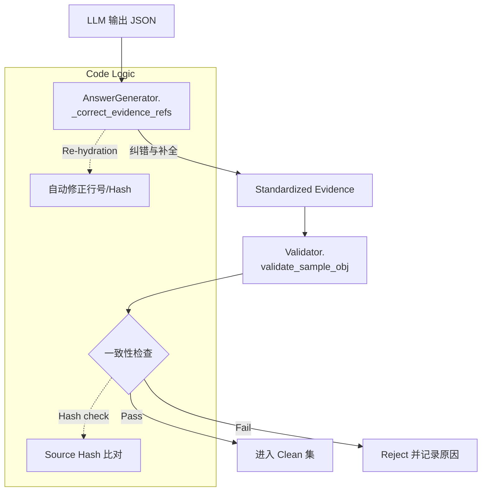

# 证据锚定与 Grounding（Grounding Integrity）

## 🌟 核心概念：像“发票”一样
>
> 就像每一笔报销都要有发票，系统会为每条回答贴上可追溯的证据标签，确保“说得出、查得到”。

## 📋 运作基石（必要元数据）

- **涉及领地 (Code Context)**：
  - `src/parser/java_parser.py`
  - `src/parser/python_parser.py`
  - `src/engine/generators/qa_rule/answer_generator.py`
  - `src/engine/generators/arch_design/design_generator.py`
  - `src/utils/data/validator.py`
  - `src/utils/retrieval/call_chain.py`
  - `configs/launch.yaml`
  - `configs/prompts/qa_rule/gen_a_user.txt`
  - `configs/prompts/arch_design/gen_s_user.txt`

- **执行准则 (Business Rules)**：
  - 每条样本必须携带 `evidence_refs`，且 **symbol_id / file_path / source_hash / line_range** 必须与 `symbols.jsonl` 一致。
  - `repo_commit` 不一致会触发告警，便于排查版本偏差。
  - 证据来自检索到的候选方法（前 N 条），回答只能选用这些证据。
  - 上下文长度被 `max_context_chars` 限制，避免“全量粘贴”。
  - 允许通过“调用链扩展”补充相关方法（弱规则）。

- **参考证据**：
  - `data/raw/extracted/symbols.jsonl` 中的 symbol 与 `repo_commit` 是证据对齐的标准。

## ⚙️ 仪表盘：我该如何控制它？

| 配置参数 | 业务名称 | 调节它的效果 | 专家建议 |
| :--- | :--- | :--- | :--- |
| `core.retrieval_top_k` | 证据候选数量 | 决定每次检索拿多少段代码 | 6（默认） |
| `core.max_context_chars` | 上下文上限 | 控制上下文长度，避免噪音 | 16000 |
| `question_answer.retrieval.mode` | QA 检索模式 | hybrid / vector_only / symbol_only | demo 用 symbol_only |
| `question_answer.retrieval.min_score` | 相似度阈值 | 过滤低相关证据 | 0.2 |
| `question_answer.retrieval.fallback_top_k` | 回退候选数 | 相似度过滤后回退数量 | 与 top_k 一致 |
| `question_answer.retrieval.call_chain.enabled` | 调用链扩展 | 启用弱规则的依赖召回 | true（已开启） |
| `design_questions.retrieval.mode` | Design 检索模式 | hybrid / symbol_only | hybrid |
| `design_questions.retrieval.call_chain.enabled` | 设计调用链扩展 | 设计样本的依赖召回 | true（已开启） |
| `design_questions.min_evidence_refs` | 设计最少证据数 | 设计样本证据下限 | 2 |

## 🛠️ 它是如何工作的（逻辑流向）

证据锚定不仅仅是一个“格式要求”，而是一个贯穿生成与校验的完整闭环。

### 1. 生成时的强制锚定 (Correction)

在 `AnswerGenerator` (`src/engine/generators/qa_rule/answer_generator.py`) 生成回答时，LLM 可能会输出不完美的证据引用（例如只给了一个 symbol_id 字符串，或者带了错误的行号）。

- **自动纠错 (`_correct_evidence_refs`)**:
  - 系统接收 LLM 的原始 `evidence_refs`。
  - 拿着这些 id 去检索上下文中真实的 `CodeSymbol` 对象。
  - **Re-hydration**: 重新填入准确的 `file_path`, `start_line`, `source_hash`，确保这些元数据绝对匹配每行代码的真实状态。
  - 如果 LLM 没输出证据但上下文中只有一段代码，系统甚至会执行 **Auto-fill** 策略。

### 2. 校验时的严格对齐 (Validation)

生成的样本必须通过 `src/utils/data/validator.py` 的 `validate_sample_obj` 检查。

- **三维一致性检查**:
  1. **Existence**: `symbol_id` 是否真实存在于 `symbols_map` 中？
  2. **Path Match**: 引用中的 `file_path` 是否与 symbol 库中的一致？
  3. **Hash Match**: 引用中的 `source_hash` 是否匹配？（这能防止代码更变后旧样本失效）
  
- **结果**:
  - 任何一项不匹配都会导致 `EVIDENCE_MISMATCH` 错误，样本直接被丢弃。

## 🧩 解决的痛点与带来的改变

- **以前的乱象**：回答“听起来合理”，但无法定位代码出处。
- **现在的秩序**：每条回答都有“证据编号”，还能反查到具体文件与行号。

## 💡 开发者笔记

- 证据一致性失败会直接判为不合格样本。
- 调用链扩展是弱规则，适合 demo，但不会强行改变原有证据结构。
- report 模式下可能出现 `quality.evidence_autofill=true` 的样本；gate 模式会拒绝此类样本。
