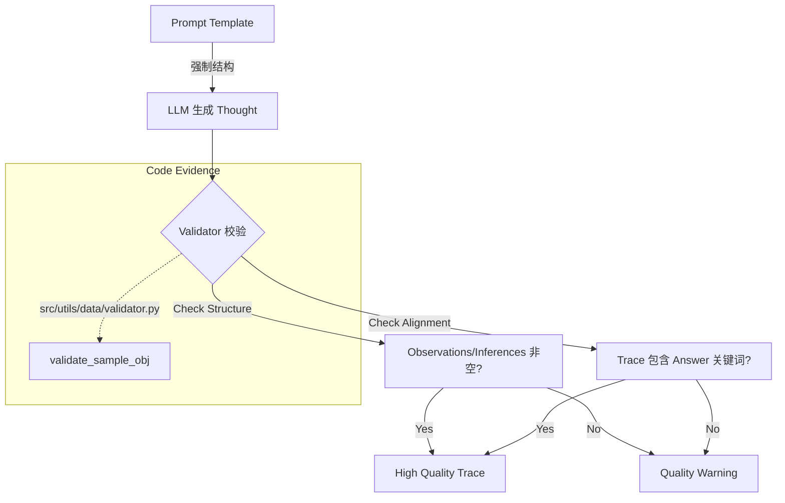

# 推理链路质量（Reasoning Trace Logic）

## 🌟 核心概念：像“工作日志”一样
>
> 就像项目复盘要有过程记录，系统要求答案不仅有结论，还要留下“为什么这么判断”的可读线索。

## 📋 运作基石（必要元数据）

- **涉及领地 (Code Context)**：
  - `src/utils/data/validator.py`
  - `src/engine/generators/qa_rule/answer_generator.py`
  - `src/engine/generators/arch_design/design_generator.py`
  - `configs/launch.yaml`
  - `configs/prompts/qa_rule/gen_a_user.txt`
  - `configs/prompts/arch_design/gen_s_user.txt`
  - `configs/prompts/common/arch_constraints.yaml`

- **执行准则 (Business Rules)**：
  - 输出必须包含结构化“推理记录”（observations / inferences / assumptions / evidence_refs）。
  - 可启用“推理记录结构校验”“证据锚定校验”“答案一致性校验”。
  - 可启用“反例对比”提示（Rejected Alternatives）。
  - 可注入架构约束清单，提醒答案遵守已有设计限制。

- **参考证据**：
  - trace 中的证据引用必须可追溯到 `symbols.jsonl`。

## ⚙️ 仪表盘：我该如何控制它？

| 配置参数 | 业务名称 | 调节它的效果 | 专家建议 |
| :--- | :--- | :--- | :--- |
| `quality.trace_rules.mode` | 推理记录校验模式 | warning / reject | demo 用 warning |
| `quality.trace_rules.require_trace_structure` | 结构校验 | 必须有 observations/inferences | true |
| `quality.trace_rules.require_evidence_anchor` | 证据锚定 | 要求 trace 中有证据引用 | true |
| `quality.trace_rules.require_answer_alignment` | 结论一致性 | 要求答案能被 trace 支撑 | 按需开启 |
| `quality.trace_rules.min_observations` | 最少观察数 | 防止空白 trace | 1 |
| `quality.trace_rules.min_inferences` | 最少推断数 | 防止空白 trace | 1 |
| `question_answer.constraints.enable_counterexample` | 反例对比 | 要求说明“为何不选其它方案” | true（已启用） |
| `design_questions.constraints.enable_counterexample` | 设计反例对比 | 同上 | true（已启用） |
| `question_answer.constraints.enable_arch_constraints` | 架构约束注入 | 把约束写进提示词 | true（已启用） |
| `design_questions.constraints.enable_arch_constraints` | 设计约束注入 | 同上 | true（已启用） |
| `core.architecture_constraints_path` | 架构约束清单 | 约束条目来源 | 指向 YAML |

## 🛠️ 它是如何工作的（逻辑流向）

推理链路的质量保障主要通过“Prompt 协议”和“后处理校验”两个环节实现。

### 1. 生产端：Prompt 协议 (Generation)

在 `gen_a_user.txt` (QA) 和 `gen_s_user.txt` (Design) 模板中，系统不仅要求输出答案，还强制要求输出一个 `thought` 对象。

- **结构化思维**: Prompt 明确定义了 `thought` 必须包含 `observations`（从代码中看到了什么）、`inferences`（基于观察推导出了什么）和 `evidence_refs`。
- **证据绑定**: 系统要求 `evidence_refs` 必须是 `observations` 的直接来源，从而迫使 LLM “看着代码说话”。

### 2. 消费端：结构校验 (Validation)

生成的 trace 随后会通过 `src/utils/data/validator.py` 进行质量检查：

- **结构完整性**:
  - 检查 `thought` 字段是否存在。
  - 检查 `observations` 和 `inferences` 是否为非空列表（`TRACE_EMPTY` 检查）。
  
- **对齐检查 (Alignment)** (可选):
  - `TRACE_ANSWER_ALIGNMENT`: 检查答案中的关键词是否在 trace 中出现过，确保“所想即所答”。
  - `TRACE_EVIDENCE_ALIGNMENT`: 检查如果有证据引用，是否撰写了相应的观察记录。

目前默认配置为 `warning` 模式，意味着 trace 质量较差的样本会被标记告警但不会直接丢弃，以便后续分析改进。

## 🧩 解决的痛点与带来的改变

- **以前的乱象**：答案只有结论，无法知道依据与思路。
- **现在的秩序**：每条答案都有“可检查的推理痕迹”。

## 💡 开发者笔记

- 默认是 warn-only，不会阻断流水线；如需强约束可切到 `reject`。
- 架构约束与反例对比为 prompt 注入，不改变数据结构，适合 demo 快速迭代。
