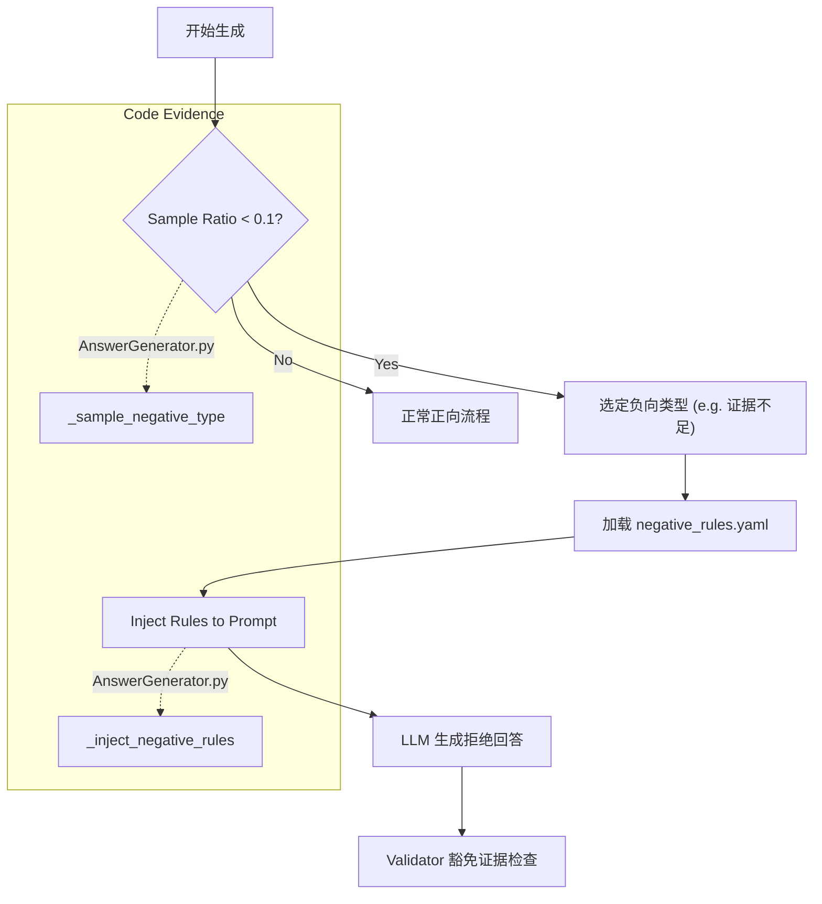

# 健壮性与负样本（Robustness & Negative Samples）

## 🌟 核心概念：像“演练故障”一样
>
> 就像演习时会故意模拟故障，系统会按比例生成“反向场景”，让模型学会纠错与拒答。

## 📋 运作基石（必要元数据）

- **涉及领地 (Code Context)**：
  - `src/engine/generators/qa_rule/answer_generator.py`
  - `src/engine/generators/arch_design/design_generator.py`
  - `src/utils/data/validator.py`
  - `configs/launch.yaml`

- **执行准则 (Business Rules)**：
  - 按 `negative_ratio` 随机抽取负样本。
  - 负样本类型由 `negative_types` 决定（如证据不足、错误前提、冲突说明）。
  - 负样本会被标记为 `quality.coverage.polarity=negative` 并记录原因类型。
  - 可通过 `quality.allow_negative_without_evidence` 放宽“负样本必须有证据”的要求（默认关闭）。

- **参考证据**：
  - 负样本仍会记录证据引用，若配置允许可放宽证据要求。

## ⚙️ 仪表盘：我该如何控制它？

| 配置参数 | 业务名称 | 调节它的效果 | 专家建议 |
| :--- | :--- | :--- | :--- |
| `question_answer.coverage.negative_ratio` | QA 负样本比例 | QA 中负样本的占比 | 0.1 |
| `question_answer.coverage.negative_types` | QA 负样本类型 | 证据不足/错误前提/冲突等 | 按风险重点选择 |
| `design_questions.coverage.negative_ratio` | Design 负样本比例 | 设计类负样本占比 | 0.05 |
| `design_questions.coverage.negative_types` | Design 负样本类型 | 冲突/模糊问题等 | 结合设计场景 |
| `quality.allow_negative_without_evidence` | 负样本证据豁免 | true 允许无证据的拒答 | demo 保持 false |

## 🛠️ 它是如何工作的（逻辑流向）

负样本生成并非简单的“随机失败”，而是经过精心编排的“红队测试”。这一过程主要在 `AnswerGenerator` 和 `DesignGenerator` 中实现。

### 1. 概率采样 (Sampling)

每个生成器在处理一个新的问题/设计目标时，首先会掷骰子。

- 代码位置：`_sample_negative_type` 方法。
- 逻辑：它使用 `src/utils/data/sampling.py`，根据配置的 `negative_ratio`（如 10%）来决定当前样本是否应为负向。
- 如果命中，还会进一步随机选择一个具体的错误类型（如 `insufficient_evidence`）。

### 2. 规则注入 (Injection)

一旦确定要生成负样本，生成器会动态修改 Prompt。

- 代码位置：`_inject_negative_rules` 方法。
- 逻辑：它会读取 `configs/prompts/qa_rule/negative_rules.yaml` 中对应类型的指令（例如：“请假装找不到关键证据，礼貌地拒绝回答”）。
- **动态插入**：这段“使坏”的指令会被强行插入到 User Prompt 的显眼位置（通常在“输出要求”之前），覆盖掉默认的“尽力回答”指令。

### 3. 下游标记 (Tagging)

生成的样本会在 `quality.coverage` 元数据中被标记为 `polarity: negative`。

- `validator.py` 看到这个标记后，会根据配置 (`allow_negative_without_evidence`) 调整校验逻辑，例如允许负样本不引用代码证据（因为本来就是去测试“无证据时是否会拒绝”）。

## 🧩 解决的痛点与带来的改变

- **以前的乱象**：样本只覆盖“顺利回答”，对错误提问没有训练价值。
- **现在的秩序**：模型能学会“指出前提错误”“拒绝胡编乱造”。

## 💡 开发者笔记

- 负样本比例是随机抽取，受 `seed` 影响，便于复现。
- 负样本依旧会进入质量校验与分布统计，保证可控。
