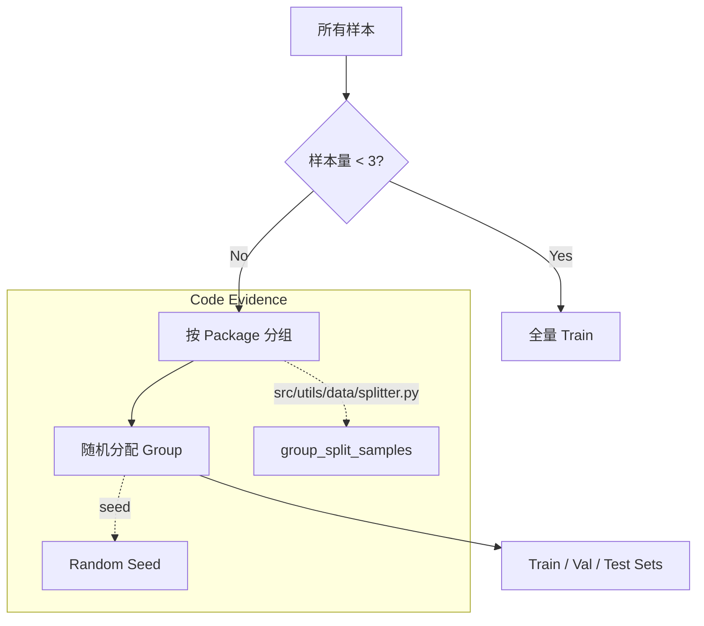

# 数据集切分与分组

## 🌟 核心概念：像“分班排课”一样
>
> 就像把学生按班级分开，系统会把样本按规则切成训练/验证/测试三组，避免“同一模块”重复出现。

## 📋 运作基石（必要元数据）

- **涉及领地 (Code Context)**：
  - `src/pipeline/steps/split.py`
  - `src/utils/splitter.py`
  - `configs/launch.yaml`

- **执行准则 (Business Rules)**：
  - 按 `group_by` 分组切分，避免同一模块重复进入不同分组。
  - QA 与 Design 会分别切分，并保留合并版切分结果。
  - 样本过少时自动退化为“全量训练”。

- **参考证据**：
  - 使用 `symbols.jsonl` 的路径信息做分组依据。

## ⚙️ 仪表盘：我该如何控制它？

| 配置参数 | 业务名称 | 调节它的效果 | 专家建议 |
| :--- | :--- | :--- | :--- |
| `split.train_ratio` | 训练集比例 | 训练数据占比 | 0.8 |
| `split.val_ratio` | 验证集比例 | 验证数据占比 | 0.1 |
| `split.test_ratio` | 测试集比例 | 测试数据占比 | 0.1 |
| `split.group_by` | 分组维度 | 按 package 分组切分 | 保持默认 |
| `core.seed` | 随机种子 | 确保切分可复现 | 42 |

## 🛠️ 它是如何工作的（逻辑流向）

数据集切分并非简单的随机乱序，而是需要兼顾“模块隔离”与“分布均匀”的复杂过程。逻辑主要由 `src/pipeline/steps/split.py` 与 `src/utils/data/splitter.py` 实现。

### 1. 分组切分 (Group & Split)

为了防止**数据泄漏 (Leakage)** —— 即同一个类或函数的代码既出现在训练集又出现在测试集，导致模型靠“死记硬背”得分，系统采用**按组切分**策略。

- **分组 (`group_by`)**: 代码首先读取 `symbols_map`，提取每个样本对应 symbol 的 `package` (或文件路径)。所有属于同一个 package 的样本被视为一个不可分割的整体。
- **分配**: 利用随机种子 (`seed`)，系统将这些“组”随机分配给 train/val/test。这样保证了一个 package 如果在测试集中，模型在训练时就绝对没见过它。

### 2. 双轨并行 (QA vs Design)

`SplitStep.execute` 执行了两套切分逻辑：

- **Combined**: 将所有去重后的样本一起切分，用于向后兼容或混合训练。
- **Independent**: 显式地将 QA 样本与 Design 样本分开切分。这对于分别评估模型的“代码理解能力”和“架构设计能力”至关重要。

### 3. 兜底策略 (Fallback)

如果总样本量极少（`len < 3`），强行切分会导致验证集为空。此时代码会自动退化为“全量训练”模式：

- `train = all_samples`
- `val = []`
- `test = []`
这保证了在 demo 或初期调试时，pipeline 不会因为数据太少而崩在这一步。

## 🧩 解决的痛点与带来的改变

- **以前的乱象**：同一模块样本被分到不同集合，评估失真。
- **现在的秩序**：按模块分组切分，评估更可信。

## 💡 开发者笔记

- QA/Design 独立切分，便于分别训练与评估。
- combined 分组仍保留，确保向后兼容。
