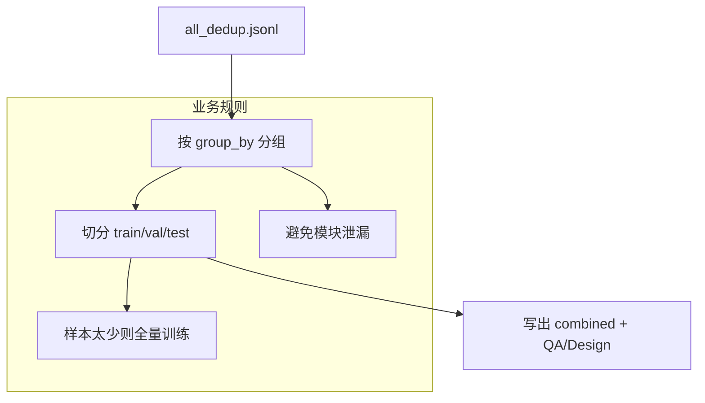

# 数据集切分与分组

## 🌟 核心概念：像“分班排课”一样
> 就像把学生按班级分开，系统会把样本按规则切成训练/验证/测试三组，避免“同一模块”重复出现。

## 📋 运作基石（必要元数据）

- **涉及领地 (Code Context)**：
  - `src/pipeline/steps/split.py`
  - `src/utils/splitter.py`
  - `configs/launch.yaml`

- **执行准则 (Business Rules)**：
  - 按 `group_by` 分组切分，避免同一模块重复进入不同分组。
  - QA 与 Design 会分别切分，并保留合并版切分结果。
  - 样本过少时自动退化为“全量训练”。

- **参考证据**：
  - 使用 `symbols.jsonl` 的路径信息做分组依据。

## ⚙️ 仪表盘：我该如何控制它？

| 配置参数 | 业务名称 | 调节它的效果 | 专家建议 |
| :--- | :--- | :--- | :--- |
| `split.train_ratio` | 训练集比例 | 训练数据占比 | 0.8 |
| `split.val_ratio` | 验证集比例 | 验证数据占比 | 0.1 |
| `split.test_ratio` | 测试集比例 | 测试数据占比 | 0.1 |
| `split.group_by` | 分组维度 | 按 package 分组切分 | 保持默认 |
| `core.seed` | 随机种子 | 确保切分可复现 | 42 |

## 🛠️ 它是如何工作的（逻辑流向）

## 🧩 解决的痛点与带来的改变

- **以前的乱象**：同一模块样本被分到不同集合，评估失真。
- **现在的秩序**：按模块分组切分，评估更可信。

## 💡 开发者笔记

- QA/Design 独立切分，便于分别训练与评估。
- combined 分组仍保留，确保向后兼容。
