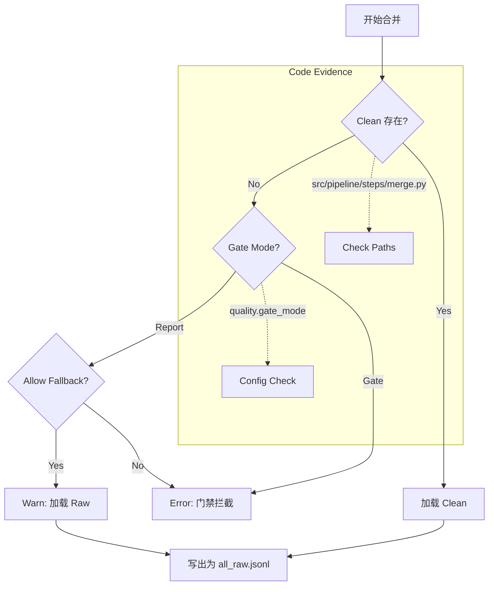

# 质量门禁合并（Merge Gate）

## 🌟 核心概念：像“收货验收”一样
>
> 就像货物进仓前要先验收，系统在合并前会优先使用“已通过检查的样本”，避免低质数据混入。

## 📋 运作基石（必要元数据）

- **涉及领地 (Code Context)**：
  - `src/pipeline/steps/merge.py`
  - `src/pipeline/steps/validation.py`
  - `configs/launch.yaml`

- **执行准则 (Business Rules)**：
  - 优先使用 `clean` 分支；没有 clean 时按模式决定是否回退 raw。
  - `gate` 模式：clean 不存在直接报错。
  - `report` 模式：允许回退 raw（可配置关闭回退）。

- **参考证据**：
  - clean 分支来自 Validation 的质量过滤结果。

## ⚙️ 仪表盘：我该如何控制它？

| 配置参数 | 业务名称 | 调节它的效果 | 专家建议 |
| :--- | :--- | :--- | :--- |
| `quality.gate_mode` | 门禁模式 | gate / report | demo 可 report |
| `quality.write_clean` | 生成 clean | 是否输出 clean 分支 | true |
| `quality.allow_fallback_in_report` | 回退开关 | report 模式是否允许 raw 回退 | demo 可 true |
| `artifacts.qa_clean_jsonl` | QA clean 路径 | clean 输出位置 | 默认即可 |
| `artifacts.design_clean_jsonl` | Design clean 路径 | clean 输出位置 | 默认即可 |

## 🛠️ 它是如何工作的（逻辑流向）

Merge Step (`src/pipeline/steps/merge.py`) 是连接“生成/校验”与“后处理”的关键枢纽。

### 1. 优先级选择 (Priority Selection)

对于 QA 和 Design 两个数据源，代码会尝试加载最高质量的数据：

- **首选 Clean**: 检查 `qa_clean.jsonl` (经过 Validator 筛选的完美数据)。
- **次选 Raw**: 如果 Clean 不存在，则检查 `qa_raw.jsonl` (LLM 直接生成的原始内容)。

### 2. 门禁逻辑 (Gate Enforcement)

根据 `quality.gate_mode` 的配置，系统决定是否允许“次选”：

- **Gate Mode**: 严格模式。如果找不到 Clean 文件，`MergeStep` 直接抛出 `FileNotFoundError`，中止流水线。这通常用于正式发版。
- **Report Mode**: 宽容模式。如果找不到 Clean 文件且 `allow_fallback_in_report=True`，系统会记录一条 Warning，然后降级加载 Raw 文件。这允许开发者在调试阶段快速跑通流程，查看 pipeline_summary 里的错误统计。

### 3. 合并输出 (Validation)

无论来源如何，最终所有被选中的样本会被合并写入 `all_raw.jsonl`，作为后续去重和切分的统一输入。

## 🧩 解决的痛点与带来的改变

- **以前的乱象**：低质样本混入最终数据，难以控制。
- **现在的秩序**：合并前先验收，质量边界更清晰。

## 💡 开发者笔记

- gate 模式适合严格数据产出；report 模式适合 demo 与调试。
- QA 与 Design 均采用 fail-fast 行为（clean 缺失直接报错）。
