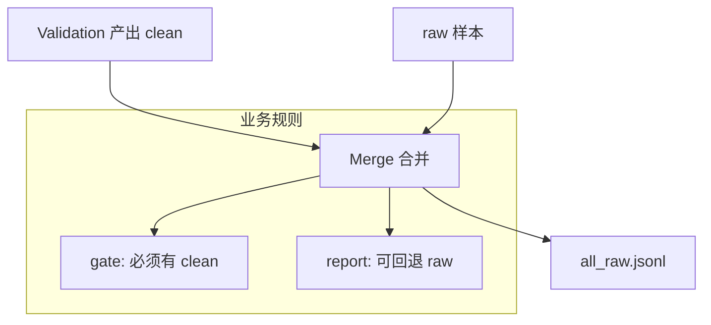

# 质量门禁合并（Merge Gate）

## 🌟 核心概念：像“收货验收”一样
> 就像货物进仓前要先验收，系统在合并前会优先使用“已通过检查的样本”，避免低质数据混入。

## 📋 运作基石（必要元数据）

- **涉及领地 (Code Context)**：
  - `src/pipeline/steps/merge.py`
  - `src/pipeline/steps/validation.py`
  - `configs/launch.yaml`

- **执行准则 (Business Rules)**：
  - 优先使用 `clean` 分支；没有 clean 时按模式决定是否回退 raw。
  - `gate` 模式：clean 不存在直接报错。
  - `report` 模式：允许回退 raw（可配置关闭回退）。

- **参考证据**：
  - clean 分支来自 Validation 的质量过滤结果。

## ⚙️ 仪表盘：我该如何控制它？

| 配置参数 | 业务名称 | 调节它的效果 | 专家建议 |
| :--- | :--- | :--- | :--- |
| `quality.gate_mode` | 门禁模式 | gate / report | demo 可 report |
| `quality.write_clean` | 生成 clean | 是否输出 clean 分支 | true |
| `quality.allow_fallback_in_report` | 回退开关 | report 模式是否允许 raw 回退 | demo 可 true |
| `artifacts.qa_clean_jsonl` | QA clean 路径 | clean 输出位置 | 默认即可 |
| `artifacts.design_clean_jsonl` | Design clean 路径 | clean 输出位置 | 默认即可 |

## 🛠️ 它是如何工作的（逻辑流向）

## 🧩 解决的痛点与带来的改变

- **以前的乱象**：低质样本混入最终数据，难以控制。
- **现在的秩序**：合并前先验收，质量边界更清晰。

## 💡 开发者笔记

- gate 模式适合严格数据产出；report 模式适合 demo 与调试。
- QA 与 Design 各自独立走门禁逻辑。
