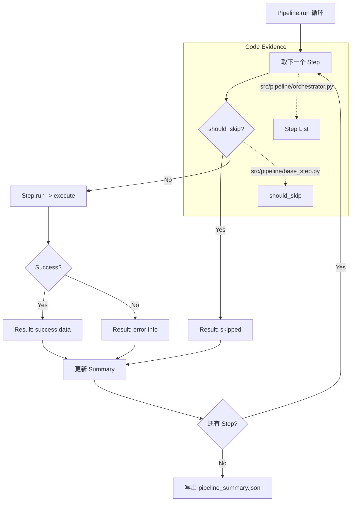

# 流程编排与步骤执行

## 🌟 核心概念：像“总控台”一样
>
> 就像调度中心按顺序发车，系统会按固定流程依次执行每一步，并记录每一步的结果。

## 📋 运作基石（必要元数据）

- **涉及领地 (Code Context)**：
  - `main.py`
  - `src/pipeline/orchestrator.py`
  - `src/pipeline/base_step.py`
  - `src/pipeline/steps/*`
  - `configs/launch.yaml`

- **执行准则 (Business Rules)**：
  - 步骤按固定顺序串行执行。
  - 每个步骤先判断是否需要跳过（skip）。
  - 即使单步失败，流程仍会继续执行后续步骤，并记录失败原因。
  - 统一写出 `pipeline_summary.json` 作为流程账本。

- **参考证据**：
  - 所有步骤都以 `data/*` 工件作为输入输出，形成可回放记录。

## ⚙️ 仪表盘：我该如何控制它？

| 配置参数 | 业务名称 | 调节它的效果 | 专家建议 |
| :--- | :--- | :--- | :--- |
| `output.*` | 输出目录集合 | 控制 raw/intermediate/final 路径 | 保持默认 |
| `logging.*` | 日志设置 | 控制日志级别与文件 | demo 级别 INFO |
| CLI: `--skip-*` | 跳过开关 | 跳过对应步骤 | 仅在调试使用 |

## 🛠️ 它是如何工作的（逻辑流向）

流水线的自动化由 `Pipeline` 类 (`src/pipeline/orchestrator.py`) 和 `BaseStep` (`src/pipeline/base_step.py`) 共同实现。

### 1. 静态编排 (Orchestration)

在 `Pipeline.run` 方法中，定义了一个固定的 `steps` 列表。

- 这个列表硬编码了步骤的执行顺序：`Parse` -> `Understand` -> `QA/Design` -> `Validation` -> ... -> `Export`。
- 这确保了数据流的依赖关系（比如必须先解析完代码，才能生成 embeddings）。

### 2. 动态跳过 (Skipping)

尽管顺序是固定的，但每个 Step 在执行前都会调用 `step.should_skip()`。

- **Flag Check**: 检查 CLI 参数（如 `--skip-llm`）是否要求跳过。
- **File Check**: 检查必要的输入文件是否存在（如 `MergeStep` 会检查是否有 raw 数据）。
- 如果返回 True，`Orchestrator` 会记录状态为 `skipped` 并直接进入下一步。

### 3. 结果审计 (Auditing)

不管步骤是成功、失败还是跳过，其返回值（包含处理数量、状态、错误信息）都会被收集到 `self.summary["steps"]` 中。

- 在流程最后，`write_summary` 会将这份详细的“体检报告”写入 `pipeline_summary.json`，供开发者复盘。

## 🧩 解决的痛点与带来的改变

- **以前的乱象**：步骤执行不透明，难以复盘。
- **现在的秩序**：每一步都有记录与结果，可复查、可回放。

## 💡 开发者笔记

- `pipeline_summary.json` 是流程审计入口。
- 单步失败不会自动停止，适合 demo，但正式场景可考虑 fail-fast。
