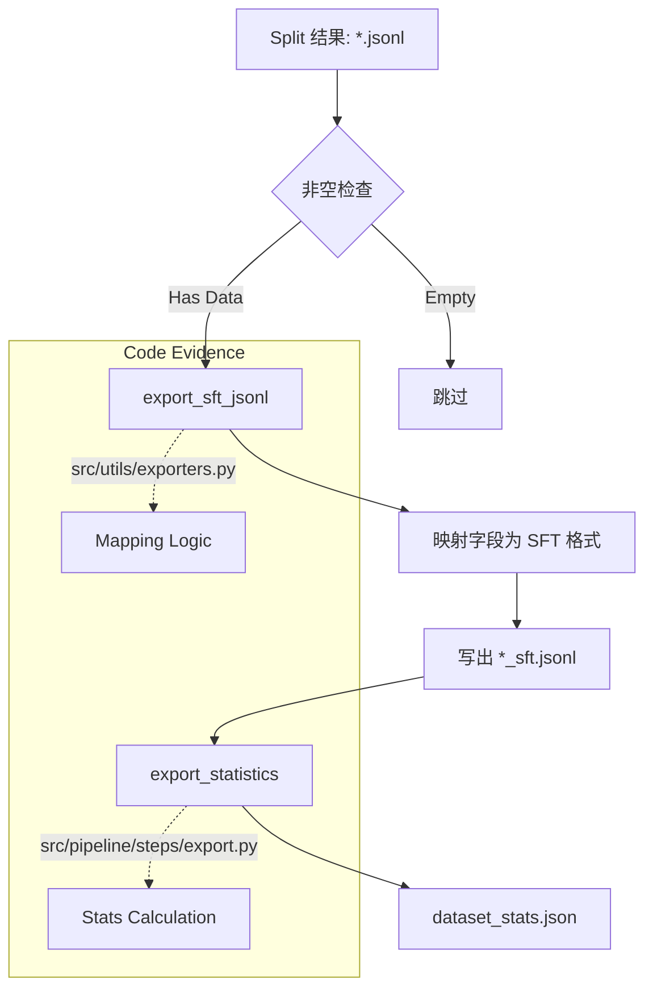

# 训练格式导出与统计（SFT）

## 🌟 核心概念：像“打包出货”一样
>
> 就像完成生产后要统一打包，系统会把数据转换成训练格式，并生成简明统计。

## 📋 运作基石（必要元数据）

- **涉及领地 (Code Context)**：
  - `src/pipeline/steps/export.py`
  - `src/utils/exporter.py`
  - `configs/launch.yaml`

- **执行准则 (Business Rules)**：
  - 合并数据与 QA/Design 子集分别导出。
  - 空文件不导出，避免产生无效文件。
  - 输出统计 `dataset_stats.json`，包含长度分布等基础指标。

- **参考证据**：
  - 输入来源为 `data/final/*` 的切分结果。

## ⚙️ 仪表盘：我该如何控制它？

| 配置参数 | 业务名称 | 调节它的效果 | 专家建议 |
| :--- | :--- | :--- | :--- |
| `output.final_dir` | 输出目录 | combined 输出位置 | data/final |
| `output.qa_final_dir` | QA 输出目录 | QA 输出位置 | data/final/qa |
| `output.design_final_dir` | Design 输出目录 | Design 输出位置 | data/final/design |
| CLI: `--skip-export` | 跳过导出 | 仅用于调试 | 正式不要跳过 |

## 🛠️ 它是如何工作的（逻辑流向）

最后一步 `ExportStep` (`src/pipeline/steps/export.py`) 负责将内部格式转换为通用的训练格式，并生成统计报表。

### 1. 格式转换 (Format Conversion)

核心函数 `export_sft_jsonl` (`src/utils/io/exporters.py`) 负责将 `TrainingSample` 对象“平铺”为 SFT (Supervised Fine-Tuning) 友好的 JSON 对象。

- **Mapping**:
  - `instruction` -> `instruction`
  - `input` -> `context`
  - `output` -> `answer` (或包含 reasoning trace 的 XML 格式，视配置而定)
- 这种解耦使得 pipeline 的内部数据结构可以包含丰富的元数据（如 `quality`, `repo_commit`），而导出的训练数据则保持精简。

### 2. 空文件保护 (Empty Checks)

代码在导出每一种 split (train/val/test) 之前，都会先检查源文件是否存在且非空。

- 这避免了在 pipeline 早期步骤（如 design generation）未产出任何数据时，生成一堆 0 字节的 `design_train_sft.jsonl` 文件，干扰后续的训练脚本。

### 3. 统计生成 (Statistics)

`export_statistics` 函数会遍历最终导出的所有样本，计算：

- **Total Count**: 总数据量。
- **Sources**: 数据来源分布 (QA vs Design)。
- **Lengths**: 统计 instruction, input, output 的平均长度和最大长度。
- 这些信息汇总在 `dataset_stats.json` 中，是评估数据规模和 Token 消耗的重要依据。

## 🧩 解决的痛点与带来的改变

- **以前的乱象**：数据可读但不可直接训练。
- **现在的秩序**：一键导出训练格式，并附带质量统计。

## 💡 开发者笔记

- 统计信息只反映当前导出的数据规模与长度。
- 如需更深层质量指标，可结合 quality/coverage 报表。
