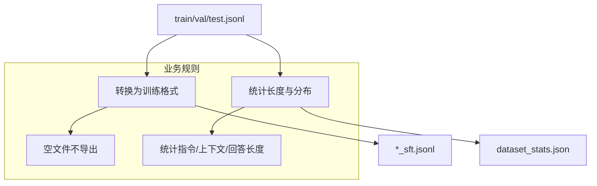

# 训练格式导出与统计（SFT）

## 🌟 核心概念：像“打包出货”一样
> 就像完成生产后要统一打包，系统会把数据转换成训练格式，并生成简明统计。

## 📋 运作基石（必要元数据）

- **涉及领地 (Code Context)**：
  - `src/pipeline/steps/export.py`
  - `src/utils/exporter.py`
  - `configs/launch.yaml`

- **执行准则 (Business Rules)**：
  - 合并数据与 QA/Design 子集分别导出。
  - 空文件不导出，避免产生无效文件。
  - 输出统计 `dataset_stats.json`，包含长度分布等基础指标。

- **参考证据**：
  - 输入来源为 `data/final/*` 的切分结果。

## ⚙️ 仪表盘：我该如何控制它？

| 配置参数 | 业务名称 | 调节它的效果 | 专家建议 |
| :--- | :--- | :--- | :--- |
| `output.final_dir` | 输出目录 | combined 输出位置 | data/final |
| `output.qa_final_dir` | QA 输出目录 | QA 输出位置 | data/final/qa |
| `output.design_final_dir` | Design 输出目录 | Design 输出位置 | data/final/design |
| CLI: `--skip-export` | 跳过导出 | 仅用于调试 | 正式不要跳过 |

## 🛠️ 它是如何工作的（逻辑流向）

## 🧩 解决的痛点与带来的改变

- **以前的乱象**：数据可读但不可直接训练。
- **现在的秩序**：一键导出训练格式，并附带质量统计。

## 💡 开发者笔记

- 统计信息只反映当前导出的数据规模与长度。
- 如需更深层质量指标，可结合 quality/coverage 报表。
