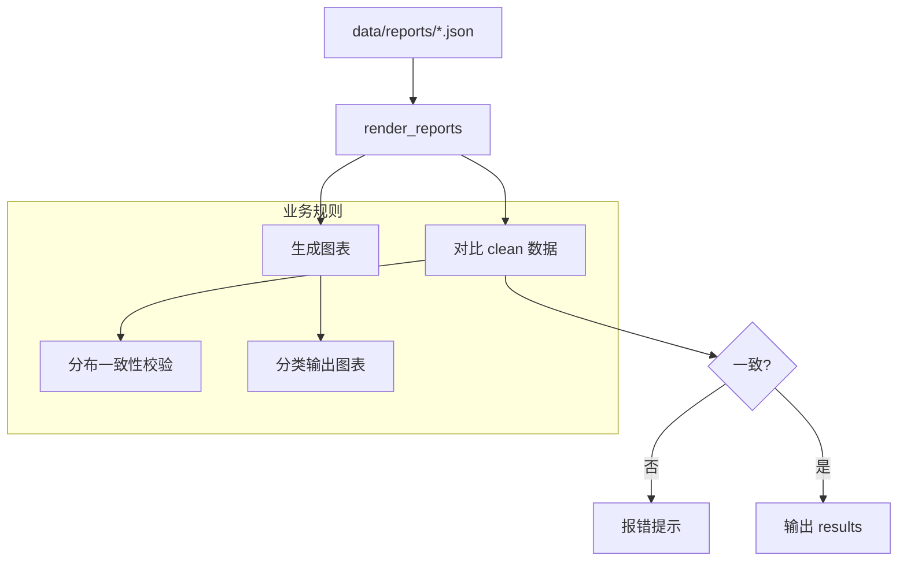

# 报表可视化与审计

## 🌟 核心概念：像“业务仪表盘”一样
> 就像看图表就能理解经营状况，系统会把报表转成图形，并在不一致时直接提示。

## 📋 运作基石（必要元数据）

- **涉及领地 (Code Context)**：
  - `data_validator/render_reports.py`
  - `data_validator/README.md`
  - `configs/launch.yaml`
  - `data/reports/*`

- **执行准则 (Business Rules)**：
  - 读取质量、分布、检索、去重等报表并生成图表。
  - 当报表与实际 clean 数据不一致时直接报错。
  - 输出目录固定在 `data_validator/results/`（按类别分组）。

- **参考证据**：
  - `coverage_report.json`、`question_type_report.json`、`qa_quality.json`、`design_quality.json` 等。

## ⚙️ 仪表盘：我该如何控制它？

| 配置参数 | 业务名称 | 调节它的效果 | 专家建议 |
| :--- | :--- | :--- | :--- |
| `output.reports_dir` | 报表目录 | 指向报表根目录 | data/reports |
| `artifacts.coverage_report_json` | 分布报表路径 | 覆盖分布图来源 | 默认即可 |
| `artifacts.question_type_report_json` | 类型报表路径 | 类型分布图来源 | 默认即可 |
| CLI: `--output-dir` | 图表输出目录 | 自定义图表输出 | data_validator/results |

## 🛠️ 它是如何工作的（逻辑流向）

## 🧩 解决的痛点与带来的改变

- **以前的乱象**：报表是文本，业务方难以直观理解。
- **现在的秩序**：图表一眼看懂，异常分布能第一时间暴露。

## 💡 开发者笔记

- 报表与 clean 数据不一致时会直接退出，避免“看错图”。
- 图表分目录输出，便于给业务方单独展示。
