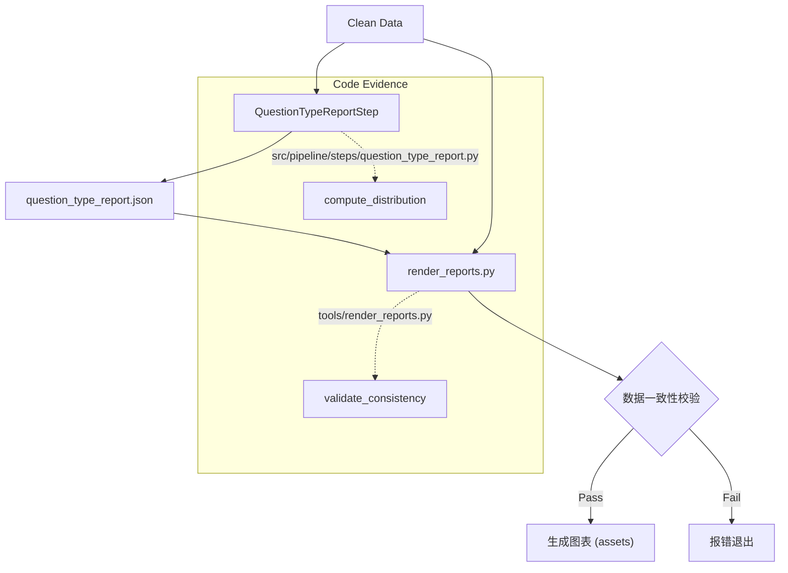

# 报表可视化与审计

## 🌟 核心概念：像“业务仪表盘”一样
>
> 就像看图表就能理解经营状况，系统会把报表转成图形，并在不一致时直接提示。

## 📋 运作基石（必要元数据）

- **涉及领地 (Code Context)**：
  - `tools/render_reports.py`
  - `tools/README.md`
  - `configs/launch.yaml`
  - `configs/types/coverage_keys.yaml`
  - `configs/types/report_visualization.yaml`
  - `data/reports/*`

- **执行准则 (Business Rules)**：
  - 读取质量、分布、检索、去重等报表并生成图表。
  - 当报表与实际 clean 数据不一致时直接报错。
  - 默认输出目录为 `tools/results/`（按类别分组，可通过 CLI 覆盖）。
  - 覆盖 key 顺序与展示文案由类型配置文件提供（可通过 CLI 覆盖路径）。

- **参考证据**：
  - `coverage_report.json`、`question_type_report.json`、`qa_quality.json`、`design_quality.json` 等。

## ⚙️ 仪表盘：我该如何控制它？

| 配置参数 | 业务名称 | 调节它的效果 | 专家建议 |
| :--- | :--- | :--- | :--- |
| `output.reports_dir` | 报表目录 | 指向报表根目录 | data/reports |
| `artifacts.coverage_report_json` | 分布报表路径 | 覆盖分布图来源 | 默认即可 |
| `artifacts.question_type_report_json` | 类型报表路径 | 类型分布图来源 | 默认即可 |
| CLI: `--output-dir` | 图表输出目录 | 自定义图表输出 | tools/results |
| CLI: `--chart-style` | 图表样式 | 选择饼图或柱状图 | pie |
| CLI: `--coverage-keys` | 覆盖 keys 配置 | 覆盖分布的 key 顺序 | configs/types/coverage_keys.yaml |
| CLI: `--viz-config` | 可视化映射 | label/retrieval 映射 | configs/types/report_visualization.yaml |

## 🛠️ 它是如何工作的（逻辑流向）

### 1. 报表生成 (Generation)

- **QuestionTypeReportStep** (`src/pipeline/steps/question_type_report.py`):
  - 读取 `qa_clean.jsonl` 和 `design_clean.jsonl`。
  - 调用 `compute_distribution` 计算各维度分布。
  - 检查 Regression：对比 `targets` 和实际分布，超过 `max_delta` 则记录 Warnings。
  - 输出 `question_type_report.json`。

### 2. 可视化与校验 (Visualization & Audit)

- **render_reports** (`tools/render_reports.py`):
  - 读取上述生成的 JSON 报表。
  - 再次统计磁盘上的 clean 数据，确保报表与数据一致（防止报表造假或过时）。
  - 调用 `matplotlib` / `pandas` 生成饼图或柱状图。

## 🧩 解决的痛点与带来的改变

- **以前的乱象**：报表是文本，业务方难以直观理解。
- **现在的秩序**：图表一眼看懂，异常分布能第一时间暴露。

## 💡 开发者笔记

- 报表与 clean 数据不一致时会直接退出，避免“看错图”。
- 图表分目录输出，便于给业务方单独展示。
