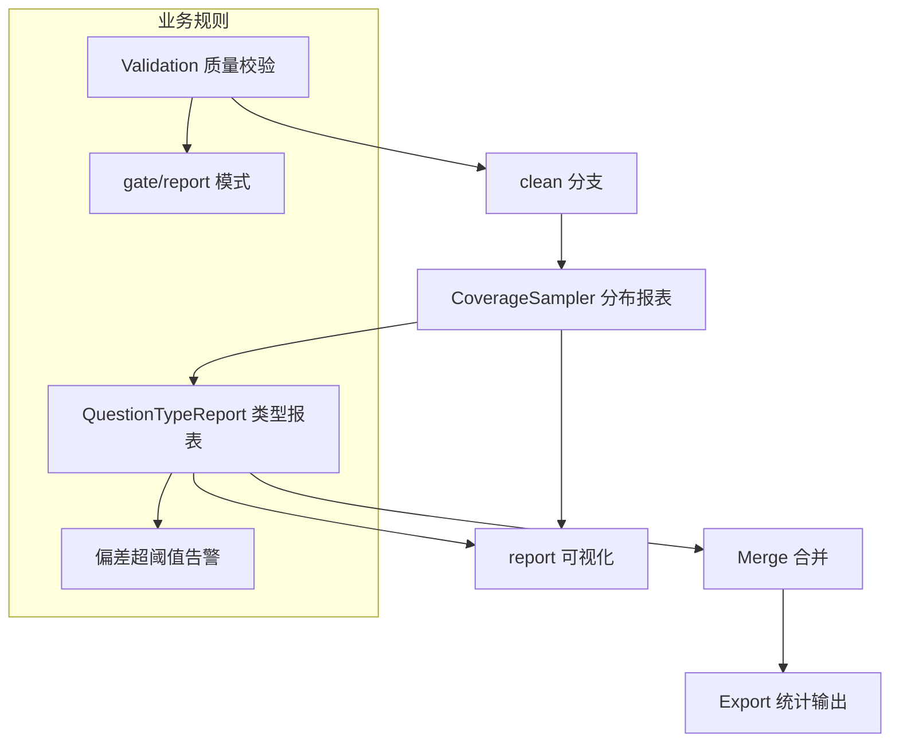

# 验证与闭环（Verification & Feedback）

## 🌟 核心概念：像“仪表盘+回访”一样
> 就像运营要看数据报表、再决定下一步动作，系统会输出质量与分布报表，并对偏差做提示。

## 📋 运作基石（必要元数据）

- **涉及领地 (Code Context)**：
  - `src/pipeline/steps/validation.py`
  - `src/pipeline/steps/coverage_sampler.py`
  - `src/pipeline/steps/question_type_report.py`
  - `src/pipeline/steps/merge.py`
  - `src/pipeline/steps/export.py`
  - `tools/render_reports.py`
  - `configs/launch.yaml`

- **执行准则 (Business Rules)**：
  - Validation 生成质量报告与 clean 分支。
  - Merge 在 gate/report 模式间切换：gate 强制使用 clean。
  - Coverage 报表输出难度/意图/模块跨度分布。
  - Question type 报表输出类型分布，并在偏差过大时告警（warn-only）。
  - Export 会输出整体数据统计（`dataset_stats.json`）。 

- **参考证据**：
  - `data/reports/*` 是审计依据（quality/coverage/question_type/dedup 等）。

## ⚙️ 仪表盘：我该如何控制它？

| 配置参数 | 业务名称 | 调节它的效果 | 专家建议 |
| :--- | :--- | :--- | :--- |
| `quality.gate_mode` | 质量门禁模式 | gate / report | demo 可 report，正式建议 gate |
| `quality.write_clean` | 产出 clean 分支 | 是否写 clean 工件 | true |
| `quality.allow_fallback_in_report` | report 回退 | report 模式可回退 raw | demo 可 true |
| `question_answer.coverage.diversity.regression.enabled` | QA 类型回归告警 | 分布偏差提醒 | true |
| `question_answer.coverage.diversity.regression.max_delta` | QA 偏差阈值 | 超过阈值会告警 | 0.1 |
| `design_questions.coverage.diversity.regression.enabled` | Design 类型回归告警 | 分布偏差提醒 | true |
| `artifacts.coverage_report_json` | 分布报告路径 | coverage_report 输出位置 | data/reports/coverage_report.json |
| `artifacts.question_type_report_json` | 类型报告路径 | question_type_report 输出位置 | data/reports/question_type_report.json |
| `output.reports_dir` | 报表目录 | 所有报表根目录 | data/reports |

## 🛠️ 它是如何工作的（逻辑流向）

## 🧩 解决的痛点与带来的改变

- **以前的乱象**：只有结果，没有“质量与分布的证据”。
- **现在的秩序**：报表齐全，偏差可见，调整有方向。

## 💡 开发者笔记

- regression 当前是 warn-only，不会中断流水线。
- `tools/render_reports.py` 可将报表转为图形，适合面向业务方展示。
