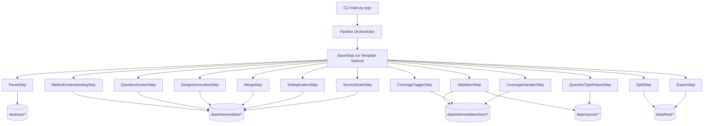

# Orchestrator & Step API Design

## 章节与重点内容

- Architecture Overview：管道层级（CLI → Orchestrator → Steps → Engines/Utils → Artifacts）
- Design Patterns：Pipeline、Template Method、Config Singleton、“文件工件即接口”
- Data Flow：从 CLI args 到文件工件，再到最终 SFT 导出（以文件系统作为持久层）
- Modular Detail：Step 生命周期、skip/错误处理策略、paths 映射设计
- Trade-offs：串行执行、质量 gate 与 clean 分支、路径契约风险

---

## Architecture Overview

### 层级关系

该系统是一个离线数据生成管道，逻辑层级如下：

1. **CLI 层**：`main.py` 解析参数并启动 pipeline
2. **编排层**：`src/pipeline/orchestrator.py` 负责加载配置、初始化路径、组装并串行执行 step
3. **步骤层**：`src/pipeline/steps/*` 每个 step 承担单一职责，读写固定 artifact
4. **引擎层**：`src/engine/*` 负责 LLM/RAG/设计问题生成等“重逻辑”，往往自带输出文件
5. **工具层**：`src/utils/*` 提供 schema、去重、校验、split、导出、安全扫描等
6. **持久层（DB 等价物）**：`data/*` + `logs/*` + `data/reports/*`

### 整体架构图（概念）

---

## Design Patterns

### 1) Pipeline Pattern（流水线/管道模式）

**选择原因**：训练数据生成天然由多个可拆分阶段组成（解析、生成、校验、去重、切分、导出），每个阶段依赖明确的输入/输出工件，适合 pipeline。

**实现方式**：Orchestrator 内固定 step 顺序串行执行；step 间通过文件工件衔接，而不是通过内存对象传递。

### 2) Template Method（模板方法）

**选择原因**：每个 step 都需要统一的 skip 判断、日志边界、异常处理与结果汇总；将样板逻辑集中到基类，step 只实现 `should_skip()` 与 `execute()`。

**实现位置**：`src/pipeline/base_step.py` 的 `BaseStep.run()`。

### 3) Singleton（配置单例）

**选择原因**：LLM 配置与 pipeline 配置需要全局一致、跨模块共享；引擎构造时通过 `Config()` 获取相同配置，避免层层传参。

**实现位置**：`src/utils/config.py` 的 `Config` 单例模式（`__new__` + `_config` 静态存储）。

### 4) Artifact-as-Interface（文件工件即接口）

**选择原因**：离线数据流水线需要可复现、可回放、可审计；文件工件作为跨 step 的稳定边界，比内存对象更易 debug/重跑/对比。

**体现**：Orchestrator 统一构造 `paths` 字典，step 根据 `paths` 读写工件。

---

## Data Flow（从 Request 到 Storage/DB）

### 控制流（Control Flow）

1. `main.py` 解析 args（例如 `--skip-parse` / `--skip-qa` / `--skip-llm`）
2. 创建 `Pipeline(config_path)`，加载配置并初始化 `paths`
3. Orchestrator 组装 step 列表并依次执行
4. 每个 step：
   - `should_skip()`：决定是否执行并记录原因
   - `execute()`：读取输入 artifact → 处理 → 写入输出 artifact
5. Orchestrator 汇总每步 result，写入 `data/reports/pipeline_summary.json`

### 数据流（Artifacts）

当前实现的“DB 等价物”为文件系统，关键工件包括：

- Parse：`data/raw/extracted/symbols.jsonl`、`data/raw/repo_meta/repo_meta.json`
- QA/Design：`data/intermediate/auto_qa_raw.jsonl`、`data/intermediate/design_raw.jsonl`
- Validation：`data/intermediate/clean/qa_clean.jsonl`、`data/intermediate/clean/design_clean.jsonl`
- Coverage：`data/reports/coverage_report.json`、`data/reports/question_type_report.json`
- Post-process：`data/intermediate/all_raw.jsonl`、`data/intermediate/all_dedup.jsonl`
- Split：`data/final/{train,val,test}.jsonl` + `data/final/{qa,design}/*`
- Export：`data/final/*_sft.jsonl` + `data/reports/dataset_stats.json`

---

## Modular Detail

### Step 生命周期与结果结构

- `BaseStep.run()` 返回 `dict`，最小字段约定为：
  - `status`: `success | skipped | failed`
  - `reason`（可选）：skip 的原因
  - `error`（可选）：失败原因字符串
  - 其他字段：由 step 自行扩展，用于 summary

### Skip 策略（摘要）

- Parse 支持基于 commit cache 命中跳过（`repo_meta.repo_commit` 匹配当前 commit）
- MethodUnderstanding 支持 `method_understanding.enabled=false`、`--skip-llm`、用户模式不需要 embeddings
- QuestionAnswer 支持 `--skip-question-answer` / `--skip-qa` / `--skip-llm`
- Design 支持 `--skip-design` / `--skip-llm`
- Dedup 支持 `--skip-dedup` 或缺少输入工件
- SecretsScan 支持 `--skip-safety` 或缺少输入工件
- Export 支持 `--skip-export`

### Paths 映射策略

Orchestrator 统一创建目录并在 `paths` 中固定常用文件名，step 直接引用 `paths[key]`，避免重复拼路径。配置可覆盖部分 artifact 路径，但建议统一由 `paths` 生成以减少耦合。

---

## Trade-offs

### 1) 串行执行 vs 并行/吞吐

- 优点：简单、确定性强、便于 debug 与复现。
- 代价：对 LLM/embedding 等耗时阶段无法并行化；整体吞吐较低。

### 2) Report-only vs Clean Gate

- 现状：Validation 会输出 clean 工件，同时 Merge 在 gate/report 模式之间切换；gate 模式要求 clean 存在，report 模式允许回退 raw。
- 收益：在不强制阻断的情况下，保留“高质量 clean 分支”并可视化质量报告。
- 风险：若配置为 report 且允许 fallback，最终训练集仍可能包含低质样本。

### 3) 文件工件边界 vs 路径/契约耦合

- 优点：可回放、可审计、天然支持断点续跑。
- 风险：不同模块（step 与 engine）若对输出路径的默认值不一致，会产生隐式耦合与错配成本；建议逐步把引擎输出路径“外显”为显式参数或统一由 `paths` 注入。
