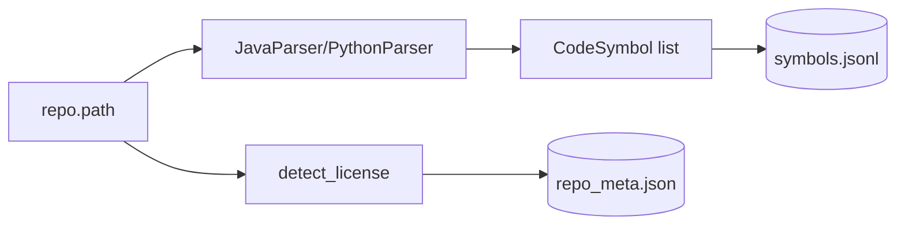

# Step 1 — ParseStep Design

## 章节与重点内容

- Architecture Overview：Parser 选择与符号抽取、repo 元信息生成
- Design Patterns：Strategy（多语言 parser）、Artifact boundary（symbols.jsonl）
- Data Flow：Repo FS → `CodeSymbol[]` → `symbols.jsonl` / `repo_meta.json`
- Modular Detail：缓存跳过策略、license 检测、语言配置获取方式
- Trade-offs：符号粒度/截断策略、commit 探测的可靠性、语言扩展成本

---

## Architecture Overview

### 职责边界（Single Responsibility）

ParseStep 的唯一职责是：**将目标代码仓库解析为标准化的 `CodeSymbol` 列表并落盘**，为后续所有生成步骤提供一致的证据来源。

### 输入/输出（Artifacts）

- 输入：
  - `config.repo.path`（仓库根目录）
  - `repo_commit`（由 Orchestrator 计算）
  - 语言配置：`config.language.name`
- 输出：
  - `data/raw/extracted/symbols.jsonl`（每行一个 `CodeSymbol`）
  - `data/raw/repo_meta/repo_meta.json`（commit、symbol 数、license 等）

### 内部依赖

- Parser：`src/parser/java_parser.py` 或 `src/parser/python_parser.py`
- Schema：`src/schemas/symbols.py::CodeSymbol`
- Safety/Compliance：`src/utils/safety.py::detect_license`

---

## Design Patterns

### 1) Strategy Pattern（解析器策略选择）

**问题**：不同语言的 AST/语法树解析完全不同，需要独立实现。

**方案**：根据 `language.name` 选择对应 parser（JavaParser/PythonParser），对外暴露统一接口 `parse_repo(repo_path, repo_commit)`。

**收益**：
- 扩展新语言仅需新增 parser + language profile，不需要修改后续步骤的消费逻辑。

### 2) Artifact Boundary（符号工件作为后续证据源）

ParseStep 不直接参与生成问答/设计，只负责把结构化证据固定在 `symbols.jsonl`，后续全部通过 `symbol_id/source_hash/line_range` 做可验证引用。

---

## Data Flow

### 数据走向（Repo → Symbols）

### 关键字段与后续契约

ParseStep 输出的 `CodeSymbol` 必须满足后续校验与切分的契约：

- `symbol_id`：稳定主键，供 `evidence_refs.symbol_id` 引用
- `source_hash`：用于校验 evidence 是否与符号一致
- `repo_commit`：用于保证样本与符号属于同一版本
- `file_path/start_line/end_line/source`：用于构造上下文与证据定位

---

## Modular Detail

### Skip/Cache 策略

- 当 CLI 设置 `--skip-parse`，并且 `repo_meta.repo_commit == current_commit` 且 `symbols.jsonl` 存在时，允许跳过解析（避免重复耗时）。
- 该策略将“commit 一致性”作为缓存 key，因此适用于 git 仓库或配置显式提供 commit 的场景。

### 语言配置读取的兼容分支

ParseStep 同时兼容 `config` 为 dict 与 `Config` 对象两种形态，避免调用方差异导致的取值失败。

### License 检测的定位

license 作为合规 metadata 存入 `repo_meta.json`，便于在数据集发布/共享前做审计与过滤策略（例如对 GPL 项目做特殊处理）。

---

## Trade-offs

### 1) 以 `repo_commit` 作为缓存 key

- 优点：简单、稳定、与源码版本强绑定。
- 风险：非 git 仓库/或 HEAD 无法探测时会回落为 `UNKNOWN_COMMIT`，导致缓存行为不可预期；建议对非 git repo 引入内容 hash 或显式版本号。

### 2) 符号粒度与截断

- 优点：方法/类级 symbol 可直接作为 QA/Design 的证据单位。
- 代价：过长 symbol 需要截断会影响上下文完整性；过短 symbol 又不足以支撑推理与证据引用。此权衡需要与语言 profile 的 `max_chars_per_symbol` 协同。

### 3) 扩展新语言的成本

- 优点：后续步骤只依赖 `CodeSymbol` 与 profile 规则，扩展面集中。
- 代价：新语言 parser 的实现质量直接决定后续数据质量（符号边界、qualified_name、annotations/decorators 抽取等）。

