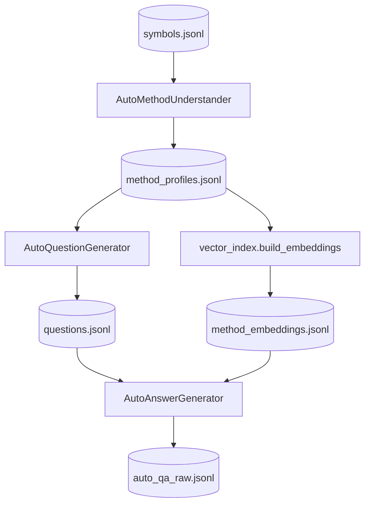

# Step 2 — AutoModuleStep Design (Method-Level RAG)

## 章节与重点内容

- Architecture Overview：四段式 Auto 链路（Profiles → Embeddings → Questions → Answers）
- Design Patterns：RAG Pipeline、Strategy（profile 规则来自 language profile）、Artifact boundary
- Data Flow：`symbols.jsonl` → `method_profiles.jsonl` / `questions.jsonl` / `auto_qa_raw.jsonl`
- Modular Detail：候选方法选择、embedding 构建、向量检索、证据引用约束
- Trade-offs：成本/质量、路径隐式耦合、向量索引的简化实现

---

## Architecture Overview

### 职责边界（Single Responsibility）

AutoModuleStep 的职责是：在启用 Auto 模式时，执行“方法级理解 + RAG”链路，生成更高质量、更可解释的 QA 数据；同时可选地输出 method profiles 供自动需求生成增强上下文。

### 执行模式

- **Auto QA 模式**：`auto.enabled=true` 且未设置 `--skip-llm/--skip-qa`
  - 产生 `auto_qa_raw.jsonl`（TrainingSample）
- **Profiles-only 模式**：Auto QA 不需要，但 auto requirements 需要 method profiles
  - 仅产生 `method_profiles.jsonl`
- **Disabled/Skipped**：Auto 关闭或显式 skip

### 输入/输出（Artifacts）

- 输入：
  - `symbols.jsonl`
  - 语言规则：language profile（用于候选选择与回答格式约束）
- 输出（默认路径由配置键控制）：
  - `data/intermediate/method_profiles.jsonl`
  - `data/intermediate/method_embeddings.jsonl`
  - `data/intermediate/questions.jsonl`
  - `data/intermediate/auto_qa_raw.jsonl`
  - 各类 rejected/失败回收文件（便于调试）

---

## Design Patterns

### 1) RAG Pipeline（检索增强生成）

Auto 模块把 QA 生成分解为：

1. **理解（理解候选方法的业务语义）** → MethodProfile
2. **索引（将 profiles 向量化）** → embeddings
3. **提问（从 profile 生成多样化问题）** → questions
4. **回答（检索 Top-K 方法作为上下文，生成带证据的回答）** → TrainingSample

该拆分把“选择什么问”和“如何答”解耦，使可控性、可观测性更强（每个阶段都有落盘工件可检查）。

### 2) Artifact-as-Interface

阶段间通过 JSONL 工件衔接（profiles/questions/embeddings），使链路可断点重跑、可回放。

### 3) Strategy via Language Profile

候选方法评分/业务标记、回答格式约束、常见错误示例等信息由 language profile 提供（Java/Python 可不同）。

---

## Data Flow

### “DB”等价说明

- 训练数据生成的“持久层”是 `data/intermediate/*` 工件文件。
- 向量索引使用 `method_embeddings.jsonl` 作为“索引库”（无独立数据库或向量数据库依赖）。

---

## Modular Detail

### A1：MethodProfile 生成（方法级理解）

关键点：

- 只选择 `symbol_type == method` 的符号作为候选。
- 候选排序采用启发式打分（业务注解/文档/行数等）。
- 输出 `MethodProfile`，包含 `business_rules/dependencies/evidence_refs` 等结构化字段，后续用于生成问题与回答。

### A2：Embedding 构建与索引格式

关键点：

- 以 `qualified_name + summary + business_rules + tags` 组装 embedding 文本。
- 使用 Ollama embeddings API 直接生成 embedding，并把向量写入 JSONL（每行一个 embedding entry）。
- 该实现是“轻量索引”，无需引入向量数据库，便于本地快速验证。

### A3：Question 生成与去重

关键点：

- 每个 profile 生成 `questions_per_method` 个问题。
- 使用简单 hash 去重（避免重复问题污染训练集多样性）。

### A4：Answer 生成（检索 Top-K 作为上下文）

关键点：

- 根据问题文本进行向量检索，取 Top-K methods 作为上下文拼接。
- 从检索到的方法构造 `available_evidence_refs`，并要求 LLM 选择其中的证据引用写入 `thought.evidence_refs`（这是后续 Validation/Split 的强契约）。
- 最终输出 `TrainingSample`（`scenario=qa_rule`）。

---

## Coupling Points（与后续步骤的耦合）

### 1) 与 QAGenerationStep 的“互斥耦合”

当 `auto.enabled=true` 时，标准 QA step 默认跳过；因此 Auto step 的成功与否将直接影响 Merge 能否获得 QA 输入。

### 2) 与 MergeStep 的“路径/命名耦合”

MergeStep 在 Auto 模式下会读取 `auto.outputs.auto_qa_raw_jsonl` 指定的文件名，并在 `paths["intermediate"]` 下定位；因此 Auto 模块输出路径必须与该定位逻辑一致。

### 3) 与 Split/Validation 的 schema 耦合

Auto 输出的 TrainingSample 必须包含 `thought.evidence_refs`（且 `symbol_id/source_hash/file_path/line` 与 symbols.jsonl 一致），否则：

- Validation 会报 evidence 缺失/不一致
- group split 会退化为 `_NO_EVIDENCE_` 分组，增加泄漏风险

---

## Trade-offs

### 1) 质量提升 vs 成本与吞吐

- 质量收益：问题多样性更强，上下文更相关，回答更可解释。
- 成本：需要多次 LLM 调用（profile+question+answer）以及 embedding 生成，整体耗时与资源显著增加。

### 2) 轻量索引 vs 工程化检索

- 优点：零外部依赖、易部署、适合本地快速验证。
- 代价：线性扫描 embeddings 的检索在规模上不具备可扩展性；未来可替换为 FAISS/向量 DB，并保持接口不变（`search(query) -> [(symbol_id, score)]`）。

### 3) 输出路径的隐式耦合

- 当前多数引擎通过 `Config` 读取输出路径；step 层未显式把 `paths` 注入引擎，导致路径契约更隐式。
- 建议演进：在 step 中显式传入输出路径，或统一由 Orchestrator 的 `paths` 生成并注入。

