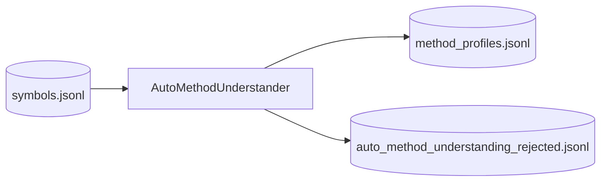
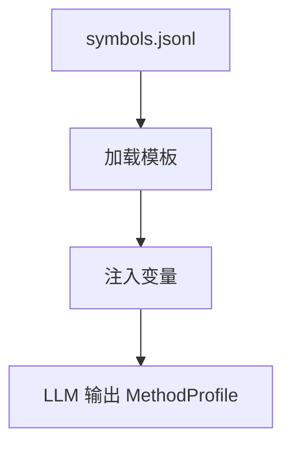

# Step 2 — MethodUnderstandingStep Design

## 章节与重点内容

- Architecture Overview：方法级理解的定位（为 QA/Design 提供 method profiles）
- Design Patterns：Profile Extraction、Artifact boundary
- Data Flow：`symbols.jsonl` → `method_profiles.jsonl`
- Modular Detail：触发条件、候选方法筛选、输出结构
- Trade-offs：质量/成本、profiles 依赖耦合

---

## Architecture Overview

### 职责边界（Single Responsibility）

MethodUnderstandingStep 的职责是：从 `symbols.jsonl` 中选择候选方法并生成 `MethodProfile`，用于后续 Question/Answer 与 Auto Design Questions 的上下文增强或 embedding 构建。

### 触发条件

- `method_understanding.enabled=true` 且
- 满足以下任一条件：
  - Auto QA 开启（未设置 `--skip-question-answer`）
  - `question_answer.build_embeddings_in_user_mode=true`（用户问题模式也要生成 embeddings）

### 输入/输出（Artifacts）

- 输入：
  - `symbols.jsonl`
  - language profile（用于候选规则）
- 输出：
  - `data/intermediate/method_profiles.jsonl`
  - `data/intermediate/rejected/auto_method_understanding_rejected.jsonl`

---

## Design Patterns

### 1) Profile Extraction

将方法的业务语义与证据引用结构化为 `MethodProfile`，后续生成问题与回答时可直接引用，减少 prompt 漫游。

### 2) Artifact-as-Interface

`method_profiles.jsonl` 是后续模块的接口契约，使流程可断点重跑、可审计。

---

## Data Flow

---

## Modular Detail

### 候选方法筛选

- 只选择 `symbol_type == method`。
- 排序依据 language profile 中的规则（注解/命名/路径等）。

### Profile 结构要点

- `summary`、`business_rules`、`dependencies`
- `evidence_refs`：后续 QA/Design 的证据引用来源

---

## Coupling Points

- QuestionAnswerStep：依赖 `method_profiles.jsonl` 构建 embeddings 与自动问题
- DesignGenerationStep：当 `design_questions.use_method_profiles=true` 时，用 profiles 增强 auto design questions

---

## Prompt 说明（模板角色）

### 模板：`configs/prompts/method_understanding/auto_method_understanding.txt`

#### 🌟 核心概念
> 就像给方法做“统一说明书”，让后续生成有稳定语义输入。

#### 📋 运作基石（元数据与规则）
- **存放位置**：`configs/prompts/method_understanding/auto_method_understanding.txt`
- **工序位置**：MethodUnderstandingStep
- **变量注入**：`symbol_id`、`file_path`、`qualified_name`、`annotations`、`javadoc`、`source_code`、`start_line`、`end_line`、`source_hash`、`repo_commit`
- **核心准则**：只输出严格 JSON、`evidence_refs` 必须逐字复制、字段固定不可缺失
- **推理模式**：结构化信息抽取（按字段填充，避免自由发挥）

#### ⚙️ 仪表盘：我该如何控制它？

| 配置参数 | 业务直观名称 | 调节它的效果 |
| :--- | :--- | :--- |
| `method_understanding.prompts.generation` | 方法理解模板 | 决定输出结构 |
| `core.max_context_chars` | 源码截断上限 | 限制上下文长度 |

#### 🛠️ 逻辑流向图 (Mermaid)

#### 🧩 解决的痛点
- **以前的乱象**：方法语义靠人工解释，难以复用。
- **现在的秩序**：结构化 MethodProfile 可统一消费。

---

## Trade-offs

### 质量提升 vs 成本

- 优势：提高问题/回答与设计问题的贴合度。
- 代价：额外 LLM 调用与中间工件维护成本。
