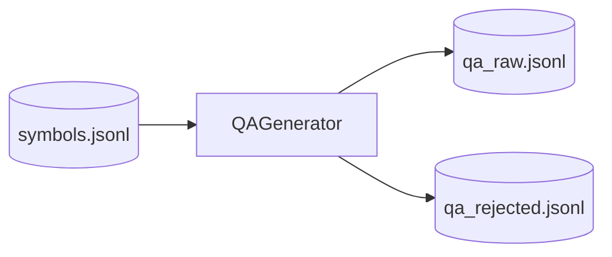

# Step 2 (Deprecated) — QAGenerationStep Design

## 章节与重点内容

- Architecture Overview：标准 QA 生成（非 Auto）
- Design Patterns：Pipeline Stage、规则/候选选择策略来自 language profile
- Data Flow：`symbols.jsonl` → `qa_raw.jsonl` / `qa_rejected.jsonl`
- Modular Detail：候选符号选择、上下文拼装、结构化输出约束
- Trade-offs：可控性 vs 质量、输出路径一致性风险

---

## Architecture Overview

### 职责边界（Single Responsibility）

QAGenerationStep 已从当前流水线移除，QA 统一由 QuestionAnswerStep 负责；本节保留为历史设计参考。

### 触发条件（与 Auto 的关系）

- 当未设置 `--skip-question-answer` 且未设置 `--skip-llm/--skip-qa` 时，该 step 默认跳过（避免重复生成 QA）。
- 当启用 `--skip-question-answer` 时，旧版 QA step 才会执行（当前已移除）。

### 输入/输出（Artifacts）

- 输入：`data/raw/extracted/symbols.jsonl`
- 输出（引擎默认写入 `data/intermediate`）：
  - `data/intermediate/qa_raw.jsonl`
  - `data/intermediate/qa_rejected.jsonl`

---

## Design Patterns

### 1) Rule-driven Candidate Selection（基于 profile 的候选选择）

QAGenerator 的候选方法优先级由 language profile 中的 QA markers 决定（如 Java 注解、Python decorator、命名/路径关键词），使规则可配置、可扩展。

### 2) Structured Output（结构化推理轨迹）

输出 `TrainingSample` 内的 `thought` 字段使用 `ReasoningTrace`（observations/inferences/evidence_refs/assumptions），避免自由文本 CoT。

---

## Data Flow

---

## Modular Detail

### 上下文构造与长度控制

QAGenerator 控制单条样本上下文长度（`qa_generator.max_context_chars`），避免 prompt 过长导致不稳定或成本暴涨。

### Evidence 引用契约

输出样本必须：

- `thought.evidence_refs[].symbol_id` 存在于 symbols_map
- `source_hash` 与 symbol.source_hash 一致
- `file_path/start_line/end_line` 与 symbol 对齐

这些契约被 ValidationStep 与 SplitStep 复用。

---

## Coupling Points（与后续步骤的耦合）

- ValidationStep：读取 `qa_raw.jsonl` 做校验并生成质量报告
- MergeStep：在非 Auto 模式下将 `qa_raw.jsonl` 合并到 `all_raw.jsonl`
- Dedup/Safety/Split/Export：依赖样本 schema 字段齐全（instruction/context/answer/thought/scenario）

---

## Trade-offs

### 1) 直接 QA 生成 vs Auto QA

- 优点：链路短、成本低、实现更简单。
- 代价：缺少 method profile 与检索分解带来的可控性，问题多样性与上下文相关性通常弱于 Auto 模式。

### 2) 输出路径一致性

QAGenerator 内部有默认输出路径 `data/intermediate/qa_raw.jsonl`；pipeline 同样在 `paths` 中定义该路径。两者需要保持一致，否则 Validation/Merge 可能找不到预期文件。

