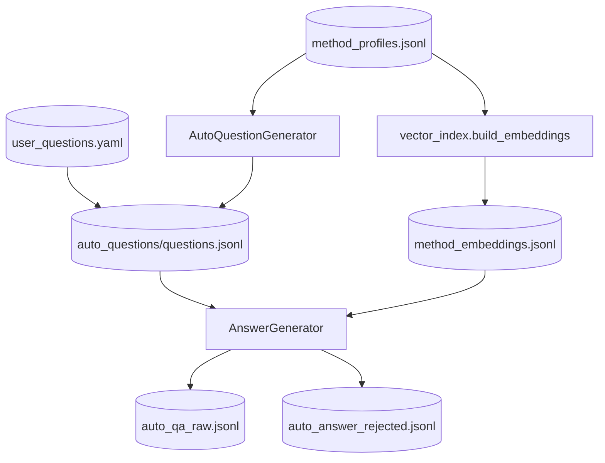

# Step 3 — QuestionAnswerStep Design (Method-Level RAG)

## 章节与重点内容

- Architecture Overview：问题生成 + 向量检索 + 回答生成
- Design Patterns：RAG Pipeline、Artifact boundary
- Data Flow：`method_profiles.jsonl` / `user_questions.yaml` → `questions.jsonl` → `auto_qa_raw.jsonl`
- Modular Detail：Auto/User 两种模式、embedding 构建、证据引用约束
- Trade-offs：成本/质量、路径契约、向量索引的简化实现

---

## Architecture Overview

### 职责边界（Single Responsibility）

QuestionAnswerStep 的职责是：在 QA 生成链路中串联**问题来源**（Auto or User）与**回答生成**（RAG），并输出 `auto_qa_raw.jsonl`。

### 执行模式

- **Auto QA 模式**：未设置 `--skip-question-answer` 且未设置 `--skip-llm/--skip-qa`
  - 依赖 `method_profiles.jsonl`
  - 先构建 embeddings，再生成问题，再生成回答
- **User QA 模式**：设置 `--skip-question-answer` 且未设置 `--skip-llm/--skip-qa`
  - 从 `question_answer.user_questions_path` 读取问题
  - 可选：`question_answer.build_embeddings_in_user_mode=true` 时仍构建 embeddings
- **Disabled/Skipped**：`--skip-qa` 或 `--skip-llm`

### 输入/输出（Artifacts）

- 输入：
  - `method_profiles.jsonl`（Auto QA 或用户模式下构建 embeddings 时需要）
  - `symbols.jsonl`（构造证据上下文）
  - `question_answer.user_questions_path`（User QA 模式）
- 输出（默认路径可被 artifacts 覆盖）：
  - `data/intermediate/method_embeddings.jsonl`
  - `data/intermediate/auto_questions/questions.jsonl`
  - `data/intermediate/auto_qa_raw.jsonl`
  - `data/intermediate/rejected/auto_answer_rejected.jsonl`
  - `data/reports/qa_retrieval_report.json`

---

## Design Patterns

### 1) RAG Pipeline（检索增强生成）

Question/Answer 模块把 QA 生成分解为：

1. **索引（将 profiles 向量化）** → embeddings
2. **提问（从 profile 生成问题或加载用户问题）** → questions
3. **回答（检索 Top-K 方法作为上下文）** → TrainingSample

该拆分把“选择什么问”和“如何答”解耦，使可控性、可观测性更强（每个阶段都有落盘工件可检查）。

### 2) Artifact-as-Interface

阶段间通过 JSONL 工件衔接（profiles/questions/embeddings），使链路可断点重跑、可回放。

---

## Data Flow

---

## Modular Detail

### Auto QA 模式

- 若 `method_profiles.jsonl` 缺失会直接失败（提示启用 MethodUnderstandingStep）。
- 构建 embeddings 使用 `question_answer.embedding_model`。
- 问题生成量受 `question_answer.max_questions` 与 `questions_per_method` 影响。

### User QA 模式

- 问题来源于 `question_answer.user_questions_path`。
- `build_embeddings_in_user_mode=true` 时仍构建 embeddings，便于没有 evidence_refs 的泛化问题做向量检索。
- 读入问题后会按 `max_questions` 截断。

### 回答生成与检索

- `core.retrieval_top_k` / `question_answer.retrieval` 控制检索与回退策略。
- 输出样本需包含 `thought.evidence_refs`，否则 Validation 会判定为 evidence 缺失。

### 约束与多样性控制（配置驱动）

- `question_answer.coverage.diversity`：按 question_type 抽样/分布
- `question_answer.scenario_injection`：将场景约束注入 prompt
- `question_answer.constraints`：反例对比、架构约束注入

---

## Coupling Points（与后续步骤的耦合）

- ValidationStep：要求 `TrainingSample` 符合 schema 与 evidence_refs 一致性。
- CoverageTagger/Sampler：依赖 `quality.coverage` 字段生成/抽样。
- MergeStep：默认读取 clean 或 raw QA 工件，路径由 artifacts 对齐。

---

## Trade-offs

- 质量收益：问题多样性更强，上下文更相关，回答更可解释。
- 成本代价：需要 embeddings + LLM 多次调用；整体耗时与资源显著增加。
- 工程约束：轻量索引便于本地验证，但不适合大规模；可演进为向量 DB。
