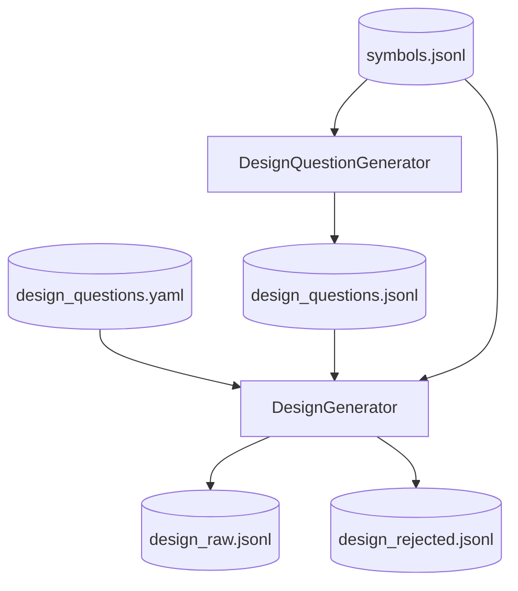

# Step 4 — DesignGenerationStep Design

## 章节与重点内容

- Architecture Overview：自动设计问题 + 设计回答生成
- Design Patterns：Question-Driven Generation、Artifact boundary
- Data Flow：`symbols.jsonl` + `design_questions` → `design_raw.jsonl`
- Modular Detail：Auto/User 设计问题、检索与 evidence 约束
- Trade-offs：质量/成本、自动问题失败回退

---

## Architecture Overview

### 职责边界（Single Responsibility）

DesignGenerationStep 的职责是：生成设计类训练样本（`scenario=arch_design`）。问题来源既可以是 Auto Design Questions，也可以来自用户配置。

### 执行模式

- **Auto 设计问题**：未设置 `--skip-question-answer` 且未设置 `--skip-auto-design-questions`
- **User 设计问题**：当 Auto 关闭或失败时回退到 `design_questions.user_questions_path`
- **Skip**：`--skip-design` 或 `--skip-llm`

### 输入/输出（Artifacts）

- 输入：
  - `symbols.jsonl`
  - `design_questions.user_questions_path`
- 输出：
  - `data/intermediate/auto_questions/design_questions.jsonl`（设计问题快照）
  - `data/intermediate/design_raw.jsonl`
  - `data/intermediate/rejected/design_rejected.jsonl`
  - `data/reports/design_retrieval_report.json`

---

## Data Flow

---

## Modular Detail

### Auto Design Questions

- 由 `DesignQuestionGenerator` 从 symbols + method_profiles 生成（若启用）。
- 生成失败会记录 warning 并回退到用户问题配置。

### 设计回答生成

- `DesignGenerator` 会保存设计问题快照（便于审计），并逐条生成样本。
- 检索/召回可用 `design_questions.retrieval` 配置；支持调用链扩展（弱规则）。
- 支持 negative sampling：`design_questions.coverage.negative_ratio` / `negative_types`。

### 约束注入

- `design_questions.constraints` 可启用“反例对比”与“架构约束”提示段。
- 设计问题可包含 `question_type` 与 `scenario_constraints`，影响 prompt 结构与样本风格。

---

## Coupling Points

- ValidationStep：依赖证据引用与 schema 完整性。
- CoverageTagger/Sampler：基于 `quality.coverage` 统计与抽样。
- MergeStep：默认读取 clean 或 raw 设计工件。

---

## Trade-offs

- Auto 设计问题提升多样性，但生成失败时需回退。
- Auto 与 User 的双路径提高灵活性，但需要明确配置与路径契约。
