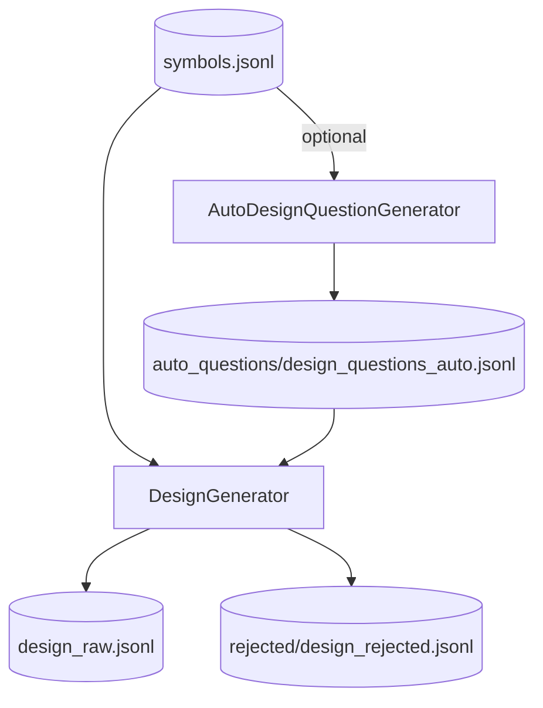

# Step 4 — DesignGenerationStep Design

## 章节与重点内容

- Architecture Overview：设计问题驱动的设计方案生成（可选 Auto Design Questions）
- Design Patterns：Two-stage generation（Design Questions → Design）、RAG（轻量检索）
- Data Flow：`symbols.jsonl` → `design_questions(_auto).jsonl` → `design_raw.jsonl`
- Modular Detail：设计问题结构、上下文分层、证据最小数约束
- Trade-offs：设计问题质量与稳定性、fallback 行为、证据覆盖 vs 成本

---

## Architecture Overview

### 职责边界（Single Responsibility）

DesignGenerationStep 的职责是：为架构设计场景生成 `TrainingSample(scenario=arch_design)`，并确保每个样本带有可验证证据引用。

### 两种输入设计问题来源

1. **Auto Design Questions（可选）**：从代码结构自动生成设计问题集合（用于更贴合仓库现状）。
2. **Default Design Questions（固定）**：从 `configs/design_questions.yaml` 读取设计问题集合（用于稳定基线与可重复测试）。

### 输入/输出（Artifacts）

- 输入：`symbols.jsonl`
- 输出：
  - design_questions：`data/intermediate/auto_questions/design_questions.jsonl`（DesignGenerator 默认）或 `auto_questions/design_questions_auto.jsonl`（design_questions 配置）
  - design：`data/intermediate/design_raw.jsonl`、`data/intermediate/rejected/design_rejected.jsonl`

---

## Design Patterns

### 1) Two-stage generation（设计问题生成与方案生成分离）

把“要解决什么问题”（Design Question）与“怎么改”（Design Sample）分开，主要收益：

- 设计问题作为显式对象便于调参、审计与复用；
- 可独立替换设计问题生成策略（固定设计问题/自动设计问题/人工输入），而不影响设计生成器的主体结构。

### 2) Light RAG（轻量检索）

DesignGenerator 在生成设计方案前，会从 symbols 中选择与设计问题相关的层级/组件，拼装成结构化上下文（Controller/Service/Repository 等），提升模型回答的贴合度与可落地性。

---

## Data Flow

---

## Modular Detail

### Design Question 数据结构

Design Question 作为结构化输入，典型字段：

- `id`
- `goal`（核心目标）
- `constraints`（约束条件）
- `acceptance_criteria`（验收标准）
- `non_goals`（非目标）

### 证据引用最小数量

设计方案样本的 `thought.evidence_refs` 通常要求覆盖：

- 入口层（Controller/route）
- 业务层（Service/core logic）
- 数据层（Repository/DAO）或关键配置点

该约束与 `design_questions.min_evidence_refs` 共同决定样本可接受性与生成成本。

### Auto Design Questions 的上下文增强（可选）

当启用 `design_questions.use_method_profiles=true` 时，DesignQuestionGenerator 会读取 `method_profiles.jsonl` 并将其摘要拼入上下文，提升自动设计问题的语义质量。

---

## Coupling Points（与后续步骤的耦合）

- ValidationStep：对 `design_raw.jsonl` 做 schema/evidence/commit 校验并产出报告
- MergeStep：把 `design_raw.jsonl` 合并进入 `all_raw.jsonl`
- SplitStep：依赖 `scenario=arch_design` 进行分流
- ExportStep：把设计样本导出为 SFT messages（默认不在 assistant content 中携带 thought）

---

## Trade-offs

### 1) Auto Design Questions 的不确定性 vs 贴合度

- 贴合度：自动设计问题可针对代码现状提出更具体的改进建议。
- 不确定性：设计问题质量高度依赖 LLM 输出稳定性；因此实现上提供 fallback 到 default design questions。

### 2) 上下文覆盖 vs token 成本

- 更广的上下文覆盖提高设计方案可落地性与证据充分性。
- 代价是 token 成本和模型格式稳定性下降（更长的 prompt 更易出现 JSON 结构破坏或遗漏 evidence_refs）。

