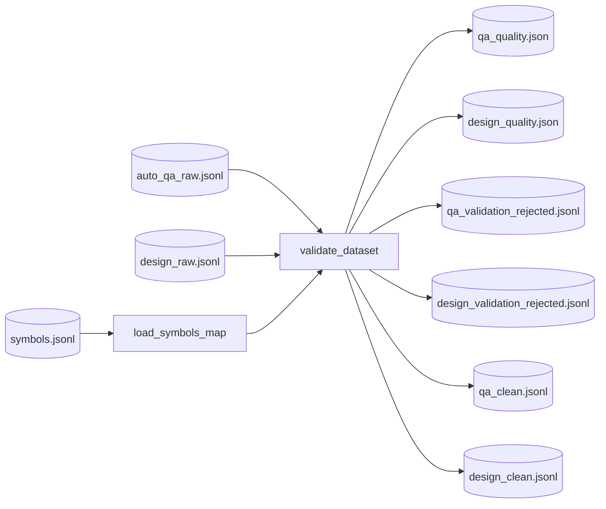

# Step 5 — ValidationStep Design

## 章节与重点内容

- Architecture Overview：质量校验与 clean 分支生成
- Design Patterns：Schema Validation（Pydantic）、Evidence Verification（hash/定位校验）
- Data Flow：`symbols.jsonl` + `{qa,design}_raw.jsonl` → quality reports + rejected + clean
- Modular Detail：trace 结构校验、错误分类与统计、输出报告结构
- Trade-offs：gate/report 模式下的质量保障

---

## Architecture Overview

### 职责边界（Single Responsibility）

ValidationStep 的职责是：对已生成的样本做结构与证据一致性校验，输出质量报告、rejected 样本，并在配置允许时生成 clean 分支供后续步骤消费。

### 输入/输出（Artifacts）

- 输入：
  - `symbols.jsonl`
  - `auto_qa_raw.jsonl`（若存在，兼容 `qa_raw.jsonl`）
  - `design_raw.jsonl`（若存在）
- 输出：
  - `data/reports/qa_quality.json`
  - `data/reports/design_quality.json`
  - `data/intermediate/rejected/qa_validation_rejected.jsonl`
  - `data/intermediate/rejected/design_validation_rejected.jsonl`
  - `data/intermediate/clean/qa_clean.jsonl`（可选）
  - `data/intermediate/clean/design_clean.jsonl`（可选）

---

## Design Patterns

### 1) Pydantic Schema Validation

通过 `TrainingSample.model_validate(raw_obj)` 保证：

- 字段存在性与类型正确性
- `scenario` 值域合法（`qa_rule` / `arch_design`）
- `thought` 符合 `ReasoningTrace` 结构

### 2) Evidence Verification（证据一致性校验）

对 `thought.evidence_refs` 做强校验：

- `symbol_id` 必须存在于 symbols_map
- `source_hash` 必须与 `CodeSymbol.source_hash` 匹配
- `file_path` 必须一致
- `repo_commit` 一致性检查（非 UNKNOWN 时）

### 3) Trace 结构校验（warn-only）

受 `quality.trace_rules` 控制，包含：

- trace 结构与字段存在性
- evidence anchor / answer alignment 的弱一致性检查

---

## Data Flow

---

## Modular Detail

### 报告内容结构

质量报告包含：

- 总样本数、通过/失败、pass_rate
- top_failures / top_warnings
- trace_summary（warn-only 统计）
- output_files（report/rejected/clean）

### clean 分支

`quality.write_clean=true` 时写入 clean 工件；Merge 会优先读取 clean。

---

## Coupling Points（与后续步骤的耦合）

- MergeStep：gate 模式要求 clean 存在，否则报错；report 模式允许 fallback raw。
- CoverageTagger/Sampler：默认在 clean 上进行标签与抽样。

---

## Trade-offs

- gate 模式提高最终数据质量，但对 clean 工件完整性要求更高。
- report 模式更宽松，便于 demo 运行，但可能放回低质样本。
