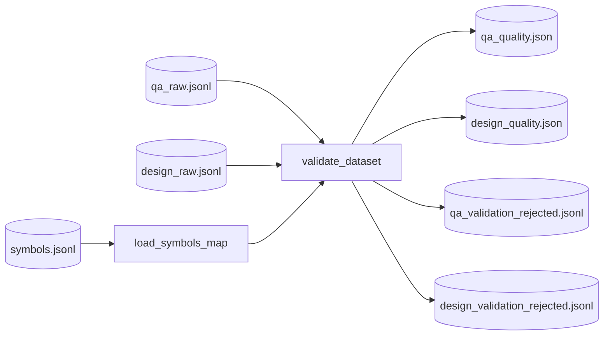

# Step 4 — ValidationStep Design

## 章节与重点内容

- Architecture Overview：质量校验的定位（report-only gate）
- Design Patterns：Schema Validation（Pydantic）、Evidence Verification（hash/定位校验）
- Data Flow：`symbols.jsonl` + `{qa,design}_raw.jsonl` → quality reports + rejected
- Modular Detail：校验规则、错误分类与统计、输出报告结构
- Trade-offs：不阻断后续 vs 数据集可训练性保证

---

## Architecture Overview

### 职责边界（Single Responsibility）

ValidationStep 的唯一职责是：对已生成的样本做结构与证据一致性校验，并输出报告与 rejected 列表，用于质量分析与回归。

> 现状重要说明：ValidationStep **不**会产出“过滤后的 clean 数据”供后续步骤使用；它是 report-only。

### 输入/输出（Artifacts）

- 输入：
  - `symbols.jsonl`
  - `qa_raw.jsonl`（若存在）
  - `design_raw.jsonl`（若存在）
- 输出：
  - `data/reports/qa_quality.json`
  - `data/reports/design_quality.json`
  - `data/intermediate/qa_validation_rejected.jsonl`
  - `data/intermediate/design_validation_rejected.jsonl`

---

## Design Patterns

### 1) Pydantic Schema Validation

通过 `TrainingSample.model_validate(raw_obj)` 保证：

- 字段存在性与类型正确性
- `scenario` 值域合法（`qa_rule` / `arch_design`）
- `thought` 符合 `ReasoningTrace` 结构

### 2) Evidence Verification（证据一致性校验）

对 `thought.evidence_refs` 做强校验：

- `symbol_id` 必须存在于 symbols_map
- `source_hash` 必须与 `CodeSymbol.source_hash` 匹配
- `file_path` 必须一致
- `repo_commit` 一致性检查（非 UNKNOWN 时）

---

## Data Flow

---

## Modular Detail

### 报告内容结构

质量报告包含：

- 总样本数、通过/失败、pass_rate
- top_failures（按错误类型聚合）
- top_warnings
- 输出文件路径（report/rejected）

### 错误分类策略

实现上把错误字符串按 `:` 之前的前缀进行聚合统计，方便观察主要失败类型（如 missing evidence、hash mismatch 等）。

---

## Coupling Points（与后续步骤的耦合）

### 与后续步骤“弱耦合”

Validation 的输出不被 Merge/Dedup/Split/Export 消费；后续仍以 raw 工件为准。这意味着：

- Validation 更多用于监控/分析，而非强制保障训练集质量；
- 若需要“可训练数据强保证”，需要新增 clean artifact 分支并在后续步骤中消费。

---

## Trade-offs

### 1) report-only 的优点

- 保留全部原始生成结果，便于分析与改进提示词/规则。
- 不引入额外的数据分支与路径复杂度，保持 pipeline 简洁。

### 2) report-only 的代价

- 后续步骤可能把 evidence 不完整/不一致的样本继续合并、去重、导出，降低最终训练集可用性。
- 建议演进方向：Validation 输出 `qa_clean.jsonl`/`design_clean.jsonl`，并让 Merge 以 clean 优先。

