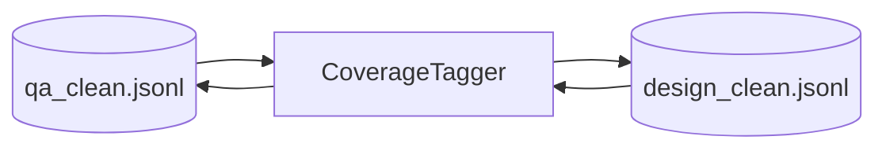

# Step 6 — CoverageTaggerStep Design

## 章节与重点内容

- Architecture Overview：覆盖标签打标（bucket/intent/module_span/polarity）
- Design Patterns：Rule-based Tagging、Artifact boundary
- Data Flow：`clean/*.jsonl` → 同路径回写
- Modular Detail：意图关键词、模块跨度判定、evidence_refs 计数辅助
- Trade-offs：规则法一致性 vs 可解释性

---

## Architecture Overview

### 职责边界（Single Responsibility）

CoverageTaggerStep 的职责是：对 clean 分支样本补齐 `quality.coverage` 标签（bucket/intent/module_span/polarity/source/scenario），为后续抽样与分布报告提供一致标注。

### 输入/输出（Artifacts）

- 输入：
  - `data/intermediate/clean/qa_clean.jsonl`
  - `data/intermediate/clean/design_clean.jsonl`
- 输出：
  - 原文件回写（补充 `quality.coverage`）

---

## Data Flow

---

## Modular Detail

### 规则打标

- **intent**：关键词匹配（config/error/deploy/impact/perf/consistency/auth/flow/how_to/compatibility/edge）。
- **module_span**：依据 `thought.evidence_refs.file_path` 的路径前缀聚合。
- **bucket**：根据 intent + module_span + hard keywords 规则推断。

### evidence_refs 辅助

`question_answer.coverage.evidence_refs` / `design_questions.coverage.evidence_refs` 支持：

- `mode=assist`：在原 bucket 基础上提升等级（基于 evidence_refs 数量）。
- `mode=strict`：完全按 evidence_refs 数量决定 bucket。

---

## Coupling Points

- CoverageSamplerStep：依赖 `quality.coverage.bucket/intent/module_span` 做抽样。
- QuestionTypeReportStep：依赖 `quality.coverage.question_type` 统计分布。

---

## Trade-offs

- 规则打标可解释、成本低，但对关键词分布敏感。
- evidence_refs 辅助能提升“难度”判定一致性，但易受 evidence 质量影响。
