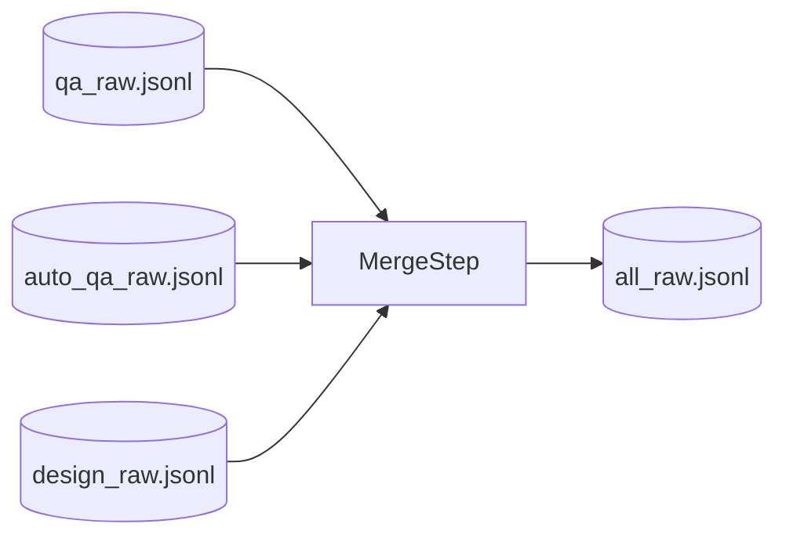

# Step 5 — MergeStep Design

## 章节与重点内容

- Architecture Overview：将 QA 与 Design 合并为统一数据流入口
- Design Patterns：Adapter/Router（按模式选择 QA 输入）、Artifact aggregation
- Data Flow：`qa_raw|auto_qa_raw` + `design_raw` → `all_raw.jsonl`
- Modular Detail：Auto 模式下 QA 文件定位策略、缺失输入的处理
- Trade-offs：简单合并 vs quality gating 缺失、模式开关造成跨步耦合

---

## Architecture Overview

### 职责边界（Single Responsibility）

MergeStep 的唯一职责是：把 QA 与 Design 的 raw 样本聚合到一个文件 `all_raw.jsonl`，为后续去重/安全扫描/切分提供统一入口。

### 输入/输出（Artifacts）

- 输入：
  - QA：`qa_raw.jsonl`（标准）或 `auto_qa_raw.jsonl`（Auto）
  - Design：`design_raw.jsonl`
- 输出：
  - `data/intermediate/all_raw.jsonl`

---

## Design Patterns

### Router（按模式路由输入源）

MergeStep 通过 `--skip-question-answer` 决定 QA 输入源：

- Auto enabled：读 `auto.outputs.auto_qa_raw_jsonl`（以文件名形式拼到 `paths["intermediate"]`）
- Auto disabled：读 `paths["qa_raw_jsonl"]`

这是一种轻量的路由/适配，避免 pipeline 内出现“双 QA 输入”的复杂性。

---

## Data Flow

---

## Modular Detail

### 缺失输入的容错

- 若 QA 或 Design 文件不存在，MergeStep 记录 warning 并继续（最终可能只合并到单一类型样本或空）。
- 该行为与 Orchestrator 的“失败不中断”策略一致，但可能导致后续步骤数据量过小。

### Auto QA 文件名抽取逻辑

Auto outputs 可能配置为完整路径，MergeStep 会做“取 basename”的兼容处理，然后再拼接到 intermediate 目录。

---

## Coupling Points（与后续步骤的耦合）

- DeduplicationStep 强依赖 `all_raw.jsonl` 存在且非空，否则会 skip。
- 通过 `--skip-question-answer` 的模式选择，Merge 与 QuestionAnswerStep 存在跨步耦合（开关改变输入契约）。

---

## Trade-offs

### 1) 统一入口的收益

- 后续 dedup/safety/split/export 只需要处理一种输入文件，降低复杂度。

### 2) 缺少“quality clean”分支

- Merge 使用 raw 数据，不关心 Validation 的通过/失败；这简化流程但会把潜在无效样本带入后处理。
- 若目标是“强保证训练集”，建议引入 clean 工件并在 Merge 中优先消费。

