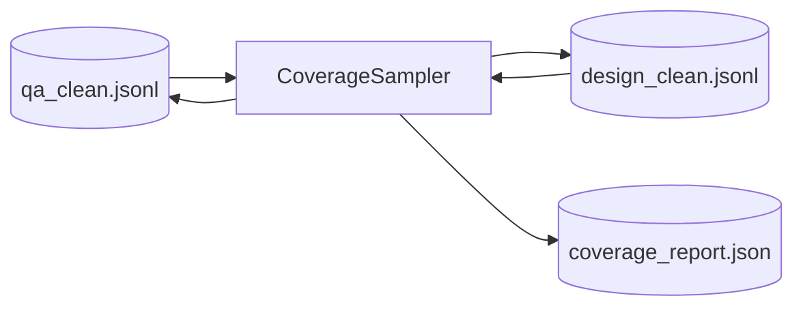

# Step 7 — CoverageSamplerStep Design

## 章节与重点内容

- Architecture Overview：按覆盖分布抽样
- Design Patterns：Stratified Sampling、Artifact boundary
- Data Flow：`clean/*.jsonl` → `coverage_report.json` + clean 回写
- Modular Detail：targets、min_sample_size、负向样本配额
- Trade-offs：分布稳定性 vs 样本规模

---

## Architecture Overview

### 职责边界（Single Responsibility）

CoverageSamplerStep 的职责是：对 clean 分支做分层抽样，使样本分布接近配置的覆盖目标（默认 80/15/5）。

### 输入/输出（Artifacts）

- 输入：
  - `data/intermediate/clean/qa_clean.jsonl`
  - `data/intermediate/clean/design_clean.jsonl`
- 输出：
  - `data/reports/coverage_report.json`
  - clean 回写（当 mode != upstream 且样本量充足）

---

## Data Flow

---

## Modular Detail

### 分布目标

- `question_answer.coverage.targets` / `design_questions.coverage.targets` 控制 bucket 配比。
- `mode=upstream` 时仅统计，不改写样本。

### 抽样策略

- 采用 bucket 分层抽样，并支持 `hard <- mid <- high` 的补齐规则。
- `min_sample_size` 过小则跳过抽样，保留原分布。

### 负向样本配额

- `negative_ratio` 允许在每个 bucket 内优先选择负向样本（若存在）。

---

## Coupling Points

- CoverageTaggerStep：依赖前置标签结果。
- MergeStep：默认读取抽样后的 clean 工件。

---

## Trade-offs

- 抽样可稳定分布，但对小样本或稀缺 bucket 会产生偏差。
- fallback 规则保证总量，但牺牲桶内“严格配额”。
