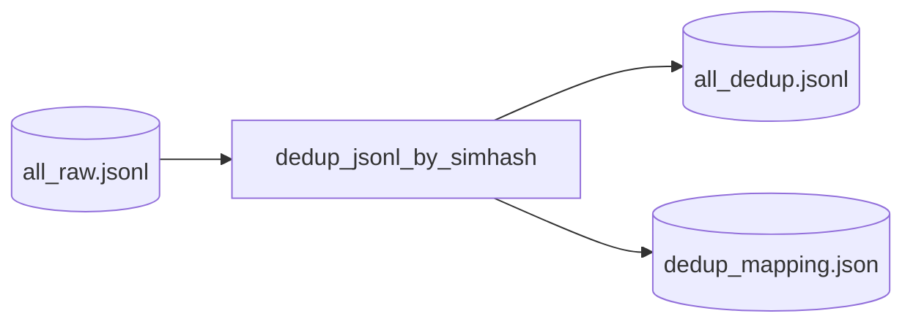

# Step 7 — DeduplicationStep Design

## 章节与重点内容

- Architecture Overview：近重复样本清理（SimHash）
- Design Patterns：Content Fingerprinting、Config-driven Gate
- Data Flow：`all_raw.jsonl` → `all_dedup.jsonl` + mapping report
- Modular Detail：SimHash 计算、Hamming 阈值、去重键选择
- Trade-offs：质量提升 vs 可能误伤、O(n²) 风险（当前实现）

---

## Architecture Overview

### 职责边界（Single Responsibility）

DeduplicationStep 的职责是：对合并后的样本进行近重复去除，降低训练集冗余与过拟合风险，并输出可审计的 mapping。

### 输入/输出（Artifacts）

- 输入：`data/intermediate/all_raw.jsonl`
- 输出：
  - `data/intermediate/all_dedup.jsonl`
  - `data/reports/dedup_mapping.json`

---

## Design Patterns

### 1) Fingerprinting（指纹去重）

对每个样本计算 simhash 指纹，并用 Hamming distance 判断近重复。

### 2) Gate by Config（可配置开关）

通过 `quality.enable_deduplication` 控制是否执行，使调试/分析时可保留重复样本观察生成分布。

---

## Data Flow

---

## Modular Detail

### 去重键选择

当前实现使用 `instruction + "\n" + answer` 作为 simhash 输入（不含 context/thought），其含义是：

- 认为“问答对内容”决定样本语义主体；
- context 更像证据/辅助信息，纳入会放大噪声并降低去重效果。

### 近重复阈值

- `dedup.max_hamming` 控制判定阈值，阈值越大去重越激进，越可能误伤“相似但有效的样本”。

### Mapping 的审计价值

`dedup_mapping.json` 记录 dropped 与 kept 的索引对应关系与 distance，便于：

- 分析去重率是否异常；
- 回溯误删案例；
- 后续引入更强算法时做对比评估。

---

## Coupling Points（与后续步骤的耦合）

- SecretsScanStep/SplitStep 默认以 `all_dedup.jsonl` 作为输入，因此 dedup 输出是后处理主干路径的一部分。
- 若 dedup 被禁用，则后续步骤目前仍会尝试读取 `all_dedup.jsonl`；因此在 pipeline 语义上，dedup 禁用时需要保证存在等价输入（当前实现通过 should_skip 条件避免执行，但不自动生成“旁路拷贝”）。

---

## Trade-offs

### 1) SimHash 的误伤 vs 训练集冗余

- 优点：实现简单、无需额外依赖、对文本近似重复有效。
- 风险：对“结构相似但细节不同”的问答可能误判为近重复而丢弃；需要结合 mapping 抽样评估。

### 2) 复杂度与可扩展性

当前实现对每条样本会与已保留样本线性比较（最坏 O(n²)）。适合小规模本地验证；若规模上升，建议：

- 引入分桶（按 hash 前缀）降低比较次数；
- 或使用 LSH/MinHash（项目依赖中已列出可选 datasketch）。

