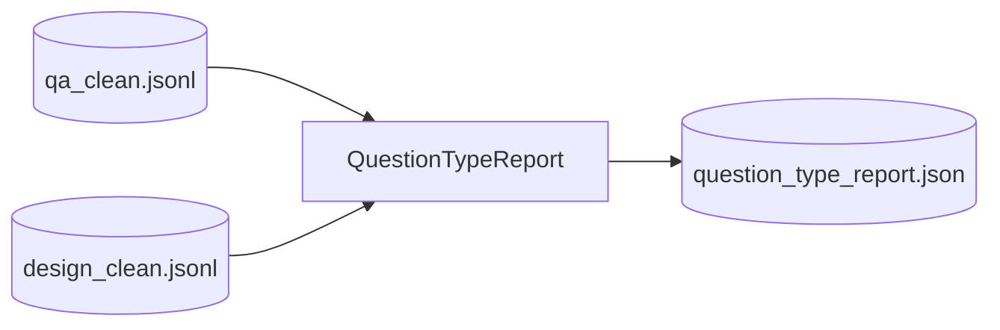

# Step 8 — QuestionTypeReportStep Design

## 章节与重点内容

- Architecture Overview：问题类型分布报告与回归告警
- Design Patterns：Lightweight Reporting
- Data Flow：`clean/*.jsonl` → `question_type_report.json`
- Modular Detail：目标分布、回归阈值、warn-only
- Trade-offs：可观测性增强 vs 无强制门禁

---

## Architecture Overview

### 职责边界（Single Responsibility）

QuestionTypeReportStep 的职责是：统计 QA/Design 的 `question_type` 分布，并在配置启用时输出分布偏差告警（warn-only）。

### 输入/输出（Artifacts）

- 输入：
  - `data/intermediate/clean/qa_clean.jsonl`
  - `data/intermediate/clean/design_clean.jsonl`
- 输出：
  - `data/reports/question_type_report.json`

---

## Data Flow

---

## Modular Detail

- `question_answer.coverage.diversity.question_type_targets`
- `design_questions.coverage.diversity.question_type_targets`
- `regression.enabled=true` 时比较实际比例与目标比例，超过 `max_delta` 仅告警。

---

## Trade-offs

- warn-only 模式适合 demo 与快速回归，不阻断流水线。
- 若用于严格分布控制，应在后续引入强 gate 或回写抽样逻辑。
