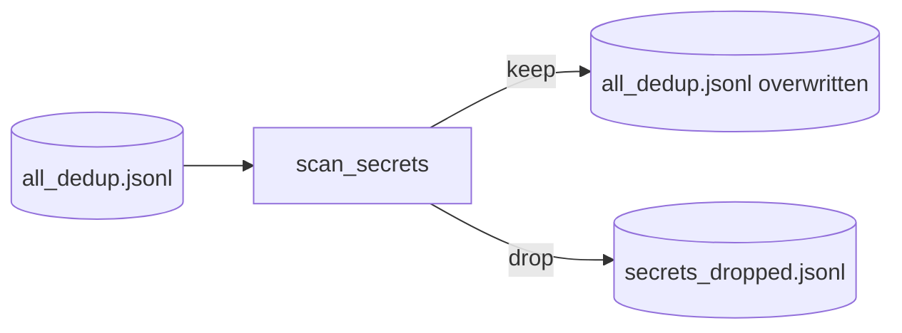

# Step 7 — SecretsScanStep Design

## 章节与重点内容

- Architecture Overview：敏感信息检测与处置（drop/sanitize）
- Design Patterns：Policy/Strategy（mode 选择）、Defense-in-Depth
- Data Flow：`all_dedup.jsonl` → (filtered) `all_dedup.jsonl` + `secrets_dropped.jsonl`
- Modular Detail：扫描范围、规则模式、就地覆写行为
- Trade-offs：安全性 vs 数据量、误报处理、可审计性

---

## Architecture Overview

### 职责边界（Single Responsibility）

SecretsScanStep 的职责是：对样本内容进行敏感信息扫描，并按照策略进行丢弃或脱敏处理，防止训练数据泄露密钥/令牌/私钥等敏感信息。

### 输入/输出（Artifacts）

- 输入：`data/intermediate/all_dedup.jsonl`
- 输出：
  - 主干输出：**就地覆写** `data/intermediate/all_dedup.jsonl`（clean/sanitized）
  - 审计输出：`data/reports/secrets_dropped.jsonl`（仅 drop 模式产生）

---

## Design Patterns

### 1) Strategy / Policy（策略选择）

通过 `safety.mode` 选择策略：

- `drop`：直接丢弃含敏感信息的样本，仅记录简要审计信息
- `sanitize`：对命中的字符串做替换/打码后保留样本

该策略使安全合规可以按场景切换（例如内部试验可 sanitize，外发数据强制 drop）。

### 2) Defense-in-Depth（纵深防御）

Secrets 扫描位于 dedup 之后、split/export 之前，属于“上线前最后一道安全门”，降低敏感信息进入最终训练集的概率。

---

## Data Flow

---

## Modular Detail

### 扫描范围

当前实现扫描文本为：`context + "\n" + answer`（不含 instruction）。

理由：敏感信息更可能出现在代码上下文或生成答案中；instruction 通常是自然语言问题，泄露概率低。

### 规则模式（Patterns）

扫描基于预定义正则集合（AWS key、private key block、JWT、常见 token/secret/password 赋值模式等），并对匹配内容做截断展示以避免二次泄露。

### 就地覆写的语义

SecretsScanStep 在发现需要过滤时会覆写 `all_dedup.jsonl` 为 clean_samples。此实现简化后续步骤读取逻辑，但会牺牲“原始 dedup 输出”的可追溯性（需依赖版本控制或额外备份）。

---

## Coupling Points（与后续步骤的耦合）

- SplitStep 直接消费 `all_dedup.jsonl`，因此 SecretsScanStep 的输出是 split 的直接输入。
- ExportStep 输出的数据集将继承 secrets policy 的结果（drop 会减少样本数；sanitize 会改变上下文字段）。

---

## Trade-offs

### 1) 安全性 vs 数据量与代表性

- `drop` 更安全，但可能在某些仓库中大幅减少数据量（尤其是包含示例密钥/测试数据的仓库）。
- `sanitize` 保留数据量但存在误脱敏/漏脱敏风险，且改变了模型学习到的文本分布。

### 2) 误报与可解释性

正则规则不可避免存在误报；通过 `secrets_dropped.jsonl` 记录类型/位置/截断匹配，支持后续分析与规则调优。

### 3) 工件覆写 vs 可回放性

覆写简化主干流程，但降低了可回放性。若未来需要强审计，建议：

- 输出 `all_dedup_clean.jsonl` 作为新工件；
- 保留 `all_dedup.jsonl` 作为未处理版本。

