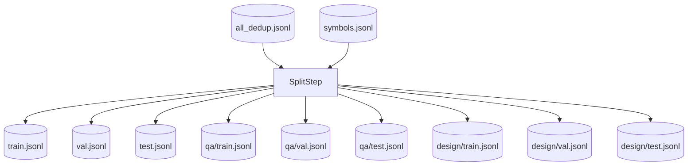

# Step 9 — SplitStep Design

## 章节与重点内容

- Architecture Overview：防泄漏的 train/val/test 切分（按组聚类）
- Design Patterns：Group-based Stratification、Deterministic Split（seed）
- Data Flow：`all_dedup.jsonl` + `symbols.jsonl` → 多份 split 工件
- Modular Detail：group key 计算（package/path）、fallback 行为、QA/Design 分流
- Trade-offs：防泄漏强度 vs 数据量/组数不足时退化、scenario 强耦合

---

## Architecture Overview

### 职责边界（Single Responsibility）

SplitStep 的职责是：将样本切分为 train/val/test，同时提供：

- 全量数据集切分（兼容旧用法）
- QA-only 与 Design-only 的独立切分（便于分别训练/评估）

### 输入/输出（Artifacts）

- 输入：
  - `data/intermediate/all_dedup.jsonl`
  - `data/raw/extracted/symbols.jsonl`（用于分组 key 计算）
- 输出：
  - `data/final/train.jsonl` / `val.jsonl` / `test.jsonl`
  - `data/final/qa/{train,val,test}.jsonl`
  - `data/final/design/{train,val,test}.jsonl`

---

## Design Patterns

### 1) Group-based Stratification（按组切分，避免泄漏）

切分的核心目标是减少“相近代码证据”跨集合泄漏。实现上通过 `thought.evidence_refs[0].symbol_id` 找到对应 `CodeSymbol`，再提取：

- `group_by=package`：使用 `qualified_name` 的包前缀
- `group_by=path`：使用 `file_path` 的目录前缀

同一组内的样本会被分配到同一个 split。

### 2) Deterministic Split（可复现切分）

通过 `global.seed` 控制分组 shuffle，使切分可复现，便于回归比较模型效果。

---

## Data Flow

---

## Modular Detail

### Scenario 分流（QA vs Design）

SplitStep 依赖 `TrainingSample.scenario` 值域：

- `qa_rule` → QA 子集
- `arch_design` → Design 子集

该分流用于生成独立的 QA/Design 训练集。

### group key 计算依赖 evidence_refs

group key 以第一个 evidence_ref 为锚点；若缺失 evidence_refs，样本会落入 `_NO_EVIDENCE_` 特殊组，切分会退化并增加泄漏风险。

### 组数不足时的退化策略

当分组数量不足（默认阈值 5）时，切分会退化为 sample-level 随机切分，以保证能生成 train/val/test（尤其在小数据量调试阶段）。

---

## Coupling Points（与后续步骤的耦合）

- ExportStep 直接消费 split 输出文件并导出 SFT。
- Split 的质量强依赖上游生成样本是否完整填写 `thought.evidence_refs`；否则 group split 无法有效防泄漏。

---

## Trade-offs

### 1) 防泄漏强度 vs 数据量/组数限制

- 按 package/path 分组可降低同一组件相关样本跨集合出现的概率。
- 但当样本量小或 evidence 分布集中时，组数不足会退化为随机切分，防泄漏能力下降。

### 2) 以第一个 evidence_ref 作为锚点

- 优点：实现简单，且多数样本会把“最关键证据”放在第一个引用。
- 风险：若证据顺序不稳定或第一个引用不是代表性组件，分组质量可能下降；未来可改为多 evidence 聚合 key（例如取最常见 package）。

