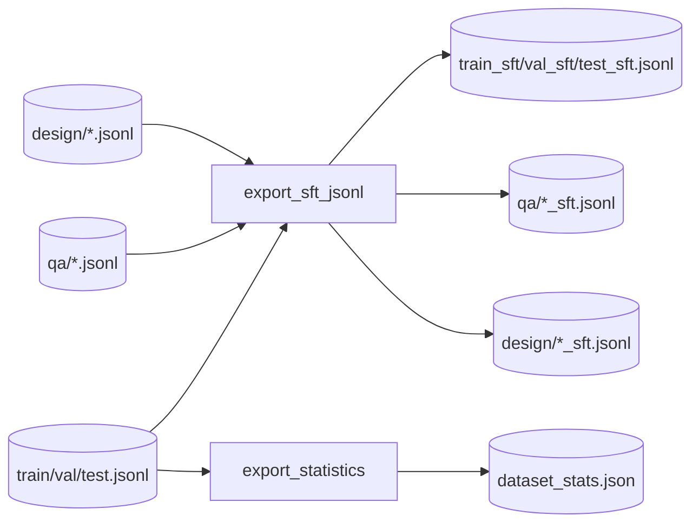

# Step 10 — ExportStep Design

## 章节与重点内容

- Architecture Overview：训练格式导出（SFT messages JSONL）与统计
- Design Patterns：Adapter（TrainingSample → Target Format）、Policy（system prompt 来自 profile）
- Data Flow：split 工件 → `*_sft.jsonl` + `dataset_stats.json`
- Modular Detail：消息结构、metadata、thought 的处理策略
- Trade-offs：不输出推理 trace 的安全性/可控性 vs 调试需求、格式扩展性

---

## Architecture Overview

### 职责边界（Single Responsibility）

ExportStep 的职责是：把 split 后的数据集转换为目标训练格式（默认 Qwen2.5 SFT messages JSONL），并输出数据集统计信息，便于训练与分析。

### 输入/输出（Artifacts）

- 输入：
  - `data/final/train.jsonl` / `val.jsonl` / `test.jsonl`
  - `data/final/qa/*`、`data/final/design/*`（若存在）
- 输出：
  - `data/final/*_sft.jsonl`（combined）
  - `data/final/qa/*_sft.jsonl`
  - `data/final/design/*_sft.jsonl`
  - `data/reports/dataset_stats.json`

---

## Design Patterns

### 1) Adapter（内部 schema 到训练格式的适配）

内部样本 schema 为 `TrainingSample`（instruction/context/answer/thought/...），而训练侧通常需要 `messages` 数组。Export 将内部 schema 适配为：

```json
{
  "messages": [
    {"role": "system", "content": "..."},
    {"role": "user", "content": "instruction + context"},
    {"role": "assistant", "content": "answer"}
  ],
  "metadata": { ... }
}
```

### 2) Policy（system prompt 的来源策略）

system prompt 默认从 language profile 获取（profile.get_system_prompt('default')），使不同语言/场景可配置不同系统提示词，而无需修改导出代码。

---

## Data Flow



---

## Modular Detail

### User content 结构

Export 将 user content 组织为：

- `instruction`
- 若存在 `context`，追加 `代码上下文：\n{context}`

这种组织兼顾：

- 训练时保持任务指令清晰（instruction 在前）
- 上下文作为证据支撑（context 在后）

### Thought 的处理策略（默认不进入 assistant content）

默认导出时：

- `thought` 不写入 assistant content（防止模型学习输出“推理过程”）
- `thought.evidence_refs` 会被放入 `metadata`，保留可审计性与评估用证据链

如需包含推理轨迹，可使用 `export_with_reasoning_trace()` 生成另一种导出格式（用于调试/评估/特定训练策略）。

---

## Coupling Points（与后续训练/评估的契约）

- 训练侧消费 `*_sft.jsonl`，其字段与消息角色必须符合目标训练框架预期（messages role 顺序与字段名固定）。
- 统计报告依赖输入样本字段（instruction/context/answer/thought.evidence_refs），用于监控数据分布与证据覆盖。

---

## Trade-offs

### 1) 不导出 thought 的优势与代价

- 优势：降低模型学会“输出推理过程”的概率，符合推理 trace 作为训练标签但不作为输出的安全策略。
- 代价：训练数据本身在 assistant content 中不可直接审阅推理链；需要通过 metadata 或另一个导出格式辅助调试。

### 2) 多格式扩展

- 当前导出实现支持 Qwen2.5 messages 与 Alpaca 格式，并可扩展更多格式。
- 代价：格式越多，越需要明确每种格式的契约与评测工具链，避免训练/评测不一致。

